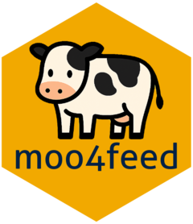

# R Package: **moo4feed** <a href="https://skysheng7.github.io/moo4feed/"></a>

**Authors**: Kehan (Sky) Sheng, Borbala Foris, Daniel Weary, Marina von Keyserlingk

<!-- badges: start -->
[](https://codecov.io/gh/skysheng7/moo4feed)
[](https://github.com/skysheng7/moo4feed/actions/workflows/R-CMD-check.yaml)
<!-- badges: end -->
  
## Overview

**moo4feed** is an R package designed to extract novel individual-level traits from raw feeding and drinking data collected through precision livestock farming systems.

The package aims to support animal welfare research and data-driven monitoring by enabling reproducible, scalable analysis workflows.

## Installation

To install the development version of **moo4feed** from GitHub, run:

```r
install.packages("devtools")

# run below if you only want to install the package
devtools::install_github("skysheng7/moo4feed")

# run below if you want to read the vignettes, and install dependencies needed for development too
devtools::install_github("skysheng7/moo4feed", dependencies = TRUE, build_vignettes = TRUE)
```

## Documentation

Full documentation and examples are available at the [package website](https://skysheng7.github.io/moo4feed/).


## Contributors

- **Principal Investigator:** Marina von Keyserlingk  
  - ORCID: 0000-0002-1427-3152  
  - Affiliation: University of British Columbia  
  - Email: <nina@mail.ubc.ca>

- **Co-Investigator:** Daniel Weary  
  - ORCID: 0000-0002-0917-3982  
  - Affiliation: University of British Columbia  
  - Email: <dan.weary@ubc.ca>

- **Contributor:** Kehan Sheng  
  - ORCID: 0000-0001-6442-5284  
  - Affiliation: University of British Columbia  
  - Email: <skysheng7@gmail.com>

- **Contributor:** Borbala Foris  
  - ORCID: 0000-0002-0901-3057  
  - Affiliation while working on this project: University of British Columbia
  - Current affiliation: University of Veterinary Medicine, Vienna
  - Email: <forisbori@gmail.com>

- **Contributor:** Kratika Rathi  
  - Affiliation: University of British Columbia  
  - Email: <kratikar2011@gmail.com>

- **Contributor:** Nicole Lopez     
  - ORCID: 0009-0000-1828-0336
  - Affiliation: University of British Columbia  
  - Email: <nicoleangelpty@gmail.com>

- **Contributor:** Colombe Tolokin
  - Affiliation: University of British Columbia  
  - Email: <colombe.tolokin@outlook.com>
  
## Acknowledgements

This R package was developed following the instructions and recommended workflows outlined in several key resources: 

- [*R Packages*](https://r-pkgs.org/) by Hadley Wickham and Jenny Bryan  
- [*Reproducible and Trustworthy Workflows for Data Science*](https://ubc-dsci.github.io/reproducible-and-trustworthy-workflows-for-data-science/) by Tiffany Timbers, Joel Ostblom, and Florencia D’Andrea  
- Courses: [DSCI 522 Data Science Workflows](https://ubc-mds.github.io/course-descriptions/DSCI_522_dsci-workflows/), [DSCI 524 Collaborative Software Development](https://ubc-mds.github.io/DSCI_524_collab-sw-dev/README.html) by Dr. Tiffany Timbers

## Project Information
- **Funding:** This project is funded by a Natural Sciences and Engineering Research Council (NSERC) Discovery Grant (RGPIN-2021-02848; Ottawa, ON, Canada) awarded to MvK. KS also received funding from the Pei-Huang Tung and Tan-Wen Tung Graduate Fellowship (Vancouver, BC, Canada), Elizabeth R. Howland Fellowship (Vancouver, BC, Canada), Wilson Henderson Fellowship (Vancouver, BC, Canada), Hugo E Meilicke Memorial Fellowship (Vancouver, BC, Canada), and Mary and David Macaree Fellowship (Vancouver, BC, Canada).
