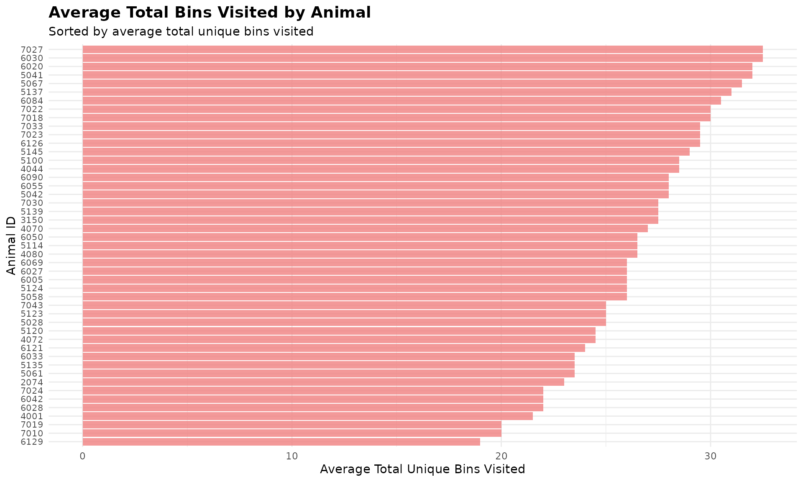

# 3. Bin Visit Analysis

``` r
library(moo4feed)
library(ggplot2)
library(dplyr)
```

## 1. 🚨 Important: Set Your Global Variables First

Before analyzing bin visit patterns, configure global variables to match
your data structure:

``` r
# Configure global variables for your data structure
set_global_cols(
  # Time zone
  tz = "America/Vancouver",
  
  # Column names in your data files
  id_col = "cow",
  trans_col = "transponder",
  start_col = "start",
  end_col = "end",
  bin_col = "bin",
  dur_col = "duration",
  intake_col = "intake",
  start_weight_col = "start_weight",
  end_weight_col = "end_weight",
  
  # Bin settings
  bins_feed = 1:30,
  bins_wat = 1:5,
  bin_offset = 100
)
```

## 2. Introduction to Bin Visit Analysis

🦦 Ollie the Otter, our in-house data scientist, explains: “Animals
exhibit distinct exploration behaviours when accessing feeding and
drinking stations. Some individuals visit many different bins while
others consistently use only a few preferred locations. This behavior
reveals individual personalities and resource utilization strategies.”

## 3. Prerequisites

This tutorial assumes completion of previous data processing steps in
**Tutorial 1: Data Cleaning**

## 4. Data Preparation

``` r
# Load cleaned example data
data(clean_feed)
data(clean_water)

# If you're using your own data from previous tutorials, use this instead:
# clean_feed <- your_cleaned_feed_data     # From your cleaning results
# clean_water <- your_cleaned_water_data   # From your cleaning results

# Quick peek at our data structure
cat("Feed data structure:\n")
#> Feed data structure:
head(clean_feed[[1]], 3)  # First day, first 3 rows
#> # A tibble: 3 × 11
#>   transponder   cow   bin start               end                 duration
#>         <int> <int> <dbl> <dttm>              <dttm>                 <dbl>
#> 1    12448407  6020     1 2020-10-31 00:26:12 2020-10-31 00:27:36       84
#> 2    11954014  4044     1 2020-10-31 01:17:43 2020-10-31 01:22:13      270
#> 3    11954042  4072     1 2020-10-31 01:37:30 2020-10-31 01:37:52       22
#> # ℹ 5 more variables: start_weight <dbl>, end_weight <dbl>, intake <dbl>,
#> #   date <date>, rate <dbl>

cat("\nWater data structure:\n") 
#> 
#> Water data structure:
head(clean_water[[1]], 3)  # First day, first 3 rows
#> # A tibble: 3 × 11
#>   transponder   cow   bin start               end                 duration
#>         <int> <int> <dbl> <dttm>              <dttm>                 <dbl>
#> 1    12200060  5114   101 2020-10-31 00:14:13 2020-10-31 00:15:03       50
#> 2    12706618  7027   101 2020-10-31 00:29:34 2020-10-31 00:30:43       69
#> 3    12200004  5058   101 2020-10-31 01:18:23 2020-10-31 01:19:10       47
#> # ℹ 5 more variables: start_weight <dbl>, end_weight <dbl>, intake <dbl>,
#> #   date <date>, rate <dbl>

cat("\nTotal days of data:\n")
#> 
#> Total days of data:
cat("Feed days:", length(clean_feed), "\n")
#> Feed days: 2
cat("Water days:", length(clean_water), "\n")
#> Water days: 2
```

## 5. Exploratory Behavior Analysis

Individual animals differ in their willingness to explore different
feeding and drinking stations. This analysis quantifies exploration
patterns by counting unique bin visits per animal per day.

### Calculate Unique Bin Visits

``` r
# Calculate unique bin visits for each animal across all days
bin_visits <- unique_bin_visits(
  feed = clean_feed,            # Our cleaned feed data
  water = clean_water,          # Our cleaned water data
  return_list = FALSE)          # 🎯 Try changing to TRUE for day-by-day!

# Look at the results
head(bin_visits)
#> # A tibble: 6 × 5
#>   date      cow unique_feed_bins_vis…¹ unique_water_bins_vi…² total_bins_visited
#>   <chr>   <int>                  <int>                  <int>              <int>
#> 1 2020-1…  2074                     20                      4                 24
#> 2 2020-1…  3150                     22                      4                 26
#> 3 2020-1…  4001                     19                      3                 22
#> 4 2020-1…  4044                     25                      4                 29
#> 5 2020-1…  4070                     24                      4                 28
#> 6 2020-1…  4072                     24                      3                 27
#> # ℹ abbreviated names: ¹​unique_feed_bins_visited, ²​unique_water_bins_visited
```

This analysis provides three key metrics for each animal on each day:

- *How many different **feed bins** they visited*
- *How many different **water bins** they visited*  
- *The **total number of unique bins** visited (feed + water)*

## 6. Identifying Exploration Patterns

### Most Exploratory Animals

``` r
# Calculate average unique bin visits per animal
avg_bin_visits <- bin_visits |>
  dplyr::group_by(cow) |>
  dplyr::summarize(
    avg_feed_bins = mean(unique_feed_bins_visited),
    avg_water_bins = mean(unique_water_bins_visited),
    avg_total_bins = mean(total_bins_visited),
    days_observed = dplyr::n(),
    .groups = "drop"
  ) |>
  dplyr::arrange(dplyr::desc(avg_total_bins))

# Display most exploratory animals
cat("🏆 TOP 5 MOST EXPLORATORY ANIMALS:\n")
#> 🏆 TOP 5 MOST EXPLORATORY ANIMALS:
head(avg_bin_visits, 5)
#> # A tibble: 5 × 5
#>     cow avg_feed_bins avg_water_bins avg_total_bins days_observed
#>   <int>         <dbl>          <dbl>          <dbl>         <int>
#> 1  6030          28              4.5           32.5             2
#> 2  7027          29              3.5           32.5             2
#> 3  5041          28              4             32               2
#> 4  6020          28              4             32               2
#> 5  5067          28.5            3             31.5             2

cat("\n🏠 TOP 5 CREATURES OF HABIT (fewest bins visited):\n")
#> 
#> 🏠 TOP 5 CREATURES OF HABIT (fewest bins visited):
tail(avg_bin_visits, 5)
#> # A tibble: 5 × 5
#>     cow avg_feed_bins avg_water_bins avg_total_bins days_observed
#>   <int>         <dbl>          <dbl>          <dbl>         <int>
#> 1  7024          19              3             22               2
#> 2  4001          18.5            3             21.5             2
#> 3  7010          16              4             20               2
#> 4  7019          16.5            3.5           20               2
#> 5  6129          17              2             19               2
```

This analysis reveals clear individual differences in exploration
behavior. Most exploratory animals visit many different stations, while
creatures of habit consistently use fewer preferred locations.

### Visualize Exploration Patterns

``` r
# Visualize top 50 most exploratory animals
top_50_explorers <- head(avg_bin_visits, 50)

ggplot(top_50_explorers, aes(x = reorder(cow, avg_total_bins), y = avg_total_bins)) +
  geom_bar(stat = "identity", fill = "lightcoral", alpha = 0.8) +
  coord_flip() +
  labs(
    title = "Average Total Bins Visited by Animal",
    subtitle = "Sorted by average total unique bins visited",
    x = "Animal ID",
    y = "Average Total Unique Bins Visited"
  ) +
  theme_minimal() +
  theme(
    axis.text.y = element_text(size = 8),
    plot.title = element_text(size = 14, face = "bold"),
    plot.subtitle = element_text(size = 11)
  )
```



## 7. Code Cheatsheet

``` r
#' Copy and modify these code blocks for your own analysis!

# ---- SETUP: Global Variables (REQUIRED FIRST!) ----
library(moo4feed)
library(ggplot2)
library(dplyr)

# Set up your column names and timezone (modify these!)
set_global_cols(
  # Time zone
  tz = "America/Vancouver",
  
  # Column names in your data files
  id_col = "cow",
  trans_col = "transponder",
  start_col = "start",
  end_col = "end",
  bin_col = "bin",
  dur_col = "duration",
  intake_col = "intake",
  start_weight_col = "start_weight",
  end_weight_col = "end_weight",
  
  # Bin settings
  bins_feed = 1:30,
  bins_wat = 1:5,
  bin_offset = 100
)

# ---- STEP 1: Load Your Data ----
# Load your cleaned data
data(clean_feed)
data(clean_water)

# Or use your own cleaned data from previous tutorials:
# clean_feed <- your_cleaned_feed_data
# clean_water <- your_cleaned_water_data

# ---- STEP 2: Calculate Unique Bin Visits ----
# Get overall summary across all days
bin_visits <- unique_bin_visits(
  feed = clean_feed,            # Your cleaned feed data
  water = clean_water,          # Your cleaned water data
  return_list = FALSE           # FALSE = combined summary, TRUE = day-by-day
)

# View results
head(bin_visits)

# ---- STEP 3: Identify Most/Least Exploratory Animals ----
# Calculate averages per animal
avg_bin_visits <- bin_visits |>
  dplyr::group_by(cow) |>
  dplyr::summarize(
    avg_feed_bins = mean(unique_feed_bins_visited),
    avg_water_bins = mean(unique_water_bins_visited), 
    avg_total_bins = mean(total_bins_visited),
    days_observed = dplyr::n(),
    .groups = "drop"
  ) |>
  dplyr::arrange(dplyr::desc(avg_total_bins))    # Most exploratory first

# Get top and bottom explorers
top_explorers <- head(avg_bin_visits, 10)       # Most exploratory
creatures_of_habit <- tail(avg_bin_visits, 10)  # Least exploratory

print(top_explorers)
print(creatures_of_habit)

# ---- STEP 4: Visualize Results ----
# Top exploratory animals bar plot
top_50_explorers <- head(avg_bin_visits, 50)

ggplot(top_50_explorers, aes(x = reorder(cow, avg_total_bins), y = avg_total_bins)) +
  geom_bar(stat = "identity", fill = "lightcoral", alpha = 0.8) +
  coord_flip() +
  labs(
    title = "Average Total Bins Visited by Animal",
    subtitle = "Sorted by average total unique bins visited",
    x = "Animal ID",
    y = "Average Total Unique Bins Visited"
  ) +
  theme_minimal() +
  theme(
    axis.text.y = element_text(size = 8),
    plot.title = element_text(size = 14, face = "bold"),
    plot.subtitle = element_text(size = 11)
  )
```
