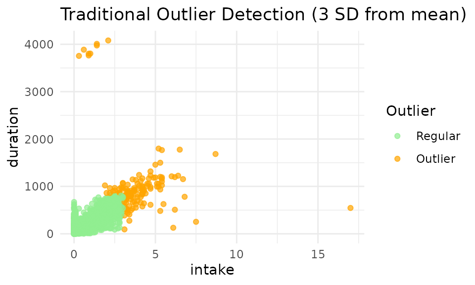
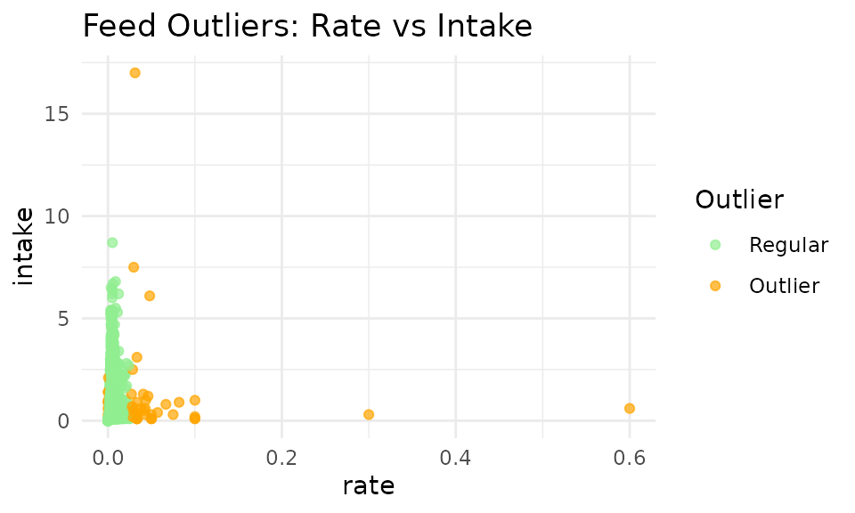
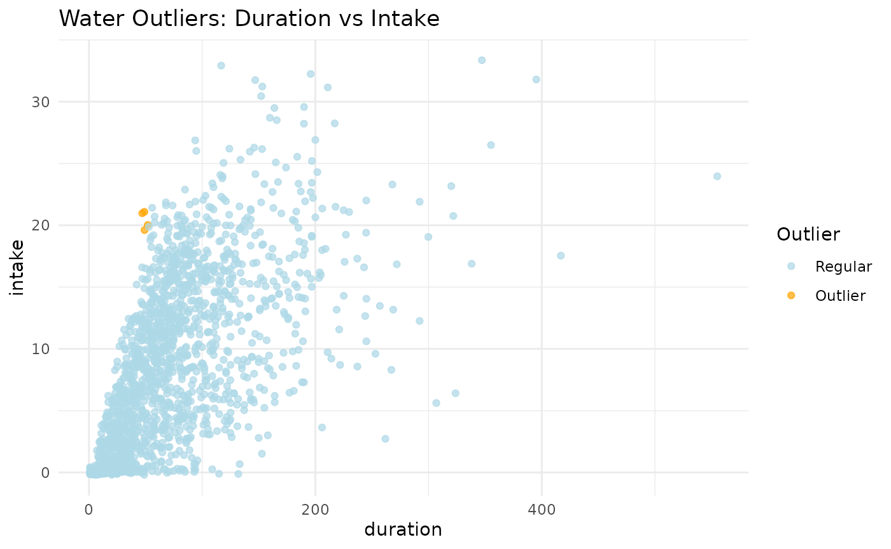

# 1. Data Cleaning

## Meet Ollie 🦦

> *“Hey there, my dear friends!”* I’m **Ollie the Otter** , a curious
> river-explorer and data‑scientist‑in‑training. One morning while
> gliding along my favorite stream, I spotted a dairy barn where
> **hundreds of cows** were visiting automatic feeders and drinkers. The
> beeping RFID readers and steady munch-munch-munching created a
> beautiful data symphony!
>
> Each night, back at my mossy den, I curl up with my otter‑sized laptop
> and learn about R. The friendly farmers have shared their raw visit
> logs, so I can uncover the hidden tales behind my cow friends. I’m
> fascinated by how **every single cow writes its own story in the
> data**—and tonight we’re going to read their stories together using
> the **`moo4feed`** package. Ready to splash in? Let’s go!


------------------------------------------------------------------------

### 1. Why Clean Your Data? 🧹

Raw data from automatic feeders contains numerous quality issues
including negative values,inconsistent timestamps due to daylight saving
changes, and erroneous visit records. Data cleaning transforms these raw
records into analysis-ready datasets suitable for behavioral research.

### 2. Load Required Packages 🧰

``` r
library(moo4feed)   # Main package for animal data processing
library(ggplot2)    # For visualization
library(dplyr)      # For data manipulation
```

The `moo4feed` package includes sample datasets from UBC Dairy Education
and Research Center, allowing you to follow this tutorial without your
own data.

------------------------------------------------------------------------

### 3. Where Are Your Files? 📂

``` r
# For your own data, edit this line:
# extdata_path <- "/path/to/my/raw/files"  # ← your folder path

# For demonstration with sample data:
extdata_path <- system.file("extdata", package = "moo4feed")
```

#### Separate Storage for Feeders and Drinkers

If your feeder and drinker files are stored separately:

``` r
extdata_path_f <- "/path/to/feeder/files"    # 🐄 For feed data
extdata_path_w <- "/path/to/drinker/files"   # 🚰 For water data
```

------------------------------------------------------------------------

### 4. Load in Data files 🔍

We use filename patterns to distinguish feeder data from drinker data:

``` r
# Find all feeder files (VR*.DAT pattern)
fileNames.f <- list.files(
  path       = extdata_path,     # 🐄 Where to look
  pattern    = "^VR.*\\.DAT$",   # 🐄 Pattern to match for feeder files
  recursive  = TRUE,             # Look in subfolders too
  full.names = TRUE              # Include full path
) |> sort()                      # Keep them in order

# Find all drinker files (VW*.DAT pattern)
fileNames.w <- list.files(
  path       = extdata_path,     # 🚰 Where to look
  pattern    = "^VW.*\\.DAT$",   # 🚰 Pattern to match for drinker files
  recursive  = TRUE,
  full.names = TRUE
) |> sort()
```

> **File Naming Requirements:** All filenames must contain a six-digit
> date (YYMMDD) sequence. The system extracts the first six-digit
> sequence as the date.
>
> **Different Filename Patterns:** Change the `pattern` to match your
> file names. For example, if your files are named `FEED_20250715.csv`,
> you could use `pattern = "^FEED_.*\\.csv$"`.

> ✅ Valid formats: `VR200306.DAT`, `Feeder_data_200306.DAT`,
> `wat_200306_01.DAT`
>
> ❌ Invalid: `wat_01_200306.DAT` (leading digits “01” interfere with
> date extraction)

------------------------------------------------------------------------

### 5. Handle Daylight Saving Time ⏰

Daylight saving time (DST) transitions can create timestamp
inconsistencies. Identify DST change dates for your study period:

``` r
# Identify DST transitions for your data years
dst_df <- get_dst_switch_info(
  years = c(2020, 2021),     # 📅 EDIT THIS to match your data years
  tz = "America/Chicago"     # EDIT THIS to your timezone if needed
                             # `Sys.timezone()` uses the timezone your computer is located at. 
)
print(dst_df)
#> # A tibble: 2 × 7
#>    year spring     fall       spring_next_day fall_next_day spring_time        
#>   <dbl> <date>     <date>     <date>          <date>        <dttm>             
#> 1  2020 2020-03-08 2020-11-01 2020-03-09      2020-11-02    2020-03-08 01:59:00
#> 2  2021 2021-03-14 2021-11-07 2021-03-15      2021-11-08    2021-03-14 01:59:00
#> # ℹ 1 more variable: fall_time <dttm>
```

------------------------------------------------------------------------

### 6. Process Data Files 🔄

#### Match Files by Date

To analyze only days with both feeder AND drinker data:

``` r
# Match feeder and drinker files by date
date_compare <- compare_files(fileNames.f, fileNames.w)
fileNames.f <- date_compare$feed    # Updated feeder file list
fileNames.w <- date_compare$water   # Updated drinker file list
cat("Filenames for your feeder data: \n\n", fileNames.f)
#> Filenames for your feeder data: 
#> 
#>  /home/runner/work/_temp/Library/moo4feed/extdata/VR201031.DAT /home/runner/work/_temp/Library/moo4feed/extdata/VR201101.DAT
cat("\n\n")
cat("Filenames for your drinker data: \n\n", fileNames.w)
#> Filenames for your drinker data: 
#> 
#>  /home/runner/work/_temp/Library/moo4feed/extdata/VW201031.DAT /home/runner/work/_temp/Library/moo4feed/extdata/VW201101.DAT

# Get the overall date range of your dataset
date_result <- get_date_range(fileNames.f)
cat("Dataset date range: ", date_result, "\n")
#> Dataset date range:  201031_201101
```

#### 📌 Configure global settings for your data

There are two ways to set up global variables for your data:

##### Option 1: Configure all settings at once with `set_global_cols()`

This is the simplest approach - set everything in one function call:

``` r
# Configure all global variables in one call
# 👉 EDIT THIS to match your data file structure
set_global_cols(
  # Time zone
  tz = "America/Vancouver",
  
  # Column names in your data files
  id_col = "cow",             # animal ID column
  trans_col = "transponder",  # transponder ID column
  start_col = "start",        # visit start time column
  end_col = "end",            # visit end time column
  bin_col = "bin",            # bin ID column
  dur_col = "duration",       # duration column
  intake_col = "intake",      # intake column
  start_weight_col = "start_weight",  # start weight column
  end_weight_col = "end_weight",      # end weight column
  
  # Bin settings
  bins_feed = 1:30,           # feed bin IDs in your barn
  bins_wat = 1:5,             # water bin IDs in your barn
  bin_offset = 100,           # add this to water bin IDs to differentiate from feeder IDs
  
  # Physical bin layout for spatial analysis (neighbor detection, synchronicity)
  # Rows are separated by "\n", bins within rows are separated by "-"
  # Only bins in the same row are spatial neighbors (left/right)
  bin_layout = "1-2-3-4-5-6-101-102-7-8-9-10-11-12-13-14-15-16-17-18-103-104-19-20-21-22-23-24-25-26-27-28-29-30-105"
)
```

##### Option 2: Configure settings individually

Alternatively, you can set each variable separately:

``` r
# ── Time zone ──────────────────────────────────────────────────────────────
set_tz2("America/Vancouver")   # governs the handling of timestamp data

# ── Column names in the raw feeder/drinker files ──────────────────────────────
set_id_col2("cow")             # animal ID
set_trans_col2("transponder")  # ID of transponder
set_start_col2("start")        # visit start time
set_end_col2("end")            # visit end time
set_bin_col2("bin")            # feed-bin identifier

# ── Feed and water bin settings ──────────────────────────────────────────────
set_bins_feed2(1:30)           # the ID of 30 feed bins present in the barn
set_bins_wat2(1:5)             # the ID of 5 water bins present in the barn
set_bin_offset2(100)           # add 100 to water bin ID to differentiate from feeder ID

# Physical bin layout for spatial analysis (neighbor detection, synchronicity)
# Rows separated by "\n", bins within rows separated by "-"
# Only bins in the same row are spatial neighbors (left/right)
# Single row example:
set_bin_layout2("1-2-3-4-5-6-101-102-7-8-9-10-11-12-13-14-15-16-17-18-103-104-19-20-21-22-23-24-25-26-27-28-29-30-105")
```

You can verify any setting at any time with the corresponding getter
functions:

``` r
cat("Timezone:", tz2(), "\n")
#> Timezone: America/Vancouver
cat("ID column:", id_col2(), "\n")
#> ID column: cow
cat("Feed bins:", paste(bins_feed2(), collapse = ", "), "\n")
#> Feed bins: 1, 2, 3, 4, 5, 6, 7, 8, 9, 10, 11, 12, 13, 14, 15, 16, 17, 18, 19, 20, 21, 22, 23, 24, 25, 26, 27, 28, 29, 30
cat("Water bins:", paste(bins_wat2(), collapse = ", "), "\n")
#> Water bins: 1, 2, 3, 4, 5
cat("Bin layout:", bin_layout2(), "\n")
#> Bin layout: 1-2-3-4-5-6-101-102-7-8-9-10-11-12-13-14-15-16-17-18-103-104-19-20-21-22-23-24-25-26-27-28-29-30-105
```

------------------------------------------------------------------------

#### Process Feeder Data

``` r
# Define your column names (if your files don't have headers)
# 👉 EDIT THIS to match your data file structure
col_names <- c("transponder", "cow", "bin", "start", "end", "duration", 
              "start_weight", "end_weight", "comment", "intake", "intake2", 
              "X1", "X2", "X3", "X4", "x5")

# Invalid IDs to remove (test tags, etc.)
# 👉 EDIT THIS to remove any test tags or invalid IDs in your data
drop_ids <- c(0, 1556, 5015, 1111, 1112, 1113, 1114)

# Columns to retain for analysis
# 👉 EDIT THIS to keep only the columns you need for analysis
select_cols <- c("transponder", "cow", "bin", "start", "end", 
                "duration", "start_weight", "end_weight", "intake")

# Process all feeder files
all_fed <- process_all_feed(
    files = fileNames.f,
    col_names   = col_names,     # Column names for your data
    drop_ids    = drop_ids,      # IDs to remove
    select_cols = select_cols,   # Columns to keep (from above)
    sep         = ",",           # 👉 EDIT if your files use a different separator (tab="\t")
    header      = FALSE,         # 👉 Change to TRUE if your files have header rows
    adjust_dst  = TRUE           # Set to FALSE if you don't want DST corrections
)

str(all_fed)
#> List of 2
#>  $ 2020-10-31:'data.frame':  3483 obs. of  10 variables:
#>   ..$ transponder : int [1:3483] 12200060 11954040 12706601 11954040 12200060 12200060 12199974 12706601 12448407 12706601 ...
#>   ..$ cow         : int [1:3483] 5114 4070 7010 4070 5114 5114 5028 7010 6020 7010 ...
#>   ..$ bin         : int [1:3483] 13 24 29 23 17 15 12 30 5 30 ...
#>   ..$ start       : POSIXct[1:3483], format: "2020-10-31 00:03:24" "2020-10-31 00:05:32" ...
#>   ..$ end         : POSIXct[1:3483], format: "2020-10-31 00:04:01" "2020-10-31 00:09:25" ...
#>   ..$ duration    : int [1:3483] 37 233 272 130 513 6 509 307 180 343 ...
#>   ..$ start_weight: num [1:3483] 18.7 8.6 11.9 9.2 14.1 23 32.6 15.1 18 13.9 ...
#>   ..$ end_weight  : num [1:3483] 19.4 7.4 10.9 8.4 12.3 23 32.6 13.9 17.4 12.6 ...
#>   ..$ intake      : num [1:3483] -0.7 1.2 1 0.8 1.8 0 0 1.2 0.6 1.3 ...
#>   ..$ date        : Date[1:3483], format: "2020-10-31" "2020-10-31" ...
#>  $ 2020-11-01:'data.frame':  3646 obs. of  10 variables:
#>   ..$ transponder : int [1:3646] 12706613 12706634 12448477 21268732 12706613 12448477 12706601 12448477 12706613 12706634 ...
#>   ..$ cow         : int [1:3646] 7022 7043 6090 6126 7022 6090 7010 6090 7022 7043 ...
#>   ..$ bin         : int [1:3646] 13 29 15 6 29 14 30 15 29 28 ...
#>   ..$ start       : POSIXct[1:3646], format: "2020-11-01 00:04:26" "2020-11-01 00:03:57" ...
#>   ..$ end         : POSIXct[1:3646], format: "2020-11-01 00:06:03" "2020-11-01 00:08:47" ...
#>   ..$ duration    : int [1:3646] 97 290 142 393 155 155 366 13 71 230 ...
#>   ..$ start_weight: num [1:3646] 12 9.3 23.8 5 8.2 15.9 20.2 23.5 7.8 8.4 ...
#>   ..$ end_weight  : num [1:3646] 12.1 8.2 23.5 3.8 7.8 15.3 19.1 23.5 7.6 7.5 ...
#>   ..$ intake      : num [1:3646] -0.1 1.1 0.3 1.2 0.4 0.6 1.1 0 0.2 0.9 ...
#>   ..$ date        : Date[1:3646], format: "2020-11-01" "2020-11-01" ...
```

> **Geographic Limitation 🌎:** Currently this function only adjust DST
> automatically for North American time zones because we don’t have data
> from other parts of the world. If you are from a different timezone
> and are having trouble handling DST changes yourself, please contact
> the maintainer and I’m happy to add support for your timezone!

Notice when we call the function
[`process_all_feed()`](https://skysheng7.github.io/moo4feed/reference/process_all_feed.md),
we **didn’t** specify `id_col`, `start_col`, `tz` etc—they’re all filled
in automatically from the global settings you defined above. If you ever
need a one-off override (for example, a different time-zone just for
this call) you can still pass that argument directly:

``` r
process_all_feed(files = fileNames.f, tz = "UTC")
```

------------------------------------------------------------------------

#### Process Water Data

``` r
# Column names (only needed because drinker files have no headers)
col_names_wat <- c(
  "transponder", "cow", "bin", "start", "end",
  "duration", "start_weight", "end_weight", "intake"
)

select_cols_wat <- c(
  "transponder", "cow", "bin", "start", "end",
  "duration", "start_weight", "end_weight", "intake"
)

# Process all water files
all_wat <- process_all_water(
  files        = fileNames.w,
  col_names    = col_names_wat,
  drop_ids     = drop_ids,
  select_cols  = select_cols_wat,
  sep          = ",",
  header       = FALSE,
  adjust_dst   = TRUE          # Disable if you don't need DST correction
)

str(all_wat)
#> List of 2
#>  $ 2020-10-31:'data.frame':  572 obs. of  10 variables:
#>   ..$ transponder : int [1:572] 11954040 12448407 12448407 12200060 12706609 12706618 11953971 11953971 11953971 12448417 ...
#>   ..$ cow         : int [1:572] 4070 6020 6020 5114 7018 7027 4001 4001 4001 6030 ...
#>   ..$ bin         : num [1:572] 104 102 102 101 104 101 104 104 104 102 ...
#>   ..$ start       : POSIXct[1:572], format: "2020-10-31 00:03:26" "2020-10-31 00:10:49" ...
#>   ..$ end         : POSIXct[1:572], format: "2020-10-31 00:04:16" "2020-10-31 00:12:16" ...
#>   ..$ duration    : int [1:572] 50 87 44 50 79 69 14 19 22 103 ...
#>   ..$ start_weight: num [1:572] 43.4 43.9 44 41.2 43.4 41.3 43.5 43.4 43.1 43.9 ...
#>   ..$ end_weight  : num [1:572] 26.9 24.3 34.1 36.4 30.4 26.4 43.5 43.1 43 27.9 ...
#>   ..$ intake      : num [1:572] 16.5 19.6 9.9 4.8 13 14.9 0 0.3 0.1 16 ...
#>   ..$ date        : Date[1:572], format: "2020-10-31" "2020-10-31" ...
#>  $ 2020-11-01:'data.frame':  566 obs. of  10 variables:
#>   ..$ transponder : int [1:566] 12448407 12706601 12706613 12200070 12199987 12706634 12448420 12448477 12448420 12448477 ...
#>   ..$ cow         : int [1:566] 6020 7010 7022 5124 5041 7043 6033 6090 6033 6090 ...
#>   ..$ bin         : num [1:566] 104 105 104 102 104 105 104 102 104 102 ...
#>   ..$ start       : POSIXct[1:566], format: "2020-11-01 00:03:19" "2020-11-01 00:03:39" ...
#>   ..$ end         : POSIXct[1:566], format: "2020-11-01 00:04:23" "2020-11-01 00:06:13" ...
#>   ..$ duration    : int [1:566] 64 154 120 307 322 60 33 96 67 92 ...
#>   ..$ start_weight: num [1:566] 43.5 40.9 43.2 43.9 43.3 41 43.6 43.9 42.4 44 ...
#>   ..$ end_weight  : num [1:566] 40.2 22.4 28.5 38.2 22.6 26.8 42.4 33.5 35.6 39.8 ...
#>   ..$ intake      : num [1:566] 3.3 18.5 14.7 5.7 20.7 14.2 1.2 10.4 6.8 4.2 ...
#>   ..$ date        : Date[1:566], format: "2020-11-01" "2020-11-01" ...
```

------------------------------------------------------------------------

### 7. Quality Check Your Data 🕵️‍♀️

Quality control identifies and corrects common data issues including
overlapping visits, impossible values, and missing records.

#### Configure Quality Check Parameters

``` r
# Define quality control thresholds
# 👉 EDIT the thresholds to match your data and preferences
my_qc_config <- qc_config(
  # Feed thresholds
  high_dur_feed = 2000,          # Flag feed visits longer than 2000 seconds
  large_intake_visit_feed = 8,   # Flag feed visits with more than 8kg intake
  large_intake_rate_feed = 0.008, # Flag feed intake rates above 0.008 kg/s
  low_feed_intake = 35,          # Flag cows eating less than 35kg/day
  high_feed_intake = 75,         # Flag cows eating more than 75kg/day
  
  # Water thresholds
  high_dur_water = 1800,         # Flag water visits longer than 1800 seconds
  large_intake_visit_water = 30, # Flag water visits with more than 30L intake
  large_intake_rate_water = 0.35, # Flag water intake rates above 0.35 L/s
  low_wat_intake = 60,           # Flag cows drinking less than 60L/day
  high_wat_intake = 180,         # Flag cows drinking more than 180L/day
  
  # General settings
  low_visit_threshold = 10,      # Flag bins with fewer than 10 visits/day
  total_cows_expected = 48,      # Set to your herd size
  replacement_threshold = 26,    # Time gap (s) to classify replacement behavior
  calibration_error = 0.5        # Feeder/drinkercalibration error (kg/L)
)
```

#### Run the quality check

``` r
# Run comprehensive quality check
qc_results <- qc(
  feed = all_fed,               # Your processed feeder data
  water = all_wat,              # Your processed drinker data
  cfg = my_qc_config,           # Your custom thresholds
  verbose = FALSE,               # Do not show detailed warning messages about errorous visits, set to TRUE to see them
  fix_double_detections = TRUE  # Automatically fix overlapping visits
)

# Store warnings for review
warning <- qc_results$warnings
```

The [`qc()`](https://skysheng7.github.io/moo4feed/reference/qc.md)
function performs multiple validation steps:

> 1.  Combined feed and water data for analysis
> 2.  Checked if we have the expected number of cows each day
> 3.  Flagged double detections (when the same cow is detected at
>     different bins at the same time) and fixed them
> 4.  Flagged negative values in duration, intake, or weight
>     measurements
> 5.  Removed records with negative durations or intakes
> 6.  Identified abnormally large feed/water intakes
> 7.  Flags cows that did not feed or drink after noon (potentially lost
>     ear tag or due to illness)
> 8.  Flagged bins with very low traffic or no visits at all
>     (potentially bin malfunction)

#### Extract Cleaned Data

``` r
# The qc_results contains our cleaned data
qc_feed <- qc_results$feed     # Cleaned feeder data
qc_water <- qc_results$water   # Cleaned drinker data
qc_combined <- qc_results$combined   # Merged feed+water data
```

### 8. Traditional vs. Advanced Outlier Detection 📊

#### Traditional 3-Standard Deviation Method

Historically, dairy research has used rigid statistical cutoffs to
remove outliers. The traditional approach removes all data points beyond
3 standard deviations from the mean:

``` r
# Demonstrate traditional outlier removal on feed data
demo_feed <- do.call(rbind, qc_feed)  # Combine all days into one dataframe

# Calculate traditional 3-SD cutoffs for intake
intake_mean <- mean(demo_feed$intake, na.rm = TRUE)
intake_sd <- sd(demo_feed$intake, na.rm = TRUE)
intake_lower <- max(0, (intake_mean - 3 * intake_sd)) # set lower bound to 0
intake_upper <- intake_mean + 3 * intake_sd

# Calculate traditional 3-SD cutoffs for duration
dur_mean <- mean(demo_feed$duration, na.rm = TRUE)
dur_sd <- sd(demo_feed$duration, na.rm = TRUE)
dur_lower <- max(0, (dur_mean - 3 * dur_sd)) # set lower bound to 0
dur_upper <- dur_mean + 3 * dur_sd

# Flag outliers using traditional method
demo_feed$outlier <- "N"
demo_feed$outlier[demo_feed$intake < intake_lower | 
                                 demo_feed$intake > intake_upper |
                                 demo_feed$duration < dur_lower | 
                                 demo_feed$duration > dur_upper] <- "Y"

# Visualize traditional outlier detection
p_traditional <- viz_outliers(
  demo_feed,
  x_var = "intake",
  y_var = "duration",
  title = "Traditional Outlier Detection (3 SD from mean)",
  jitter_amount = 0,
  regular_color = "lightgreen",
  outlier_color = "orange"
)

print(p_traditional)
```



#### Limitations of the Traditional 3-SD Method

The standard approach using a 3-standard-deviation (3-SD) cutoff
presents several challenges:

1.  **Overly strict thresholds**: While effective at removing extreme
    outliers, this method imposes rigid, rectangular cutoff zones that
    may not align with biological rationales.
2.  **Excessive conservatism**: The approach may discard biologically
    reasonable extremes. Previous validation study showed that long
    feeding visit accompanied by high feed intake is possible, but they
    dare considered data errors using 3-SD method. In the meanwhile,
    it’s not likely for a cow to consume 3kg in 5 seconds, but those
    will not be labeled as outliers using 3-SD method.
3.  **Misclassification of valid data**: Many feeding events that appear
    normal in the context of cow behavior are incorrectly flagged as
    outliers simply because they fall outside the 3-SD range. Excluding
    these points can significantly distort estimates of individual
    animal’s daily intake and feeding duration.
4.  **Misses multivariate relationships**: The method evaluates each
    variable independently, failing to consider the relationship between
    intake, duration, and feeding rate.
5.  **Ignores differences among farms and animals**: Everyone’s data is
    different. The method does not account for variations in feeding
    behavior across different farms or individual cows.

### 9. Advanced KNN Outlier Detection 🔬

K-Nearest Neighbors (KNN) outlier detection evaluates data points in
multidimensional space, considering relationships between intake,
duration, and rate simultaneously. The KNN method looks at each data
point and compares it to its neighbors. If a point is very different
from its neighbors (in the 3-demensional space of intake, duration, and
rate), it might be an outlier.

#### KNN Method Advantages

- **Multidimensional analysis**: Considers the intake, duration, and
  rate in one go
- **Flexible boundaries**: You can change the boundaries to fit YOUR
  data
- **Relationship-aware**: Preserves correlations between variables

``` r
# Apply KNN outlier detection
feed_with_outliers <- knn_clean_feed(
  qc_feed,            # Our cleaned feed data
  k = 50,                # Number of neighbors to consider
  threshold_percentile = 99.3,  # Threshold for outlier detection
  # Custom scaling helps balance the influence of each variable
  custom_scaling = list(
    rate = 10000,        # Scaling for intake rate
    intake = 7,          # Scaling for intake amount
    duration = 0.03      # Scaling for duration
  ),
  remove_outliers = FALSE # Set to TRUE if you wish to remove outliers
)

# Visualize KNN outlier detection
p_knn <- viz_outliers(
  feed_with_outliers,
  x_var = "rate",
  y_var = "intake",
  title = "Feed Outliers: Rate vs Intake",
  jitter_amount = 0,
  regular_color = "lightgreen",
  outlier_color = "orange"
)
print(p_knn)
```



> **Ollie’s Tips for KNN Outlier Detection:** 🦦
>
> - **Experiment with settings**: Try different values for `k`,
>   `threshold_percentile`, and `custom_scaling` to see what works best
>   for your data
> - **Visualize before removing**: Always use
>   [`viz_outliers()`](https://skysheng7.github.io/moo4feed/reference/viz_outliers.md)
>   to check if the detected outliers make sense before removing them
> - **Custom scaling matters**: Adjusting the scaling values helps
>   balance the influence of different variables and adjusting for
>   variables at different scales:
>   - e.g., duration is in tens to hundreds of seconds, but rate is
>     often \< 1, so rate needs to be scaled up in order to be
>     comparable to duration
>   - Increase scaling for variables that should have more influence
>   - Decrease scaling for variables that should have less influence
> - **Why these scaling values?**: These values were chosen to be
>   conservative and not remove too many data points. From previous
>   experience, it’s likely for a cow to have very long durations per
>   visit, but very unlikely to have large intake in a short time, so we
>   flagged outliers to catch visits with large intake and high rate.
> - **Be cautious**: Don’t set `remove_outliers = TRUE` until you’re
>   confident the detection is working correctly

**Important Note**: The 2D visualization above only shows two dimensions
(duration vs. intake), but KNN analysis operates in 3D space using:
**Intake** (kg), **Duration** (seconds), and **Rate** (kg/s). Some
points that appear normal in 2D may be outliers when considering all
three dimensions.

#### Apply KNN to Water Data

``` r
# KNN outlier detection for water data
water_with_outliers <- knn_clean_water(
  qc_water,           # Our cleaned water data
  k = 50,                # Number of neighbors to consider
  threshold_percentile = 99,  # Threshold for outlier detection
  # Water data often needs different scaling
  custom_scaling = list(
    rate = 2000,           # Scaling for intake rate
    intake = 7,          # Scaling for intake amount
    duration = 0.01      # Scaling for duration
  ),
  remove_outliers = FALSE # Set to TRUE if you wish to remove outliers
)

# Let's also look at rate vs intake
p2 <- viz_outliers(
  water_with_outliers,
  x_var = "rate",
  y_var = "intake",
  title = "Water Outliers: Rate vs Intake",
  jitter_amount = 0,
  regular_color = "lightblue",
  outlier_color = "orange"
)
print(p2)
```



#### Remove Outliers

Once you’re satisfied with the outlier detection, you can choose to
remove them:

``` r
# Remove outliers from feed data
cleaned_feed_no_outliers <- knn_clean_feed(
  qc_feed,
  k = 50,
  threshold_percentile = 99.3,
  custom_scaling = list(rate = 10000, intake = 7, duration = 0.03),
  remove_outliers = TRUE
)

# Remove outliers from water data
cleaned_water_no_outliers <- knn_clean_water(
  qc_water,
  k = 50,
  threshold_percentile = 99.8,
  custom_scaling = list(rate = 2000, intake = 1, duration = 0.01),
  remove_outliers = TRUE
)

# Create final cleaned datasets
clean_feed <- cleaned_feed_no_outliers
clean_water <- cleaned_water_no_outliers
clean_comb <- combine_feed_water(clean_feed, clean_water)
```

### 10. Daily Intake Summaries 📈

``` r
# Generate daily intake summaries
daily_summary <- feed_water_summary(
  feed = qc_feed,           # Your cleaned feed data 
  water = qc_water,         # Your cleaned water data
  warn = warning,              # Warning dataframe to update
  cfg = my_qc_config           # Quality check configuration
)

# Inspect the summary results
summary_df <- daily_summary$summary
head(summary_df)
#> # A tibble: 6 × 8
#>   date         cow feed_intake feed_duration feed_visits water_intake
#>   <date>     <int>       <dbl>         <dbl>       <int>        <dbl>
#> 1 2020-10-31  2074        60.9         11163          46        105. 
#> 2 2020-10-31  3150        59.2         17618          52        116. 
#> 3 2020-10-31  4001        53.3          8099          55         75  
#> 4 2020-10-31  4044        63.4         12038          73        125. 
#> 5 2020-10-31  4070        63.3         12530          59        123. 
#> 6 2020-10-31  4072        54.7         13679          79         99.5
#> # ℹ 2 more variables: water_duration <dbl>, water_visits <int>

# Look at the updated warnings that include intake anomalies
warning <- daily_summary$warn
head(warning)
#> # A tibble: 2 × 16
#>   date       total_cows missing_cow double_detection_bins negative_visit_bins
#>   <chr>           <int> <chr>       <chr>                 <chr>              
#> 1 2020-10-31         47 Yes         30                    6; 12; 13          
#> 2 2020-11-01         47 Yes         3; 5; 6; 18           6; 12; 13; 30      
#> # ℹ 11 more variables: cows_disappeared_after_noon <chr>,
#> #   bins_never_visited <chr>, bins_low_traffic <chr>, long_dur_feeder <chr>,
#> #   large_intake_feed_visit <chr>, low_daily_feed_intake_cows <chr>,
#> #   high_daily_feed_intake_cows <chr>, long_dur_drinker <chr>,
#> #   large_intake_water_visit <chr>, low_daily_water_intake_cows <chr>,
#> #   high_daily_water_intake_cows <chr>
```

### 11. Summary

This tutorial demonstrated comprehensive data cleaning for automatic
feeder data:

✅ **File processing**: Handled multiple data files with date matching

✅ **Quality control**: Identified and corrected common data issues

✅ **Advanced outlier detection**: Compared traditional vs. KNN methods

✅ **Daily summaries**: Created analysis-ready intake metrics

The cleaned datasets are now ready for behavioral analysis as
demonstrated in subsequent tutorials.

### 12. Code cheatsheet 📋

``` r
#' Copy and modify these code blocks for your own analysis!

# ---- SETUP: Load Packages ----
library(moo4feed)

# ---- STEP 1: Set Paths to Data Files ----
# For your own data:
# extdata_path <- "/path/to/my/raw/files"

# Or for the demo data:
extdata_path <- system.file("extdata", package = "moo4feed")

# If feeders and drinkers are in different folders:
# extdata_path_f <- "/path/to/feeder/files"
# extdata_path_w <- "/path/to/drinker/files"

# ---- STEP 2: Find Data Files ----
# Find all feeder files (VR*.DAT)
fileNames.f <- list.files(
  path       = extdata_path,
  pattern    = "^VR.*\\.DAT$",
  recursive  = TRUE,
  full.names = TRUE
) |> sort()

# Find all drinker files (VW*.DAT)
fileNames.w <- list.files(
  path       = extdata_path,
  pattern    = "^VW.*\\.DAT$",
  recursive  = TRUE,
  full.names = TRUE
) |> sort()

# ---- STEP 3: Handle Daylight Saving Time ----
dst_df <- get_dst_switch_info(years = c(2020, 2021), tz = "America/Chicago")

# ---- STEP 4: Match Files by Date ----
date_compare <- compare_files(fileNames.f, fileNames.w)
fileNames.f <- date_compare$feed
fileNames.w <- date_compare$water

# Get the overall date range
date_result <- get_date_range(fileNames.f)

# ---- STEP 5: Configure Global Settings ----
# Option 1: All at once
set_global_cols(
  # Time zone
  tz = "America/Vancouver",
  
  # Column names in your data files
  id_col = "cow",
  trans_col = "transponder",
  start_col = "start",
  end_col = "end",
  bin_col = "bin",
  dur_col = "duration",
  intake_col = "intake",
  start_weight_col = "start_weight",
  end_weight_col = "end_weight",
  
  # Bin settings
  bins_feed = 1:30,
  bins_wat = 1:5,
  bin_offset = 100
)

# Option 2: Individual settings (alternative)
# set_tz2("America/Vancouver")
# set_id_col2("cow")
# set_trans_col2("transponder")
# set_start_col2("start")
# set_end_col2("end")
# set_bin_col2("bin")
# set_bins_feed2(1:30)
# set_bins_wat2(1:5)
# set_bin_offset2(100)

# ---- STEP 6: Process Feeder Data ----
# Define column names for feeder files
col_names <- c("transponder", "cow", "bin", "start", "end", "duration", 
              "start_weight", "end_weight", "comment", "intake", "intake2", 
              "X1", "X2", "X3", "X4", "x5")

# IDs to remove
drop_ids <- c(0, 1556, 5015, 1111, 1112, 1113, 1114)

# Columns to keep
select_cols <- c("transponder", "cow", "bin", "start", "end", 
                "duration", "start_weight", "end_weight", "intake")

# Process all feeder files
all_fed <- process_all_feed(
    files = fileNames.f,
    col_names   = col_names,
    drop_ids    = drop_ids,
    select_cols = select_cols,
    sep         = ",",
    header      = FALSE,
    adjust_dst  = TRUE
)

# ---- STEP 7: Process Water Data ----
# Column names for water files
col_names_wat <- c(
  "transponder", "cow", "bin", "start", "end",
  "duration", "start_weight", "end_weight", "intake"
)

# Use same IDs to remove
drop_ids <- c(0, 1556, 5015, 1111:1114)

# Columns to keep
select_cols_wat <- c(
  "transponder", "cow", "bin", "start", "end",
  "duration", "start_weight", "end_weight", "intake"
)

# Process all water files
all_wat <- process_all_water(
  files        = fileNames.w,
  col_names    = col_names_wat,
  drop_ids     = drop_ids,
  select_cols  = select_cols_wat,
  sep          = ",",
  header       = FALSE,
  adjust_dst   = TRUE
)

# ---- STEP 8: Quality Check Configuration ----
my_qc_config <- qc_config(
  # Feed thresholds
  high_dur_feed = 2000,
  large_intake_visit_feed = 8,
  large_intake_rate_feed = 0.008,
  low_feed_intake = 35,
  high_feed_intake = 75,
  
  # Water thresholds
  high_dur_water = 1800,
  large_intake_visit_water = 30,
  large_intake_rate_water = 0.35,
  low_wat_intake = 60,
  high_wat_intake = 180,
  
  # General settings
  low_visit_threshold = 10,
  total_cows_expected = 48,
  replacement_threshold = 26,
  calibration_error = 0.5
)

# ---- STEP 9: Run Quality Check ----
qc_results <- qc(
  feed = all_fed,
  water = all_wat,
  cfg = my_qc_config,
  id_col = id_col2(),               # Animal ID column (default from global vars)
  start_col = start_col2(),         # Visit start time column (default from global vars)
  end_col = end_col2(),             # Visit end time column (default from global vars)
  bin_col = bin_col2(),             # Bin/feeder ID column (default from global vars)
  dur_col = duration_col2(),        # Visit duration column (default from global vars)
  intake_col = intake_col2(),       # Intake amount column (default from global vars)
  start_weight_col = start_weight_col2(),  # Start weight column (default from global vars)
  end_weight_col = end_weight_col2(),      # End weight column (default from global vars)
  tz = tz2(),                       # Timezone (default from global vars)
  bins_feed = bins_feed2(),         # Valid feed bin numbers (default from global vars)
  bins_wat = bins_wat2(),           # Valid water bin numbers (default from global vars)
  bin_offset = bin_offset2(),       # Bin offset for water bins (default from global vars)
  verbose = FALSE,
  fix_double_detections = TRUE
)

# Store warnings
warning <- qc_results$warnings

# ---- STEP 10: Extract Cleaned Data ----
qc_feed <- qc_results$feed
qc_water <- qc_results$water
qc_combined <- qc_results$combined

# ---- STEP 11: KNN Outlier Detection ----
# Detect outliers in feed data
feed_with_outliers <- knn_clean_feed(
  qc_feed,
  k = 50,
  threshold_percentile = 99.3,
  custom_scaling = list(
    rate = 10000,
    intake = 7,
    duration = 0.03
  ),
  intake_col = intake_col2(),       # Intake amount column (default from global vars)
  duration_col = duration_col2(),   # Visit duration column (default from global vars)
  date_col = "date",                # Date column name
  remove_outliers = FALSE
)

# Visualize feed outliers
p1 <- viz_outliers(
  feed_with_outliers,
  x_var = "duration",
  y_var = "intake",
  title = "Feed Outliers: Duration vs Intake",
  jitter_amount = 0.2,
  regular_color = "lightgreen",
  outlier_color = "orange"
)
print(p1)

p2 <- viz_outliers(
  feed_with_outliers,
  x_var = "rate",
  y_var = "intake",
  title = "Feed Outliers: Rate vs Intake",
  jitter_amount = 0,
  regular_color = "lightgreen",
  outlier_color = "orange"
)
print(p2)

# Detect outliers in water data
water_with_outliers <- knn_clean_water(
  qc_water,
  k = 50,
  threshold_percentile = 99,
  custom_scaling = list(
    rate = 2000,
    intake = 7,
    duration = 0.01
  ),
  intake_col = intake_col2(),       # Intake amount column (default from global vars)
  duration_col = duration_col2(),   # Visit duration column (default from global vars)
  date_col = "date",                # Date column name
  remove_outliers = FALSE
)

# Visualize water outliers
p3 <- viz_outliers(
  water_with_outliers,
  x_var = "duration",
  y_var = "intake",
  title = "Water Outliers: Duration vs Intake",
  regular_color = "lightblue",
  outlier_color = "orange"
)
print(p3)

p4 <- viz_outliers(
  water_with_outliers,
  x_var = "rate",
  y_var = "intake",
  title = "Water Outliers: Rate vs Intake",
  jitter_amount = 0,
  regular_color = "lightblue",
  outlier_color = "orange"
)
print(p4)

# Remove outliers
cleaned_feed_no_outliers <- knn_clean_feed(
  qc_feed,
  k = 50,
  threshold_percentile = 99.3,
  custom_scaling = list(rate = 10000, intake = 7, duration = 0.03),
  intake_col = intake_col2(),       # Intake amount column (default from global vars)
  duration_col = duration_col2(),   # Visit duration column (default from global vars)
  date_col = "date",                # Date column name
  remove_outliers = TRUE
)

# Same for water data
cleaned_water_no_outliers <- knn_clean_water(
  qc_water,
  k = 50,
  threshold_percentile = 99.8,
  custom_scaling = list(rate = 2000, intake = 1, duration = 0.01),
  intake_col = intake_col2(),       # Intake amount column (default from global vars)
  duration_col = duration_col2(),   # Visit duration column (default from global vars)
  date_col = "date",                # Date column name
  remove_outliers = TRUE
)

# Set final cleaned datasets
clean_feed <- cleaned_feed_no_outliers
clean_water <- cleaned_water_no_outliers
clean_comb <- combine_feed_water(clean_feed, clean_water)

# ---- STEP 12: Create Daily Summaries ----
daily_summary <- feed_water_summary(
  feed = qc_feed,
  water = qc_water,
  warn = warning,
  cfg = my_qc_config,
  id_col = id_col2(),               # Animal ID column (default from global vars)
  intake_col = intake_col2(),       # Intake amount column (default from global vars)
  dur_col = duration_col2()         # Visit duration column (default from global vars)
)

# Get summary dataframe
summary_df <- daily_summary$summary

# Get updated warnings
warning <- daily_summary$warn
```
