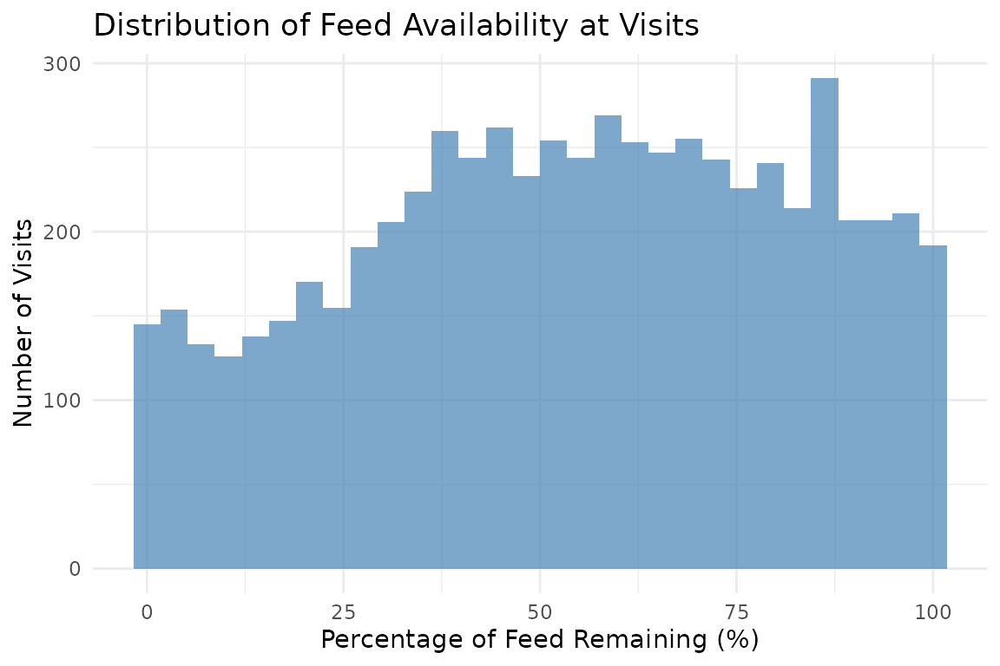
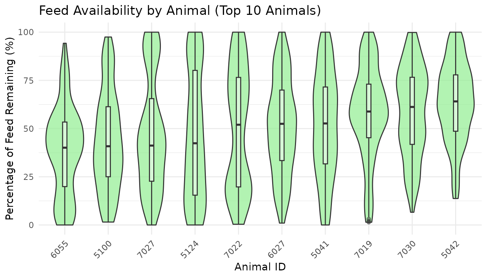
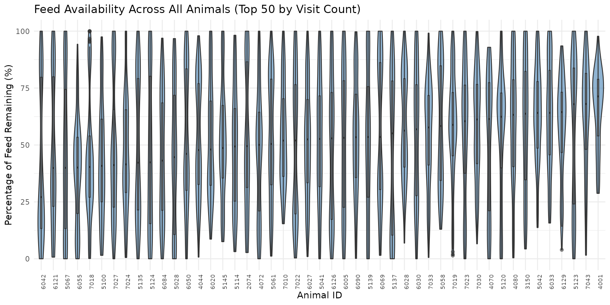

# 7. Feed Availability Analysis

``` r
library(moo4feed)
library(ggplot2)
library(dplyr)
```

## 1. Set Your Global Variables First

Before analyzing feed availability patterns, configure global variables
to match your data structure:

``` r
# Configure global variables for your data structure
set_global_cols(
  id_col = "cow",           # Animal ID column name
  start_col = "start",      # Visit start time column
  end_col = "end",          # Visit end time column
  bin_col = "bin",          # Bin/feeder ID column
  intake_col = "intake",    # Feed intake amount column
  dur_col = "duration",     # Visit duration column
  start_weight_col = "start_weight",  # Bin weight at visit start
  end_weight_col = "end_weight",      # Bin weight at visit end
  tz = "America/Vancouver"  # Your timezone
)
```

## 2. Introduction to Feed Availability Analysis

Understanding when feed is added to bins and how much feed is available
when animals visit each bin can help researchers and farmers better
track feed management on daily basis, and identify animals that may be
disadvantaged (e.g., those who consistently eat the “left-over” feed).

- **Monitor feed addition**: Identify when bins are refilled throughout
  the day, the frequency of feed additions, and the amount of feed added
  to each bin.
- **Identify disadvantaged animals**: Animals visiting when bins are
  nearly empty may be disadvantaged

## 3. Prerequisites

This tutorial assumes completion of previous data processing steps in
[**Tutorial 1: Data
Cleaning**](https://skysheng7.github.io/moo4feed/articles/data_cleaning.md).

Your data must include **start_weight** and **end_weight** columns
representing the bin weight at the beginning and end of each visit.

## 4. Data Preparation

``` r
# Load cleaned example data
data(clean_feed)

# If you're using your own data from previous tutorials, use this instead:
# clean_feed <- your_cleaned_feed_data     # From your cleaning results

# Quick peek at our data structure
head(clean_feed[[1]], 3)  # First day, first 3 rows
#> # A tibble: 3 × 11
#>   transponder   cow   bin start               end                 duration
#>         <int> <int> <dbl> <dttm>              <dttm>                 <dbl>
#> 1    12448407  6020     1 2020-10-31 00:26:12 2020-10-31 00:27:36       84
#> 2    11954014  4044     1 2020-10-31 01:17:43 2020-10-31 01:22:13      270
#> 3    11954042  4072     1 2020-10-31 01:37:30 2020-10-31 01:37:52       22
#> # ℹ 5 more variables: start_weight <dbl>, end_weight <dbl>, intake <dbl>,
#> #   date <date>, rate <dbl>

cat("\nTotal days of feed data:", length(clean_feed), "\n")
#> 
#> Total days of feed data: 2
```

## 5. Detecting Feed Addition Events

Feed additions are detected by identifying significant weight increases
between consecutive visits at the same bin. When the bin weight at the
start of a visit is much higher than the bin weight at the end of the
previous visit, feed was probably added in between.

### Understanding Feed Addition Detection

The
[`detect_feed_additions()`](https://skysheng7.github.io/moo4feed/reference/detect_feed_additions.md)
function gives you 2 options to processes feed data:

**Option 1: Within-bin aggregation (always applied)**

When a farmer adds feed to the same bin multiple times in quick
succession (within `max_bin_time_gap` seconds), those additions are
combined into a single feed event for that bin.

For example, a farmer might add feed to Bin 1 three times in the same
morning:

| Time   | Bin   | Amount |
|--------|-------|--------|
| 6:00am | Bin 1 | 10 kg  |
| 6:01am | Bin 1 | 20 kg  |
| 6:03am | Bin 1 | 15 kg  |

Instead of recording three separate entries, the function combines them
into one: **45 kg added to Bin 1 at 6:00am**.

Example code below:

``` r
# Detect feed additions for each bin separately
feed_additions <- detect_feed_additions(
  data = clean_feed,
  min_weight_increase = 5,      # Minimum kg increase to count as addition

  max_bin_time_gap = 3600,      # Group rapid additions within 1 hour
  aggregate_all_bin = FALSE     # Keep per-bin additions (required for availability calc)
)

# Examine the first day's feed additions
head(feed_additions[[1]])
#>         date                time weight_increase bin_weight_after_fill bin
#> 1 2020-10-31 2020-10-31 06:04:40            34.6                  40.0  21
#> 2 2020-10-31 2020-10-31 06:04:51            27.5                  41.6  15
#> 3 2020-10-31 2020-10-31 06:04:53            31.5                  35.0   2
#> 4 2020-10-31 2020-10-31 06:05:00            30.4                  35.1   7
#> 5 2020-10-31 2020-10-31 06:05:16            33.3                  40.2   3
#> 6 2020-10-31 2020-10-31 06:05:20            49.1                  54.0  23
```

Each feed addition event contains:

- **`date`**: Date of the feed addition
- **`bin`**: Bin identifier where feed was added
- **`time`**: Timestamp of the first detected addition in this event
- **`weight_increase`**: Total amount of feed added (kg)
- **`bin_weight_after_fill`**: Total bin weight after the final addition
  (kg)

**Option 2: Across-bin aggregation (optional)**

When `aggregate_all_bin = TRUE`, feed additions across *different* bins
within a short time window are grouped into a single farm-level feeding
event. This captures the full picture of a feeding session — when it
started, when it ended, and the average amount added per bin.

For example, during a morning feeding session, a farmer might add:

| Time   | Bin   | Amount |
|--------|-------|--------|
| 6:00am | Bin 1 | 50 kg  |
| 6:05am | Bin 2 | 60 kg  |
| 6:10am | Bin 3 | 45 kg  |

Instead of three separate bin-level records, the function returns one
event: **155 kg added across all bins at 6:00am**.

Use this option when you care about total feed added per session, rather
than the breakdown per bin.

Example code below:

``` r
# Detect multi-bin feed events
feed_events <- detect_feed_additions(
  data = clean_feed,
  min_weight_increase = 5,
  max_bin_time_gap = 3600,
  min_bins_for_group = 3,       # At least 3 bins filled to count as event
  aggregate_all_bin = TRUE      # Aggregate across bins
)

# Examine the aggregated events
cat("Aggregated feed events on first day:\n")
#> Aggregated feed events on first day:
head(feed_events[[1]])
#>         date event_id         event_start           event_end bins_filled
#> 1 2020-10-31        1 2020-10-31 06:04:40 2020-10-31 06:26:34          30
#> 2 2020-10-31        3 2020-10-31 15:46:59 2020-10-31 16:13:30          29
#>   avg_weight_increase min_weight_increase max_weight_increase
#> 1            35.48333                11.6                85.5
#> 2            54.24828                18.1                87.7

cat("\nMulti-bin feed events per day:\n")
#> 
#> Multi-bin feed events per day:
sapply(feed_events, nrow)
#> 2020-10-31 2020-11-01 
#>          2          2
```

Aggregated events contain:

- **`event_id`**: Unique identifier for the feed event on that day
- **`event_start`**: When farmers started adding feed to the bins
- **`event_end`**: When farmers finished adding feed to the bins
- **`bins_filled`**: Number of bins refilled in the event
- **`avg_weight_increase`**: Average feed added across bins (kg)

## 6. Calculating Feed Availability at Each Visit

Once we have per-bin feed additions, we can calculate the percentage of
feed remaining when each animal visits. This helps identify animals that
consistently visit when bins are nearly empty.

### Calculate Feed Availability

``` r
# Calculate feed availability for each visit
availability <- calculate_feed_availability(
  visit_data = clean_feed,
  feed_addition_data = feed_additions  # Must use aggregate_all_bin = FALSE
)

# The function returns a list with two elements:
# 1. visits - visit-level data with feed percentages
# 2. daily_summary - summary statistics per animal per day
```

### Visit-Level Results

``` r
# Examine visit-level data from first day (all columns in a scrollable table)
visits_with_availability <- availability$visits[[1]]

tbl <- tail(visits_with_availability[, c("cow", "bin", "start", "start_weight",
                                          "feed_addition_time", "bin_weight_after_fill",
                                          "pct_feed_remaining")])
html_table <- knitr::kable(tbl, format = "html")
cat('<div style="overflow-x: auto;">', html_table, '</div>')
```

|  cow | bin | start               | start_weight | feed_addition_time  | bin_weight_after_fill | pct_feed_remaining |
|-----:|----:|:--------------------|-------------:|:--------------------|----------------------:|-------------------:|
| 6005 |  30 | 2020-10-31 22:29:25 |         22.4 | 2020-10-31 15:54:27 |                  58.3 |           38.42196 |
| 6005 |  30 | 2020-10-31 22:58:00 |         22.1 | 2020-10-31 15:54:27 |                  58.3 |           37.90738 |
| 6069 |  30 | 2020-10-31 22:59:30 |         21.8 | 2020-10-31 15:54:27 |                  58.3 |           37.39280 |
| 6028 |  30 | 2020-10-31 23:00:29 |         21.6 | 2020-10-31 15:54:27 |                  58.3 |           37.04974 |
| 6069 |  30 | 2020-10-31 23:14:07 |         21.2 | 2020-10-31 15:54:27 |                  58.3 |           36.36364 |
| 6069 |  30 | 2020-10-31 23:17:52 |         20.5 | 2020-10-31 15:54:27 |                  58.3 |           35.16295 |

New columns added to visit data:

- **`feed_addition_time`**: When feed was last added to this bin
- **`feed_added_weight`**: Weight of feed added to this bin (kg)
- **`bin_weight_after_fill`**: Bin weight after feed was added (kg).
  Note this is likely to be different from the `feed_added_weight`
  because it includes any residual feed that was already in the bin.
- **`pct_feed_remaining`**: Percentage of feed remaining (`start_weight`
  / `bin_weight_after_fill`) when visit started

**Important**: For multi-day data, visits occurring early in a day
(before any feed addition on that day) are automatically matched to feed
additions from the previous calendar day. This works even if days are
out of order or have gaps in the data. The function uses actual dates
(from the `date` column or list names) to determine which day is
“previous”, not list position.

### Daily Summary Statistics

``` r
# Examine daily summary from first day
daily_summary <- availability$daily_summary[[1]]

head(daily_summary)
#>         date  cow mean_pct_feed_remaining median_pct_feed_remaining
#> 1 2020-10-31 2074                59.70264                  53.96419
#> 2 2020-10-31 3150                62.22631                  67.39741
#> 3 2020-10-31 4001                68.03947                  73.08782
#> 4 2020-10-31 4044                56.13479                  52.74473
#> 5 2020-10-31 4070                44.92761                  37.19187
#> 6 2020-10-31 4072                48.04099                  51.27479
#>   sd_pct_feed_remaining total_visits_analyzed
#> 1              28.59389                    45
#> 2              26.29525                    52
#> 3              18.72861                    49
#> 4              24.65588                    58
#> 5              29.56021                    54
#> 6              26.01743                    71
```

The daily summary provides per animal:

- **`mean_pct_feed_remaining`**: Average percentage of feed remaining
  across visits
- **`median_pct_feed_remaining`**: Median percentage of feed remaining
  across visits
- **`sd_pct_feed_remaining`**: Standard deviation of percentage of feed
  remaining across visits
- **`total_visits_analyzed`**: Number of visits with valid feed data

## 7. Analyzing Feed Availability Patterns

### Identify Potentially Disadvantaged Animals

Animals consistently visiting when little feed remains may be
competitively disadvantaged. We calculated statistics using visit-level
data to get accurate measures across all visits recorded in multiple
days.Using median is recommended because the distribution of feed
availability is often skewed, making median a more robust measure of
central tendency than mean.

``` r
# Combine all visits across days
all_visits <- do.call(rbind, availability$visits)

# Filter to visits with valid feed percentage
valid_visits <- all_visits |>
  dplyr::filter(!is.na(pct_feed_remaining))

# Calculate overall statistics per animal using visit-level data
low_availability <- valid_visits |>
  dplyr::group_by(cow) |>
  dplyr::summarise(
    overall_mean_pct = mean(pct_feed_remaining, na.rm = TRUE),
    overall_median_pct = median(pct_feed_remaining, na.rm = TRUE),
    total_visits = dplyr::n(),
    .groups = "drop"
  ) |>
  dplyr::arrange(overall_median_pct)

# Animals visiting when little feed remains (lowest median feed availability)
head(low_availability, 5)
#> # A tibble: 5 × 4
#>     cow overall_mean_pct overall_median_pct total_visits
#>   <int>            <dbl>              <dbl>        <int>
#> 1  6042             41.1               27.1           97
#> 2  6121             47.4               39.9          112
#> 3  5067             45.3               40.0          149
#> 4  6055             38.6               40.1          201
#> 5  7018             44.0               40.3          155

# Animals visiting when most feed remains (highest median feed availability)
tail(low_availability, 5)
#> # A tibble: 5 × 4
#>     cow overall_mean_pct overall_median_pct total_visits
#>   <int>            <dbl>              <dbl>        <int>
#> 1  6033             62.9               64.1          146
#> 2  6129             58.2               64.5           77
#> 3  5123             56.9               67.9          148
#> 4  7043             62.8               68.0          107
#> 5  4001             66.4               71.3           90
```

### Visualize Feed Availability Distribution

``` r
# Distribution of feed availability across all visits
all_visits <- do.call(rbind, availability$visits)

# Filter to visits with valid feed percentage
valid_visits <- all_visits |>
  dplyr::filter(!is.na(pct_feed_remaining))

# Create histogram
ggplot(valid_visits, aes(x = pct_feed_remaining)) +
  geom_histogram(bins = 30, fill = "steelblue", alpha = 0.7) +
  labs(
    title = "Distribution of Feed Availability at Visits",
    x = "Percentage of Feed Remaining (%)",
    y = "Number of Visits"
  ) +
  theme_minimal()
```



### Compare Feed Availability by Animal (Top 10)

``` r
# Violin plot of feed availability by animal (top 10 animals by visit count)
top_animals <- valid_visits |>
  dplyr::count(cow, sort = TRUE) |>
  head(10) |>
  dplyr::pull(cow)

valid_visits |>
  dplyr::filter(cow %in% top_animals) |>
  ggplot(aes(x = reorder(cow, pct_feed_remaining, FUN = median),
             y = pct_feed_remaining)) +
  geom_violin(fill = "lightgreen", alpha = 0.7) +
  geom_boxplot(width = 0.1, fill = "white", alpha = 0.5) +
  labs(
    title = "Feed Availability by Animal (Top 10 Animals)",
    x = "Animal ID",
    y = "Percentage of Feed Remaining (%)"
  ) +
  theme_minimal() +
  theme(axis.text.x = element_text(angle = 45, hjust = 1))
```



### Compare Feed Availability Across All Animals

``` r
# Violin plot for all animals (limited to 50 animals with most visits)
top_50_animals <- valid_visits |>
  dplyr::count(cow, sort = TRUE) |>
  head(50) |>
  dplyr::pull(cow)

valid_visits |>
  dplyr::filter(cow %in% top_50_animals) |>
  ggplot(aes(x = reorder(cow, pct_feed_remaining, FUN = median),
             y = pct_feed_remaining)) +
  geom_violin(fill = "steelblue", alpha = 0.6) +
  geom_boxplot(width = 0.1, fill = "white", alpha = 0.5) +
  labs(
    title = "Feed Availability Across All Animals (Top 50 by Visit Count)",
    x = "Animal ID",
    y = "Percentage of Feed Remaining (%)"
  ) +
  theme_minimal() +
  theme(axis.text.x = element_text(angle = 90, hjust = 1, size = 7))
```



## 8. Summary

This tutorial demonstrated feed availability analysis:

- **Feed addition detection**: Identified when bins are refilled based
  on weight increases
- **Per-visit availability**: Calculated the percentage of feed
  remaining at each visit
- **Daily summaries**: Aggregated feed availability statistics per
  animal per day
- **Pattern identification**: Found animals that may be competitively
  disadvantaged

## 9. Code Cheatsheet

``` r
#' Copy and modify these code blocks for your own analysis!

# ---- SETUP: Global Variables (REQUIRED FIRST!) ----
library(moo4feed)
library(ggplot2)
library(dplyr)

# Set up your column names and timezone (modify these!)
set_global_cols(
  id_col = "cow",                     # Your animal ID column
  start_col = "start",                # Visit start time column
  end_col = "end",                    # Visit end time column
  bin_col = "bin",                    # Bin/feeder ID column
  intake_col = "intake",              # Feed intake amount column
  dur_col = "duration",               # Visit duration column
  start_weight_col = "start_weight",  # Bin weight at visit start
  end_weight_col = "end_weight",      # Bin weight at visit end
  tz = "America/Vancouver"            # Your timezone
)

# ---- STEP 1: Load Your Data ----
# Use the example data:
data(clean_feed)

# Or use your own cleaned data from Tutorial 1:
# clean_feed <- your_cleaned_feed_data

# ---- STEP 2: Detect Feed Additions (Per-Bin) ----
# This is required for calculating feed availability
feed_additions <- detect_feed_additions(
  data = clean_feed,
  min_weight_increase = 5,      # Minimum kg to count as addition
  max_bin_time_gap = 3600,      # Group additions within 1 hour (seconds)
  aggregate_all_bin = FALSE     # Keep per-bin (REQUIRED for availability)
)

# Check results
head(feed_additions[[1]])

# ---- STEP 3: Detect Aggregated Feed Events (Optional) ----
# Use this to identify coordinated multi-bin feeding events
feed_events <- detect_feed_additions(
  data = clean_feed,
  min_weight_increase = 5,
  max_bin_time_gap = 3600,
  min_bins_for_group = 3,       # At least 3 bins to count as event
  aggregate_all_bin = TRUE      # Aggregate across bins
)

# Check results
head(feed_events[[1]])

# ---- STEP 4: Calculate Feed Availability ----
availability <- calculate_feed_availability(
  visit_data = clean_feed,
  feed_addition_data = feed_additions  # From Step 2 (aggregate_all_bin = FALSE)
)

# Access visit-level data with feed percentages
visits_with_pct <- availability$visits

# Access daily summaries per animal
daily_summaries <- availability$daily_summary

# View first day results
head(visits_with_pct[[1]])
print(daily_summaries[[1]])

# ---- STEP 5: Analyze Patterns ----
# Combine all visits across days
all_visits <- do.call(rbind, availability$visits)

# Filter to valid visits
valid_visits <- all_visits |>
  dplyr::filter(!is.na(pct_feed_remaining))

# Find animals with lowest feed availability using visit-level data
low_availability <- valid_visits |>
  dplyr::group_by(cow) |>
  dplyr::summarise(
    overall_mean_pct = mean(pct_feed_remaining, na.rm = TRUE),
    overall_median_pct = median(pct_feed_remaining, na.rm = TRUE),
    total_visits = dplyr::n(),
    .groups = "drop"
  ) |>
  dplyr::arrange(overall_median_pct)

print(low_availability)

# ---- STEP 6: Visualize Results ----
# Distribution of feed availability

# Histogram of feed availability
ggplot(all_visits, aes(x = pct_feed_remaining)) +
  geom_histogram(bins = 30, fill = "steelblue", alpha = 0.7) +
  labs(
    title = "Distribution of Feed Availability at Visits",
    x = "Percentage of Feed Remaining (%)",
    y = "Number of Visits"
  ) +
  theme_minimal()

# Violin plot for top 10 animals by visit count
top_animals <- valid_visits |>
  dplyr::count(cow, sort = TRUE) |>
  head(10) |>
  dplyr::pull(cow)

valid_visits |>
  dplyr::filter(cow %in% top_animals) |>
  ggplot(aes(x = reorder(cow, pct_feed_remaining, FUN = median),
             y = pct_feed_remaining)) +
  geom_violin(fill = "lightgreen", alpha = 0.7) +
  geom_boxplot(width = 0.1, fill = "white", alpha = 0.5) +
  labs(
    title = "Feed Availability by Animal (Top 10)",
    x = "Animal ID",
    y = "Percentage of Feed Remaining (%)"
  ) +
  theme_minimal() +
  theme(axis.text.x = element_text(angle = 45, hjust = 1))

# Violin plot for all animals (limited to top 50 by visit count)
top_50_animals <- valid_visits |>
  dplyr::count(cow, sort = TRUE) |>
  head(50) |>
  dplyr::pull(cow)

valid_visits |>
  dplyr::filter(cow %in% top_50_animals) |>
  ggplot(aes(x = reorder(cow, pct_feed_remaining, FUN = median),
             y = pct_feed_remaining)) +
  geom_violin(fill = "steelblue", alpha = 0.6) +
  geom_boxplot(width = 0.1, fill = "white", alpha = 0.5) +
  labs(
    title = "Feed Availability Across All Animals (Top 50)",
    x = "Animal ID",
    y = "Percentage of Feed Remaining (%)"
  ) +
  theme_minimal() +
  theme(axis.text.x = element_text(angle = 90, hjust = 1, size = 7))
```

------------------------------------------------------------------------
