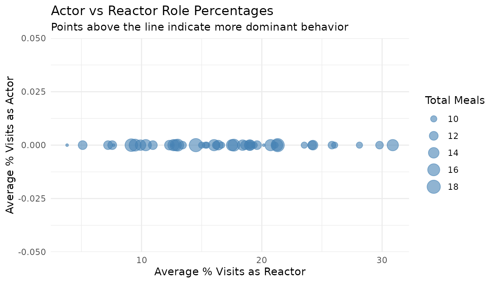

# 8. Meal-Level Behavior Analysis

``` r
library(moo4feed)
library(ggplot2)
library(dplyr)
```

## 1. Set Your Global Variables First

Before analyzing meal-level behavior patterns, configure global
variables to match your data structure:

``` r
# Configure global variables for your data structure
set_global_cols(
  id_col = "cow",           # Animal ID column name
  start_col = "start",      # Visit start time column
  end_col = "end",          # Visit end time column
  bin_col = "bin",          # Bin/feeder ID column
  intake_col = "intake",    # Feed intake amount column
  dur_col = "duration",     # Visit duration column
  tz = "America/Vancouver"  # Your timezone
)
```

## 2. Introduction to Meal-Level Behavior Analysis

A meal groups multiple feeding visits that happened consecutively in
time. Analyzing feeding behaviours on meal-level instaed of visit-level
is more biologically meaningful. This tutorial demonstrates how to:

> 1.  **Analyze non-nutritive visits within meals** - Identify
>     exploratory behavior during each meal
> 2.  **Examine actor/reactor roles within meals** - Understand the
>     frequency of them being an actor/reactor for agonistic
>     interactions during meals
> 3.  **Summarize meal-level behavior patterns** - Aggregate findings
>     per animal per day

## 3. Prerequisites

This tutorial requires:

1.  Completion of [**Tutorial 1: Data
    Cleaning**](https://skysheng7.github.io/moo4feed/articles/data_cleaning.md)
2.  Completion of [**Tutorial 2: Meal
    Clustering**](https://skysheng7.github.io/moo4feed/articles/meal_clustering.md) -
    your data must have meal labels
3.  For actor/reactor analysis: [**Tutorial 4: Replacement
    Detection**](https://skysheng7.github.io/moo4feed/articles/replacement_detection.md)

## 4. Data Preparation

First, we need to prepare meal-labeled data:

``` r
# Load cleaned example data
data(clean_feed)
data(clean_comb)

# If you're using your own data from previous tutorials, use this instead:
# clean_feed <- your_cleaned_feed_data
# clean_comb <- your_cleaned_comb_data

# Label visits with meal assignments
# (See Tutorial 2: Meal Clustering for details on parameter selection)
labeled_visits <- meal_label_visits(
  data = clean_feed,
  eps = NULL,                # Auto-determine optimal interval
  min_pts = 2,               # Minimum visits to form a meal
  method = "gmm",            # Use GMM for interval detection
  eps_scope = "all_animals",
  lower_bound = NULL,
  upper_bound = NULL,
  use_log_transform = TRUE,
  log_multiplier = 20,
  log_offset = 1
)

# Quick peek at meal-labeled data
labeled_visits[[1]][, c("cow", "bin", "start", "intake", "meal_id", "meal_start")] |>
  dplyr::arrange(cow, meal_id, start) |>
  head()
#> # A tibble: 6 × 6
#>     cow   bin start               intake meal_id meal_start         
#>   <int> <dbl> <dttm>               <dbl>   <int> <dttm>             
#> 1  2074    20 2020-10-31 06:06:52  2           1 2020-10-31 06:06:52
#> 2  2074    20 2020-10-31 06:11:58  2.10        1 2020-10-31 06:06:52
#> 3  2074    16 2020-10-31 06:22:18  0           1 2020-10-31 06:06:52
#> 4  2074    11 2020-10-31 06:23:15  0.600       1 2020-10-31 06:06:52
#> 5  2074    11 2020-10-31 06:25:05  3.80        1 2020-10-31 06:06:52
#> 6  2074     9 2020-10-31 06:35:40  1.40        1 2020-10-31 06:06:52
```

## 5. Non-Nutritive Visits Within Meals

Non-nutritive visits (visits where animals don’t consume feed despite it
being available) and empty bin visits (visits to bins with no feed) can
occur during meals. Analyzing these patterns within meal contexts
provides insights into exploratory behavior.

### Understanding Visit Types Within Meals

The
[`meal_non_nutritive_summary()`](https://skysheng7.github.io/moo4feed/reference/meal_non_nutritive_summary.md)
function classifies each visit within a meal as:

- **Nutritive**: Animal consumed feed (intake \> calibration error)
- **Non-nutritive**: Feed available but animal didn’t eat (exploratory)
- **Empty bin**: No feed available in the bin

### Analyze Non-Nutritive Patterns

``` r
# Create quality control configuration
my_qc_config <- qc_config(
  calibration_error = 0.5    # Equipment measurement threshold (kg)
)

# Analyze non-nutritive and empty bin visits within meals
meal_visits <- meal_non_nutritive_summary(
  data = labeled_visits,
  cfg = my_qc_config
)

# Examine the results from first day
cat("Meal visit analysis (first day):\n")
#> Meal visit analysis (first day):
head(meal_visits[[1]])
#>         date  cow mean_non_nutritive_per_meal median_non_nutritive_per_meal
#> 1 2020-10-31 2074                    3.800000                           2.0
#> 2 2020-10-31 3150                    2.571429                           2.0
#> 3 2020-10-31 4001                    2.833333                           2.5
#> 4 2020-10-31 4044                    6.000000                           6.0
#> 5 2020-10-31 4070                    2.571429                           0.0
#> 6 2020-10-31 4072                    5.375000                           5.5
#>   sd_non_nutritive_per_meal mean_empty_bin_per_meal median_empty_bin_per_meal
#> 1                  2.949576               0.0000000                         0
#> 2                  2.439750               0.0000000                         0
#> 3                  2.316607               0.0000000                         0
#> 4                  3.000000               0.0000000                         0
#> 5                  3.359422               0.4285714                         0
#> 6                  2.924649               0.1250000                         0
#>   sd_empty_bin_per_meal total_non_nutritive_visits total_empty_bin_visits
#> 1             0.0000000                         19                      0
#> 2             0.0000000                         18                      0
#> 3             0.0000000                         17                      0
#> 4             0.0000000                         30                      0
#> 5             1.1338934                         18                      3
#> 6             0.3535534                         43                      1
#>   total_meals
#> 1           5
#> 2           7
#> 3           6
#> 4           5
#> 5           7
#> 6           8
```

The summary provides per animal per day:

- **`mean_non_nutritive_per_meal`**: Average non-nutritive visits per
  meal
- **`median_non_nutritive_per_meal`**: Median non-nutritive visits per
  meal
- **`sd_non_nutritive_per_meal`**: Standard deviation
- **`mean_empty_bin_per_meal`**: Average empty bin visits per meal
- **`median_empty_bin_per_meal`**: Median empty bin visits per meal
- **`sd_empty_bin_per_meal`**: Standard deviation
- **`total_non_nutritive_visits`**: Total count of non-nutritive visits
- **`total_empty_bin_visits`**: Total count of empty bin visits
- **`total_meals`**: Number of meals analyzed

### Identify Animals with High Exploratory Behavior

``` r
# Combine all days
all_meal_visits <- do.call(rbind, meal_visits)

# Find animals with highest non-nutritive visits per meal
high_exploratory <- all_meal_visits |>
  dplyr::group_by(cow) |>
  dplyr::summarise(
    avg_non_nutritive = mean(mean_non_nutritive_per_meal, na.rm = TRUE),
    avg_empty_bin = mean(mean_empty_bin_per_meal, na.rm = TRUE),
    total_meals = sum(total_meals),
    .groups = "drop"
  ) |>
  dplyr::arrange(desc(avg_non_nutritive))

cat("Animals with most non-nutritive visits per meal:\n")
#> Animals with most non-nutritive visits per meal:
head(high_exploratory, 5)
#> # A tibble: 5 × 4
#>     cow avg_non_nutritive avg_empty_bin total_meals
#>   <int>             <dbl>         <dbl>       <int>
#> 1  7030              20.5        0               11
#> 2  5042              16.3        0               10
#> 3  7027              14.1        0.0556          17
#> 4  6027              13.5        0.125            9
#> 5  6055              11.7        0.5             12

cat("\nAnimals with most empty bin visits per meal:\n")
#> 
#> Animals with most empty bin visits per meal:
high_exploratory |>
  dplyr::arrange(desc(avg_empty_bin)) |>
  head(5)
#> # A tibble: 5 × 4
#>     cow avg_non_nutritive avg_empty_bin total_meals
#>   <int>             <dbl>         <dbl>       <int>
#> 1  5137              6.04         1.46           10
#> 2  5067              3.77         1.37           15
#> 3  5124              7.64         1.11           14
#> 4  6005              5.33         0.833          12
#> 5  5028              3.25         0.75           10
```

### Visualize Non-Nutritive Patterns

``` r
# Distribution of non-nutritive visits per meal
ggplot(all_meal_visits, aes(x = mean_non_nutritive_per_meal)) +
  geom_histogram(bins = 20, fill = "coral", alpha = 0.7) +
  labs(
    title = "Distribution of Non-Nutritive Visits Per Meal",
    x = "Average Non-Nutritive Visits Per Meal",
    y = "Number of Animal-Days"
  ) +
  theme_minimal()
```


## 6. Actor/Reactor Roles Within Meals

When we combine meal data with replacement events, we can analyze the
social roles animals play **during their meals**. An animal might enter
a visit as an “actor” (replacing another animal) or leave as a “reactor”
(being replaced by another animal).

### Understanding Actor/Reactor Roles

- **Actor**: The animal entered this visit by replacing another animal
  at the bin
- **Reactor**: The animal was replaced by another animal when leaving
  this visit
- **Actor-Reactor**: Both events occurred during the same visit (rare
  but possible)

### Prepare Replacement Data

``` r
# Detect replacement events
# (See Tutorial 4: Replacement Detection for details)
replacements <- record_replacement_days(
  comb = clean_comb,
  cfg = qc_config(replacement_threshold = 26)
)

cat("Replacement events per day:\n")
#> Replacement events per day:
sapply(replacements, nrow)
#> 2020-10-31 2020-11-01 
#>        655        709
```

### Analyze Actor/Reactor Roles Within Meals

We need meal-labeled data that matches the combined feed/water data used
for replacement detection:

``` r
# Label the combined data with meals
labeled_comb <- meal_label_visits(
  data = clean_comb,
  eps = NULL,
  min_pts = 2,
  method = "gmm",
  eps_scope = "all_animals",
  lower_bound = NULL,
  upper_bound = NULL,
  use_log_transform = TRUE,
  log_multiplier = 20,
  log_offset = 1
)

# Analyze actor/reactor roles within meals
meal_roles <- meal_replacement_roles(
  visit_data = labeled_comb,
  replacement_data = replacements,
  time_tolerance = 1           # Seconds tolerance for matching
)

# Examine the meal-level results
cat("Actor/reactor roles per meal (first day):\n")
#> Actor/reactor roles per meal (first day):
head(meal_roles[[1]])
#>         date  cow meal_id total_visits_in_meal actor_visits reactor_visits
#> 1 2020-10-31 2074       1                    8            0              2
#> 2 2020-10-31 2074       2                   18            0              2
#> 3 2020-10-31 2074       3                    7            0              4
#> 4 2020-10-31 2074       4                   12            0              2
#> 5 2020-10-31 2074       5                    4            0              0
#> 6 2020-10-31 2074       6                    4            0              1
#>   actor_reactor_visits pct_actor pct_reactor pct_actor_reactor
#> 1                    0         0    25.00000                 0
#> 2                    0         0    11.11111                 0
#> 3                    0         0    57.14286                 0
#> 4                    0         0    16.66667                 0
#> 5                    0         0     0.00000                 0
#> 6                    0         0    25.00000                 0
```

The results show for each animal’s meal:

- **`total_visits_in_meal`**: Total visits in the meal
- **`actor_visits`**: Visits where animal entered as actor
- **`reactor_visits`**: Visits where animal left as reactor
- **`actor_reactor_visits`**: Visits with both roles
- **`pct_actor`**: Percentage of visits as actor
- **`pct_reactor`**: Percentage of visits as reactor
- **`pct_actor_reactor`**: Percentage with both roles

### Summarize Roles Per Animal Per Day

``` r
# Get daily summary statistics across all meals
daily_roles <- meal_replacement_roles_summary(meal_roles)

cat("Daily role summary (first day):\n")
#> Daily role summary (first day):
print(daily_roles[[1]])
#>          date  cow mean_pct_actor median_pct_actor sd_pct_actor
#> 1  2020-10-31 2074              0                0            0
#> 2  2020-10-31 3150              0                0            0
#> 3  2020-10-31 4001              0                0            0
#> 4  2020-10-31 4044              0                0            0
#> 5  2020-10-31 4070              0                0            0
#> 6  2020-10-31 4072              0                0            0
#> 7  2020-10-31 4080              0                0            0
#> 8  2020-10-31 5028              0                0            0
#> 9  2020-10-31 5041              0                0            0
#> 10 2020-10-31 5042              0                0            0
#> 11 2020-10-31 5058              0                0            0
#> 12 2020-10-31 5061              0                0            0
#> 13 2020-10-31 5067              0                0            0
#> 14 2020-10-31 5100              0                0            0
#> 15 2020-10-31 5114              0                0            0
#> 16 2020-10-31 5120              0                0            0
#> 17 2020-10-31 5123              0                0            0
#> 18 2020-10-31 5124              0                0            0
#> 19 2020-10-31 5135              0                0            0
#> 20 2020-10-31 5137              0                0            0
#> 21 2020-10-31 5139              0                0            0
#> 22 2020-10-31 5145              0                0            0
#> 23 2020-10-31 6005              0                0            0
#> 24 2020-10-31 6020              0                0            0
#> 25 2020-10-31 6027              0                0            0
#> 26 2020-10-31 6028              0                0            0
#> 27 2020-10-31 6030              0                0            0
#> 28 2020-10-31 6033              0                0            0
#> 29 2020-10-31 6042              0                0            0
#> 30 2020-10-31 6050              0                0            0
#> 31 2020-10-31 6055              0                0            0
#> 32 2020-10-31 6069              0                0            0
#> 33 2020-10-31 6084              0                0            0
#> 34 2020-10-31 6090              0                0            0
#> 35 2020-10-31 6121              0                0            0
#> 36 2020-10-31 6126              0                0            0
#> 37 2020-10-31 6129              0                0            0
#> 38 2020-10-31 7010              0                0            0
#> 39 2020-10-31 7018              0                0            0
#> 40 2020-10-31 7019              0                0            0
#> 41 2020-10-31 7022              0                0            0
#> 42 2020-10-31 7023              0                0            0
#> 43 2020-10-31 7024              0                0            0
#> 44 2020-10-31 7027              0                0            0
#> 45 2020-10-31 7030              0                0            0
#> 46 2020-10-31 7033              0                0            0
#> 47 2020-10-31 7043              0                0            0
#>    mean_pct_reactor median_pct_reactor sd_pct_reactor mean_pct_actor_reactor
#> 1         22.486772          20.833333      19.404180                      0
#> 2         19.702381          20.000000      21.970818                      0
#> 3          5.769231           0.000000      14.131672                      0
#> 4         15.107660           8.333333      15.859523                      0
#> 5         14.345212           8.333333      17.196570                      0
#> 6         19.057861          21.637427      10.009381                      0
#> 7         12.892416          14.285714       9.754975                      0
#> 8         35.833333          30.000000      21.666667                      0
#> 9          6.584416           0.000000       9.558268                      0
#> 10        12.813524           7.692308      11.583569                      0
#> 11        12.142857          15.000000      12.791573                      0
#> 12         9.833377           0.000000      15.105378                      0
#> 13         4.388375           0.000000       5.648305                      0
#> 14         9.865591          11.111111       9.152691                      0
#> 15        21.369048          23.809524      20.259792                      0
#> 16         4.790823           0.000000       8.540175                      0
#> 17        21.142589          15.773810      22.267125                      0
#> 18        21.333333          16.666667      16.890168                      0
#> 19         9.545455           9.090909      11.047107                      0
#> 20        22.600733          14.285714      24.850230                      0
#> 21        15.714286           7.142857      20.603150                      0
#> 22        21.211450          12.903226      22.428807                      0
#> 23        18.024734          20.714286       9.238658                      0
#> 24        22.995805          20.000000      18.183889                      0
#> 25         6.922043           4.166667       9.172341                      0
#> 26        23.577264          11.111111      22.854105                      0
#> 27        11.011905           2.380952      17.354023                      0
#> 28        16.467846          18.181818       8.056472                      0
#> 29        18.904762           9.523810      18.149668                      0
#> 30        15.654135          20.000000      15.742178                      0
#> 31        12.005046           7.916667      14.384608                      0
#> 32        16.980373           5.405405      24.937729                      0
#> 33        20.988132          15.789474      10.862766                      0
#> 34        19.671026          17.647059      17.187854                      0
#> 35        11.332315           7.142857      11.505065                      0
#> 36        12.966721          10.795455      12.825538                      0
#> 37        20.444444          20.000000      18.734665                      0
#> 38        15.470178          10.101010      17.570823                      0
#> 39        26.589556          22.619048      20.134313                      0
#> 40         9.023920           7.812500       9.984882                      0
#> 41        25.227273          20.454545      25.296981                      0
#> 42        14.813105           9.523810      15.840853                      0
#> 43        13.926644          15.109890      11.000924                      0
#> 44        13.658677          10.204082      15.906108                      0
#> 45        16.019187          16.413374      16.171367                      0
#> 46        14.783249          15.151515      11.450989                      0
#> 47        31.483516          28.571429      17.835574                      0
#>    median_pct_actor_reactor sd_pct_actor_reactor total_meals
#> 1                         0                    0           6
#> 2                         0                    0           9
#> 3                         0                    0           6
#> 4                         0                    0           5
#> 5                         0                    0           7
#> 6                         0                    0           8
#> 7                         0                    0           9
#> 8                         0                    0           4
#> 9                         0                    0           7
#> 10                        0                    0           5
#> 11                        0                    0           7
#> 12                        0                    0           9
#> 13                        0                    0           7
#> 14                        0                    0           7
#> 15                        0                    0           8
#> 16                        0                    0           6
#> 17                        0                    0           6
#> 18                        0                    0           5
#> 19                        0                    0           4
#> 20                        0                    0           5
#> 21                        0                    0           6
#> 22                        0                    0           7
#> 23                        0                    0           6
#> 24                        0                    0           7
#> 25                        0                    0           4
#> 26                        0                    0           5
#> 27                        0                    0           8
#> 28                        0                    0           3
#> 29                        0                    0           5
#> 30                        0                    0           5
#> 31                        0                    0           6
#> 32                        0                    0           6
#> 33                        0                    0           7
#> 34                        0                    0           7
#> 35                        0                    0           5
#> 36                        0                    0           8
#> 37                        0                    0           5
#> 38                        0                    0           6
#> 39                        0                    0           6
#> 40                        0                    0           6
#> 41                        0                    0           4
#> 42                        0                    0           7
#> 43                        0                    0           6
#> 44                        0                    0           9
#> 45                        0                    0           4
#> 46                        0                    0           8
#> 47                        0                    0           5
```

The daily summary provides:

- **`mean_pct_actor`**: Average percentage of actor visits across meals
- **`median_pct_actor`**: Median percentage
- **`sd_pct_actor`**: Standard deviation
- Similarly for reactor and actor-reactor roles
- **`total_meals`**: Number of meals analyzed

### Identify Dominant and Subordinate Animals

``` r
# Combine all daily summaries
all_daily_roles <- do.call(rbind, daily_roles)

# Find animals with highest actor percentages (potentially dominant)
dominant_animals <- all_daily_roles |>
  dplyr::group_by(cow) |>
  dplyr::summarise(
    avg_pct_actor = mean(mean_pct_actor, na.rm = TRUE),
    avg_pct_reactor = mean(mean_pct_reactor, na.rm = TRUE),
    total_meals = sum(total_meals),
    .groups = "drop"
  ) |>
  dplyr::mutate(
    dominance_ratio = avg_pct_actor / (avg_pct_reactor + 0.01)  # Avoid division by zero
  ) |>
  dplyr::arrange(desc(dominance_ratio))

cat("Animals with highest actor-to-reactor ratio (potentially dominant):\n")
#> Animals with highest actor-to-reactor ratio (potentially dominant):
head(dominant_animals, 5)
#> # A tibble: 5 × 5
#>     cow avg_pct_actor avg_pct_reactor total_meals dominance_ratio
#>   <int>         <dbl>           <dbl>       <int>           <dbl>
#> 1  2074             0           19.0           11               0
#> 2  3150             0           21.3           18               0
#> 3  4001             0            3.81           9               0
#> 4  4044             0           15.3           10               0
#> 5  4070             0           19.0           10               0

cat("\nAnimals with lowest actor-to-reactor ratio (potentially subordinate):\n")
#> 
#> Animals with lowest actor-to-reactor ratio (potentially subordinate):
tail(dominant_animals, 5)
#> # A tibble: 5 × 5
#>     cow avg_pct_actor avg_pct_reactor total_meals dominance_ratio
#>   <int>         <dbl>           <dbl>       <int>           <dbl>
#> 1  7024             0            20.7          15               0
#> 2  7027             0            14.5          18               0
#> 3  7030             0            13.4          11               0
#> 4  7033             0            18.4          14               0
#> 5  7043             0            29.8          11               0
```

### Visualize Role Patterns

``` r
# Scatter plot: Actor vs Reactor percentages
ggplot(dominant_animals, aes(x = avg_pct_reactor, y = avg_pct_actor)) +
  geom_point(aes(size = total_meals), alpha = 0.6, color = "steelblue") +
  geom_abline(slope = 1, intercept = 0, linetype = "dashed", color = "gray50") +
  labs(
    title = "Actor vs Reactor Role Percentages",
    subtitle = "Points above the line indicate more dominant behavior",
    x = "Average % Visits as Reactor",
    y = "Average % Visits as Actor",
    size = "Total Meals"
  ) +
  theme_minimal()
```



## 7. Combining Meal-Level Insights

By combining non-nutritive visit analysis with actor/reactor roles, we
can build a comprehensive picture of each animal’s meal behavior:

``` r
# Merge the summaries for a combined view
combined_behavior <- dominant_animals |>
  dplyr::left_join(
    high_exploratory |> dplyr::select(cow, avg_non_nutritive, avg_empty_bin),
    by = "cow"
  )

cat("Combined meal behavior profile:\n")
#> Combined meal behavior profile:
head(combined_behavior)
#> # A tibble: 6 × 7
#>     cow avg_pct_actor avg_pct_reactor total_meals dominance_ratio
#>   <int>         <dbl>           <dbl>       <int>           <dbl>
#> 1  2074             0           19.0           11               0
#> 2  3150             0           21.3           18               0
#> 3  4001             0            3.81           9               0
#> 4  4044             0           15.3           10               0
#> 5  4070             0           19.0           10               0
#> 6  4072             0           17.5           15               0
#> # ℹ 2 more variables: avg_non_nutritive <dbl>, avg_empty_bin <dbl>
```

## 8. Summary

This tutorial demonstrated meal-level behavior analysis:

- **Non-nutritive visits within meals**: Identified exploratory behavior
  patterns
- **Actor/reactor roles**: Analyzed social dynamics during meals
- **Daily summaries**: Aggregated behavior metrics per animal per day
- **Behavioral profiles**: Combined multiple metrics to characterize
  animals

These metrics can help identify animals that may be:

- **Highly exploratory**: Many non-nutritive visits per meal
- **Competitively disadvantaged**: Many empty bin visits, high reactor
  percentage
- **Socially dominant**: High actor-to-reactor ratio

## 9. Code Cheatsheet

``` r
#' Copy and modify these code blocks for your own analysis!

# ---- SETUP: Global Variables (REQUIRED FIRST!) ----
library(moo4feed)
library(ggplot2)
library(dplyr)

# Set up your column names and timezone (modify these!)
set_global_cols(
  id_col = "cow",           # Your animal ID column
  start_col = "start",      # Visit start time column
  end_col = "end",          # Visit end time column
  bin_col = "bin",          # Bin/feeder ID column
  intake_col = "intake",    # Feed intake amount column
  dur_col = "duration",     # Visit duration column
  tz = "America/Vancouver"  # Your timezone
)

# ---- STEP 1: Prepare Meal-Labeled Data ----
# Load your cleaned data
data(clean_feed)
data(clean_comb)

# Label visits with meals (see Tutorial 2 for details)
labeled_visits <- meal_label_visits(
  data = clean_feed,
  eps = NULL,                # Auto-determine
  min_pts = 2,
  method = "gmm",
  eps_scope = "all_animals",
  use_log_transform = TRUE,
  log_multiplier = 20,
  log_offset = 1
)

# ---- STEP 2: Analyze Non-Nutritive Visits Within Meals ----
my_qc_config <- qc_config(calibration_error = 0.5)

meal_visits <- meal_non_nutritive_summary(
  data = labeled_visits,
  cfg = my_qc_config
)

# View results
head(meal_visits[[1]])

# Combine all days
all_meal_visits <- do.call(rbind, meal_visits)

# Find animals with high exploratory behavior
high_exploratory <- all_meal_visits |>
  dplyr::group_by(cow) |>
  dplyr::summarise(
    avg_non_nutritive = mean(mean_non_nutritive_per_meal, na.rm = TRUE),
    avg_empty_bin = mean(mean_empty_bin_per_meal, na.rm = TRUE),
    .groups = "drop"
  ) |>
  dplyr::arrange(desc(avg_non_nutritive))

print(high_exploratory)

# ---- STEP 3: Analyze Actor/Reactor Roles Within Meals ----
# First, detect replacement events (see Tutorial 4)
replacements <- record_replacement_days(
  comb = clean_comb,
  cfg = qc_config(replacement_threshold = 26)
)

# Label combined data with meals
labeled_comb <- meal_label_visits(
  data = clean_comb,
  eps = NULL,
  min_pts = 2,
  method = "gmm",
  eps_scope = "all_animals"
)

# Analyze roles within meals
meal_roles <- meal_replacement_roles(
  visit_data = labeled_comb,
  replacement_data = replacements,
  time_tolerance = 1
)

# View meal-level results
head(meal_roles[[1]])

# ---- STEP 4: Get Daily Role Summaries ----
daily_roles <- meal_replacement_roles_summary(meal_roles)

# View daily summaries
print(daily_roles[[1]])

# Combine all days
all_daily_roles <- do.call(rbind, daily_roles)

# Find dominant/subordinate animals
dominance_summary <- all_daily_roles |>
  dplyr::group_by(cow) |>
  dplyr::summarise(
    avg_pct_actor = mean(mean_pct_actor, na.rm = TRUE),
    avg_pct_reactor = mean(mean_pct_reactor, na.rm = TRUE),
    total_meals = sum(total_meals),
    .groups = "drop"
  ) |>
  dplyr::mutate(
    dominance_ratio = avg_pct_actor / (avg_pct_reactor + 0.01)
  ) |>
  dplyr::arrange(desc(dominance_ratio))

print(dominance_summary)

# ---- STEP 5: Visualize Results ----
# Distribution of non-nutritive visits
ggplot(all_meal_visits, aes(x = mean_non_nutritive_per_meal)) +
  geom_histogram(bins = 20, fill = "coral", alpha = 0.7) +
  theme_minimal()

# Actor vs Reactor scatter plot
ggplot(dominance_summary, aes(x = avg_pct_reactor, y = avg_pct_actor)) +
  geom_point(aes(size = total_meals), alpha = 0.6) +
  geom_abline(slope = 1, intercept = 0, linetype = "dashed") +
  theme_minimal()
```

------------------------------------------------------------------------
