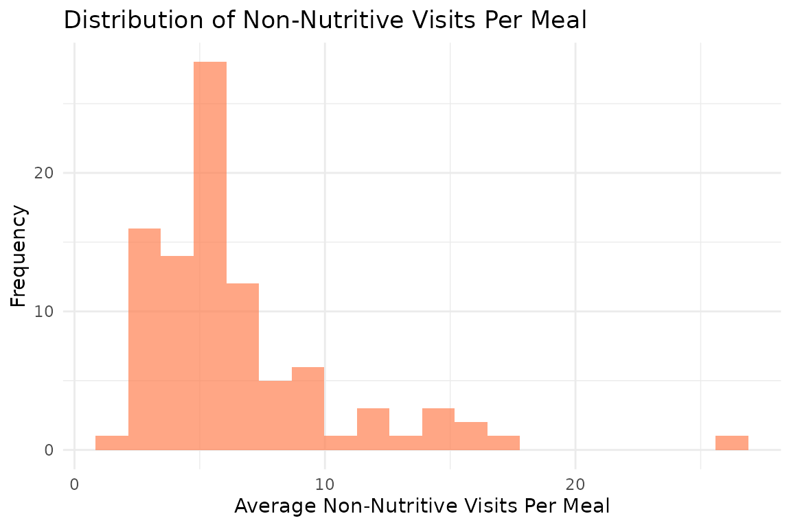
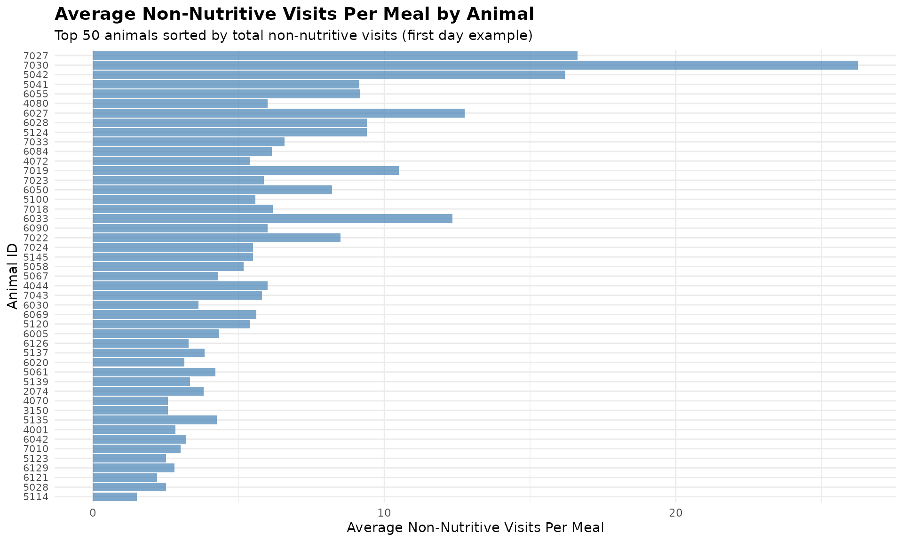
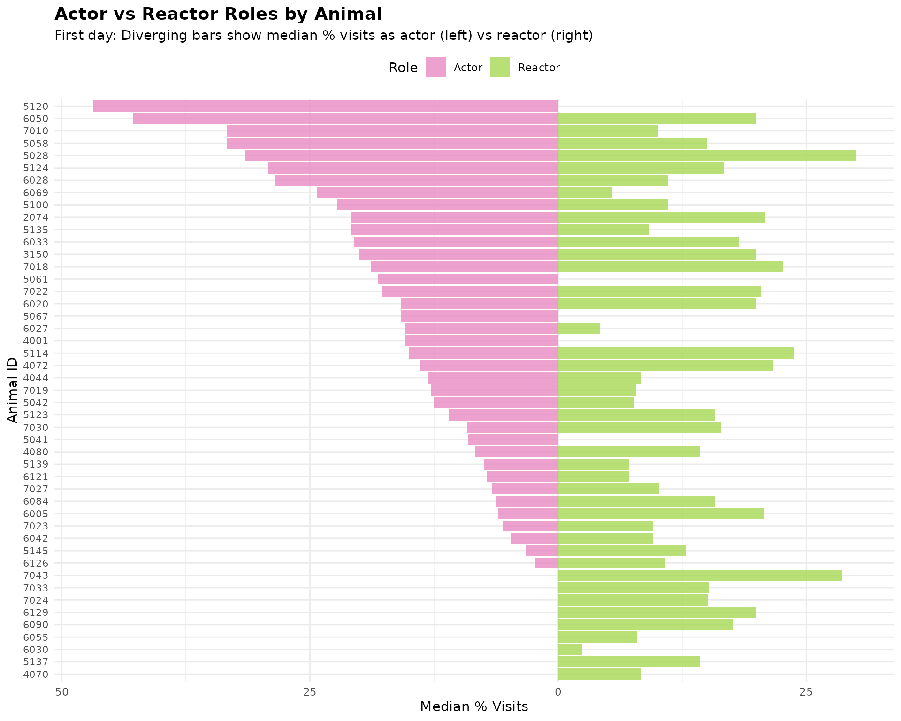
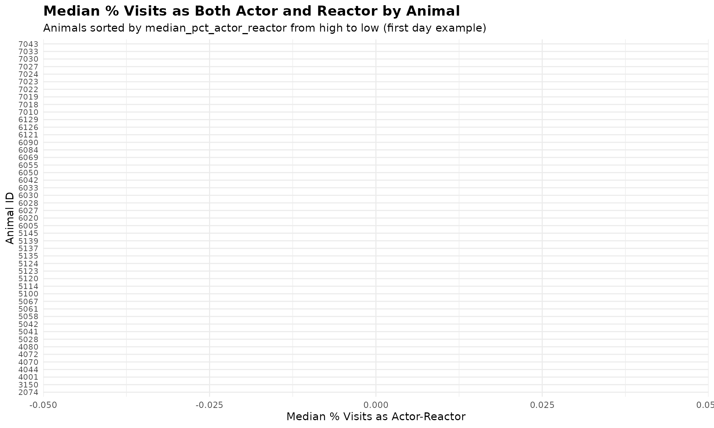

# 8. Meal-Level Behavior Analysis

``` r
library(moo4feed)
library(ggplot2)
library(dplyr)
```

## 1. Set Your Global Variables First

Before analyzing meal-level behavior patterns, configure global
variables to match your data structure:

``` r
# Configure global variables for your data structure
set_global_cols(
  # Time zone
  tz = "America/Vancouver",
  
  # Column names in your data files
  id_col = "cow",
  trans_col = "transponder",
  start_col = "start",
  end_col = "end",
  bin_col = "bin",
  dur_col = "duration",
  intake_col = "intake",
  start_weight_col = "start_weight",
  end_weight_col = "end_weight",
  
  # Bin settings
  bins_feed = 1:30,
  bins_wat = 1:5,
  bin_offset = 100
)
```

## 2. Introduction to Meal-Level Behavior Analysis

A meal groups multiple feeding visits that happened consecutively in
time. Analyzing feeding behaviours on meal-level instaed of visit-level
is more biologically meaningful. This tutorial demonstrates how to:

1.  **Analyze non-nutritive visits within meals** - Identify exploratory
    behavior during each meal
2.  **Examine actor/reactor roles within meals** - Understand the
    frequency of each animal being an actor/reactor for agonistic
    interactions during meals
3.  **Summarize meal-level behavior patterns** - Aggregate meal-level
    behavior patterns per animal per day

## 3. Prerequisites

This tutorial requires:

1.  Completion of [**Tutorial 1: Data
    Cleaning**](https://skysheng7.github.io/moo4feed/articles/data_cleaning.md)
2.  Completion of [**Tutorial 2: Meal
    Clustering**](https://skysheng7.github.io/moo4feed/articles/meal_clustering.md) -
    your data must have meal labels
3.  For actor/reactor analysis: [**Tutorial 4: Replacement
    Detection**](https://skysheng7.github.io/moo4feed/articles/replacement_detection.md)

## 4. Data Preparation

First, we need to prepare meal-labeled data:

``` r
# Load cleaned example data
data(clean_feed)
data(clean_comb)

# If you're using your own data from previous tutorials, use this instead:
# clean_feed <- your_cleaned_feed_data
# clean_comb <- your_cleaned_comb_data

# Label visits with meal assignments
# (See Tutorial 2: Meal Clustering for details on parameter selection)
labeled_visits <- meal_label_visits(
  data = clean_feed,
  eps = NULL,                # Auto-determine optimal interval
  min_pts = 2,               # Minimum visits to form a meal
  method = "gmm",            # Use GMM for interval detection
  eps_scope = "all_animals",
  lower_bound = NULL,
  upper_bound = NULL,
  use_log_transform = TRUE,
  log_multiplier = 20,
  log_offset = 1
)

# Quick peek at meal-labeled data
labeled_visits[[1]][, c("cow", "bin", "start", "intake", "meal_id", "meal_start")] |>
  dplyr::arrange(cow, meal_id, start) |>
  head()
#> # A tibble: 6 × 6
#>     cow   bin start               intake meal_id meal_start         
#>   <int> <dbl> <dttm>               <dbl>   <int> <dttm>             
#> 1  2074    20 2020-10-31 06:06:52  2           1 2020-10-31 06:06:52
#> 2  2074    20 2020-10-31 06:11:58  2.10        1 2020-10-31 06:06:52
#> 3  2074    16 2020-10-31 06:22:18  0           1 2020-10-31 06:06:52
#> 4  2074    11 2020-10-31 06:23:15  0.600       1 2020-10-31 06:06:52
#> 5  2074    11 2020-10-31 06:25:05  3.80        1 2020-10-31 06:06:52
#> 6  2074     9 2020-10-31 06:35:40  1.40        1 2020-10-31 06:06:52
```

## 5. Non-Nutritive Visits Within Meals

Non-nutritive visits (visits where animals don’t consume feed despite it
being available) and empty bin visits (visits to bins with no feed) can
occur during meals. Analyzing these patterns within meal contexts
provides insights into exploratory behavior.

### Understanding Visit Types Within Meals

The
[`meal_non_nutritive_summary()`](https://skysheng7.github.io/moo4feed/reference/meal_non_nutritive_summary.md)
function classifies each visit within a meal as:

- **Nutritive**: Animal consumed feed (intake \> calibration error)
- **Non-nutritive**: Feed available but animal didn’t eat (exploratory)
- **Empty bin**: No feed available in the bin

### Analyze Non-Nutritive Patterns

``` r
# Create quality control configuration
my_qc_config <- qc_config(
  calibration_error = 0.5    # Equipment measurement threshold (kg)
)

# Analyze non-nutritive and empty bin visits within meals
meal_visits <- meal_non_nutritive_summary(
  data = labeled_visits,
  cfg = my_qc_config
)

# Examine the results from first day, sort by total non-nutritive visits descending
meal_visits[[1]] |>
  dplyr::arrange(desc(total_non_nutritive_visits)) |>
  head()
#>         date  cow mean_non_nutritive_per_meal median_non_nutritive_per_meal
#> 1 2020-10-31 7027                   16.625000                          11.5
#> 2 2020-10-31 7030                   26.250000                          28.5
#> 3 2020-10-31 5042                   16.200000                          11.0
#> 4 2020-10-31 5041                    9.142857                           7.0
#> 5 2020-10-31 6055                    9.166667                           8.0
#> 6 2020-10-31 4080                    6.000000                           5.0
#>   sd_non_nutritive_per_meal mean_empty_bin_per_meal median_empty_bin_per_meal
#> 1                 13.886659               0.0000000                         0
#> 2                 16.152915               0.0000000                         0
#> 3                 12.716131               0.0000000                         0
#> 4                  6.362090               0.1428571                         0
#> 5                  7.054549               0.0000000                         0
#> 6                  3.640055               0.1111111                         0
#>   sd_empty_bin_per_meal total_non_nutritive_visits total_empty_bin_visits
#> 1             0.0000000                        133                      0
#> 2             0.0000000                        105                      0
#> 3             0.0000000                         81                      0
#> 4             0.3779645                         64                      1
#> 5             0.0000000                         55                      0
#> 6             0.3333333                         54                      1
#>   total_meals
#> 1           8
#> 2           4
#> 3           5
#> 4           7
#> 5           6
#> 6           9
```

The summary provides per animal per day:

- **`mean_non_nutritive_per_meal`**: Average non-nutritive visits per
  meal
- **`median_non_nutritive_per_meal`**: Median non-nutritive visits per
  meal
- **`sd_non_nutritive_per_meal`**: Standard deviation
- **`mean_empty_bin_per_meal`**: Average empty bin visits per meal
- **`median_empty_bin_per_meal`**: Median empty bin visits per meal
- **`sd_empty_bin_per_meal`**: Standard deviation
- **`total_non_nutritive_visits`**: Total count of non-nutritive visits
- **`total_empty_bin_visits`**: Total count of empty bin visits
- **`total_meals`**: Number of meals analyzed

### Visualize Non-Nutritive Distribution

``` r
# Combine all days all animals
all_meal_visits <- do.call(rbind, meal_visits)

# Distribution of non-nutritive visits per meal across all animals
ggplot(all_meal_visits, aes(x = mean_non_nutritive_per_meal)) +
  geom_histogram(bins = 20, fill = "steelblue", alpha = 0.7) +
  labs(
    title = "Distribution of Non-Nutritive Visits Per Meal",
    x = "Average Non-Nutritive Visits Per Meal",
    y = "Frequency"
  ) +
  theme_minimal()
```



### Visualize Non-Nutritive by Animal

``` r
# Use first day's data as an example
first_day_data <- meal_visits[[1]] |>
  dplyr::arrange(desc(median_non_nutritive_per_meal)) |>
  head(50)  # Limit to up to top 50 animals with the most non-nutritive visits per meal

# Create bar plot
ggplot(first_day_data, aes(x = reorder(cow, median_non_nutritive_per_meal), 
                           y = median_non_nutritive_per_meal)) +
  geom_bar(stat = "identity", fill = "coral", alpha = 0.7) +
  coord_flip() +  # Horizontal bars for better readability
  labs(
    title = "Average Non-Nutritive Visits Per Meal by Animal",
    subtitle = "Animals sorted by median non-nutritive visits per meal (first day example)",
    x = "Animal ID",
    y = "Average Non-Nutritive Visits Per Meal"
  ) +
  theme_minimal() +
  theme(
    axis.text.y = element_text(size = 8),
    plot.title = element_text(size = 14, face = "bold"),
    plot.subtitle = element_text(size = 11)
  )
```



Similarly, you can visualize the distribution of empty bin visits per
meal across all animals. However, I’m not visualizing it here because
the number of empty bin visits is very low in on day 1, causing the
median empty bin visits per meal to be 0 for all animals.

## 6. Actor/Reactor Roles Within Meals

When we combine meal data with replacement events, we can analyze the
social roles animals play **during their meals**. An animal might enter
a visit as an “actor” (replacing another animal) or leave as a “reactor”
(being replaced by another animal).

### Understanding Actor/Reactor Roles

- **Actor**: The animal entered this visit by replacing another animal
  at the bin
- **Reactor**: The animal was replaced by another animal when leaving
  this visit
- **Actor-Reactor**: Both events occurred during the same visit (rare
  but possible). They entered as actor and left as reactor within the
  same visit.

### Prepare Replacement Data

``` r
# Detect replacement events
# (See Tutorial 4: Replacement Detection for details)
replacements <- record_replacement_days(
  comb = clean_comb,
  cfg = qc_config(replacement_threshold = 26)
)

# Replacement events per day:
sapply(replacements, nrow)
#> 2020-10-31 2020-11-01 
#>        655        709
```

### Analyze Actor/Reactor Roles Within Meals

We need meal-labeled data that matches the combined feed/water data used
for replacement detection:

``` r
# Label the combined data with meals
labeled_comb <- meal_label_visits(
  data = clean_comb,
  eps = NULL,
  min_pts = 2,
  method = "gmm",
  eps_scope = "all_animals",
  lower_bound = NULL,
  upper_bound = NULL,
  use_log_transform = TRUE,
  log_multiplier = 20,
  log_offset = 1
)

# Analyze actor/reactor roles within meals
meal_roles <- meal_replacement_roles(
  visit_data = labeled_comb,
  replacement_data = replacements,
  time_tolerance = 1           # Seconds tolerance for matching
)

# Examine the meal-level results
# Actor/reactor roles per meal (first day)
meal_roles[[1]] |>
  dplyr::arrange(desc(pct_reactor)) |>
  head()
#>         date  cow meal_id total_visits_in_meal actor_visits reactor_visits
#> 1 2020-10-31 5028       1                    3            2              2
#> 2 2020-10-31 5137       4                   12            2              8
#> 3 2020-10-31 5123       3                   11            6              7
#> 4 2020-10-31 5145       4                    8            2              5
#> 5 2020-10-31 6069       1                    8            3              5
#> 6 2020-10-31 3150       5                    5            2              3
#>   actor_reactor_visits pct_actor pct_reactor pct_actor_reactor
#> 1                    1  66.66667    66.66667         33.333333
#> 2                    1  16.66667    66.66667          8.333333
#> 3                    6  54.54545    63.63636         54.545455
#> 4                    1  25.00000    62.50000         12.500000
#> 5                    2  37.50000    62.50000         25.000000
#> 6                    1  40.00000    60.00000         20.000000
```

The results show for each animal’s meal:

- **`total_visits_in_meal`**: Total feeding visits in that meal
- **`actor_visits`**: Total number of visits where animal entered as
  actor in that meal
- **`reactor_visits`**: Total number of visits where animal left as
  reactor in that meal
- **`actor_reactor_visits`**: Total number of visits when they entered
  as actor and left as reactor in that meal
- **`pct_actor`**: Percentage of visits as actor in that meal
- **`pct_reactor`**: Percentage of visits as reactor in that meal
- **`pct_actor_reactor`**: Percentage of visits when they entered as
  actor and left as reactor in that meal

### Summarize Roles Per Animal Per Day

``` r
# Get daily summary statistics across all meals
daily_roles <- meal_replacement_roles_summary(meal_roles)

# Daily role summary (first day)
daily_roles[[1]] |>
  dplyr::arrange(desc(mean_pct_actor)) |>
  head()
#>         date  cow mean_pct_actor median_pct_actor sd_pct_actor mean_pct_reactor
#> 1 2020-10-31 6050       45.21362         42.85714     24.34903        15.654135
#> 2 2020-10-31 7010       42.59259         33.33333     33.27155        15.470178
#> 3 2020-10-31 5120       39.80404         46.87500     21.30828         4.790823
#> 4 2020-10-31 5058       36.24536         33.33333     27.56264        12.142857
#> 5 2020-10-31 5028       35.77381         31.54762     22.94492        35.833333
#> 6 2020-10-31 5124       26.85632         29.16667     21.36422        21.333333
#>   median_pct_reactor sd_pct_reactor mean_pct_actor_reactor
#> 1           20.00000      15.742178               8.887218
#> 2           10.10101      17.570823               9.788360
#> 3            0.00000       8.540175               4.790823
#> 4           15.00000      12.791573               4.365079
#> 5           30.00000      21.666667              10.714286
#> 6           16.66667      16.890168              13.666667
#>   median_pct_actor_reactor sd_pct_actor_reactor total_meals
#> 1                 5.714286            13.095707           5
#> 2                 5.555556            13.143649           6
#> 3                 0.000000             8.540175           6
#> 4                 0.000000             7.331289           7
#> 5                 4.761905            15.733514           4
#> 6                 8.333333            13.144496           5
```

The daily summary provides:

- **`date`**: Date of the summary
- **`cow`**: Animal identifier
- **`mean_pct_actor`**: Average percentage of visits as an actor across
  all meals
- **`median_pct_actor`**: Median percentage of visits as an actor across
  all meals
- **`sd_pct_actor`**: Standard deviation of percentage of visits as an
  actor across all meals
- **`mean_pct_reactor`**: Average percentage of visits as a reactor
  across all meals
- **`median_pct_reactor`**: Median percentage of visits as a reactor
  across all meals
- **`sd_pct_reactor`**: Standard deviation of percentage of visits as a
  reactor across all meals
- **`mean_pct_actor_reactor`**: Average percentage of visits with both
  actor and reactor roles across all meals
- **`median_pct_actor_reactor`**: Median percentage of visits with both
  actor and reactor roles across all meals
- **`sd_pct_actor_reactor`**: Standard deviation of percentage of visits
  with both actor and reactor roles across all meals
- **`total_meals`**: Number of meals analyzed

### Visualize Actor/Reactor Roles

This is a diverging bar chart showing the median percentage of visits as
an actor versus a reactor across all meals. Each animal is represented
on the y-axis, with the left side showing their actor percentage and the
right side showing their reactor percentage. This makes it easy to read
each animal’s ID and compare their interaction patterns on day 1.

``` r
# Use first day's data for visualization
first_day_roles <- daily_roles[[1]]

# Reshape data to long format and make actor values negative for diverging plot
plot_data <- dplyr::bind_rows(
  first_day_roles |> 
    dplyr::select(cow, pct = median_pct_actor) |> 
    dplyr::mutate(role = "Actor", plot_value = -pct),
  first_day_roles |> 
    dplyr::select(cow, pct = median_pct_reactor) |> 
    dplyr::mutate(role = "Reactor", plot_value = pct)
)

# Sort animals by their actor percentage for a cleaner chart
cow_order <- first_day_roles |>
  dplyr::arrange(median_pct_actor) |>
  dplyr::pull(cow)

plot_data$cow <- factor(plot_data$cow, levels = cow_order)

# Create diverging bar chart
ggplot(plot_data, aes(x = cow, y = plot_value, fill = role)) +
  geom_bar(stat = "identity", alpha = 0.8) +
  coord_flip() +
  scale_fill_manual(values = c("Actor" = "#e78ac3", "Reactor" = "#a6d854")) +
  scale_y_continuous(labels = abs) + # Show absolute values on axis
  labs(
    title = "Actor vs Reactor Roles by Animal",
    subtitle = "First day: Diverging bars show median % visits as actor (left) vs reactor (right)",
    x = "Animal ID",
    y = "Median % Visits",
    fill = "Role"
  ) +
  theme_minimal() +
  theme(
    plot.title = element_text(size = 14, face = "bold"),
    plot.subtitle = element_text(size = 11),
    axis.text.y = element_text(size = 8),
    legend.position = "top"
  )
```



``` r
# Bar plot: median_pct_actor_reactor sorted from high to low
first_day_roles_sorted <- first_day_roles |>
  dplyr::filter(median_pct_actor_reactor > 0) |>
  dplyr::arrange(desc(median_pct_actor_reactor))

ggplot(first_day_roles_sorted, aes(x = reorder(cow, median_pct_actor_reactor), 
                                   y = median_pct_actor_reactor)) +
  geom_bar(stat = "identity", fill = "#edb870", alpha = 0.7) +
  coord_flip() +  # Horizontal bars for better readability
  labs(
    title = "Median % Visits as Actor upon Entry and Reactor upon Exit",
    subtitle = "Animals with non-zero median_pct_actor_reactor, sorted high to low (first day example)",
    x = "Animal ID",
    y = "Median % Visits as Actor upon Entry and Reactor upon Exit"
  ) +
  theme_minimal() +
  theme(
    axis.text.y = element_text(size = 8),
    plot.title = element_text(size = 14, face = "bold"),
    plot.subtitle = element_text(size = 11)
  )
```



**Note**: Many animals have 0% actor-reactor average, they are excluded
from the plot for better readability.

## 8. Summary

This tutorial demonstrated meal-level behavior analysis:

- **Non-nutritive visits within meals**: Identified exploratory behavior
  patterns
- **Actor/reactor roles**: Analyzed the percentage of visits as an actor
  or reactor across all meals
- **Daily summaries**: Aggregated behavior patterns per animal per day

## 9. Code Cheatsheet

``` r
#' Copy and modify these code blocks for your own analysis!

# ---- SETUP: Global Variables (REQUIRED FIRST!) ----
library(moo4feed)
library(ggplot2)
library(dplyr)

# Set up your column names and timezone (modify these!)
set_global_cols(
  # Time zone
  tz = "America/Vancouver",
  
  # Column names in your data files
  id_col = "cow",
  trans_col = "transponder",
  start_col = "start",
  end_col = "end",
  bin_col = "bin",
  dur_col = "duration",
  intake_col = "intake",
  start_weight_col = "start_weight",
  end_weight_col = "end_weight",
  
  # Bin settings
  bins_feed = 1:30,
  bins_wat = 1:5,
  bin_offset = 100
)

# ---- STEP 1: Prepare Meal-Labeled Data ----
# Load your cleaned data
data(clean_feed)
data(clean_comb)

# Label visits with meals (see Tutorial 2 for details)
labeled_visits <- meal_label_visits(
  data = clean_feed,
  eps = NULL,                # Auto-determine
  min_pts = 2,
  method = "gmm",
  eps_scope = "all_animals",
  use_log_transform = TRUE,
  log_multiplier = 20,
  log_offset = 1
)

# ---- STEP 2: Analyze Non-Nutritive Visits Within Meals ----
my_qc_config <- qc_config(calibration_error = 0.5)

meal_visits <- meal_non_nutritive_summary(
  data = labeled_visits,
  cfg = my_qc_config
)

# View results
head(meal_visits[[1]])

# Combine all days
all_meal_visits <- do.call(rbind, meal_visits)

# Find animals with high exploratory behavior
high_exploratory <- all_meal_visits |>
  dplyr::group_by(cow) |>
  dplyr::summarise(
    avg_non_nutritive = mean(mean_non_nutritive_per_meal, na.rm = TRUE),
    avg_empty_bin = mean(mean_empty_bin_per_meal, na.rm = TRUE),
    .groups = "drop"
  ) |>
  dplyr::arrange(desc(avg_non_nutritive))

print(high_exploratory)

# ---- STEP 3: Analyze Actor/Reactor Roles Within Meals ----
# First, detect replacement events (see Tutorial 4)
replacements <- record_replacement_days(
  comb = clean_comb,
  cfg = qc_config(replacement_threshold = 26)
)

# Label combined data with meals
labeled_comb <- meal_label_visits(
  data = clean_comb,
  eps = NULL,
  min_pts = 2,
  method = "gmm",
  eps_scope = "all_animals",
  lower_bound = NULL,
  upper_bound = NULL,
  use_log_transform = TRUE,
  log_multiplier = 20,
  log_offset = 1
)

# Analyze roles within meals
meal_roles <- meal_replacement_roles(
  visit_data = labeled_comb,
  replacement_data = replacements,
  time_tolerance = 1
)

# View meal-level results
head(meal_roles[[1]])

# ---- STEP 4: Get Daily Role Summaries ----
daily_roles <- meal_replacement_roles_summary(meal_roles)

# View daily summaries
print(daily_roles[[1]])

# Combine all days
all_daily_roles <- do.call(rbind, daily_roles)

# Find dominant/subordinate animals
dominance_summary <- all_daily_roles |>
  dplyr::group_by(cow) |>
  dplyr::summarise(
    avg_pct_actor = mean(mean_pct_actor, na.rm = TRUE),
    avg_pct_reactor = mean(mean_pct_reactor, na.rm = TRUE),
    total_meals = sum(total_meals),
    .groups = "drop"
  ) |>
  dplyr::mutate(
    dominance_ratio = avg_pct_actor / (avg_pct_reactor + 0.01)
  ) |>
  dplyr::arrange(desc(dominance_ratio))

print(dominance_summary)

# ---- STEP 5: Visualize Results ----
# Distribution of non-nutritive visits
ggplot(all_meal_visits, aes(x = mean_non_nutritive_per_meal)) +
  geom_histogram(bins = 20, fill = "steelblue", alpha = 0.7) +
  labs(
    title = "Distribution of Non-Nutritive Visits Per Meal",
    x = "Average Non-Nutritive Visits Per Meal",
    y = "Frequency"
  ) +
  theme_minimal()

# Non-nutritive visits bar plot by animal (first day example)
first_day_data <- meal_visits[[1]] |>
  dplyr::arrange(desc(median_non_nutritive_per_meal)) |>
  head(50)

ggplot(first_day_data, aes(x = reorder(cow, median_non_nutritive_per_meal), 
                           y = median_non_nutritive_per_meal)) +
  geom_bar(stat = "identity", fill = "coral", alpha = 0.7) +
  coord_flip() +
  labs(
    title = "Average Non-Nutritive Visits Per Meal by Animal",
    subtitle = "Animals sorted by median non-nutritive visits per meal (first day example)",
    x = "Animal ID",
    y = "Average Non-Nutritive Visits Per Meal"
  ) +
  theme_minimal() +
  theme(
    axis.text.y = element_text(size = 8),
    plot.title = element_text(size = 14, face = "bold"),
    plot.subtitle = element_text(size = 11)
  )

# Empty bin visits bar plot by animal (first day example)
first_day_empty_bin <- meal_visits[[1]] |>
  dplyr::arrange(desc(median_empty_bin_per_meal)) |>
  head(50)

ggplot(first_day_empty_bin, aes(x = reorder(cow, median_empty_bin_per_meal), 
                                y = median_empty_bin_per_meal)) +
  geom_bar(stat = "identity", fill = "olivedrab3", alpha = 0.7) +
  coord_flip() +
  labs(
    title = "Average Empty Bin Visits Per Meal by Animal",
    subtitle = "Animals sorted by median empty bin visits per meal (first day example)",
    x = "Animal ID",
    y = "Average Empty Bin Visits Per Meal"
  ) +
  theme_minimal() +
  theme(
    axis.text.y = element_text(size = 8),
    plot.title = element_text(size = 14, face = "bold"),
    plot.subtitle = element_text(size = 11)
  )

# Actor vs Reactor diverging bar plot (first day example)
first_day_roles <- daily_roles[[1]]

# Reshape data to long format and make actor values negative for diverging plot
plot_data <- dplyr::bind_rows(
  first_day_roles |> 
    dplyr::select(cow, pct = median_pct_actor) |> 
    dplyr::mutate(role = "Actor", plot_value = -pct),
  first_day_roles |> 
    dplyr::select(cow, pct = median_pct_reactor) |> 
    dplyr::mutate(role = "Reactor", plot_value = pct)
)

# Sort animals by their actor percentage for a cleaner chart
cow_order <- first_day_roles |>
  dplyr::arrange(median_pct_actor) |>
  dplyr::pull(cow)

plot_data$cow <- factor(plot_data$cow, levels = cow_order)

# Create diverging bar chart
ggplot(plot_data, aes(x = cow, y = plot_value, fill = role)) +
  geom_bar(stat = "identity", alpha = 0.8) +
  coord_flip() +
  scale_fill_manual(values = c("Actor" = "#e78ac3", "Reactor" = "#a6d854")) +
  scale_y_continuous(labels = abs) + # Show absolute values on axis
  labs(
    title = "Actor vs Reactor Roles by Animal",
    subtitle = "First day: Diverging bars show median % visits as actor (left) vs reactor (right)",
    x = "Animal ID",
    y = "Median % Visits",
    fill = "Role"
  ) +
  theme_minimal() +
  theme(
    plot.title = element_text(size = 14, face = "bold"),
    plot.subtitle = element_text(size = 11),
    axis.text.y = element_text(size = 8),
    legend.position = "top"
  )

# Actor-Reactor bar plot (first day example)
first_day_roles_sorted <- first_day_roles |>
  dplyr::filter(median_pct_actor_reactor > 0) |>
  dplyr::arrange(desc(median_pct_actor_reactor))

ggplot(first_day_roles_sorted, aes(x = reorder(cow, median_pct_actor_reactor), 
                                   y = median_pct_actor_reactor)) +
  geom_bar(stat = "identity", fill = "#edb870", alpha = 0.7) +
  coord_flip() +
  labs(
    title = "Median % Visits as Both Actor and Reactor by Animal",
    subtitle = "Animals with non-zero median_pct_actor_reactor, sorted high to low (first day example)",
    x = "Animal ID",
    y = "Median % Visits as Actor-Reactor"
  ) +
  theme_minimal() +
  theme(
    axis.text.y = element_text(size = 8),
    plot.title = element_text(size = 14, face = "bold"),
    plot.subtitle = element_text(size = 11)
  )
```

------------------------------------------------------------------------
