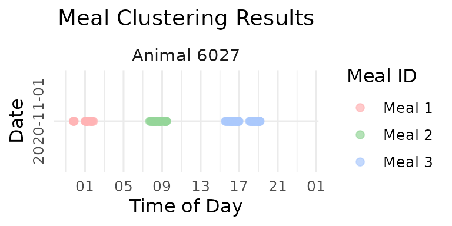
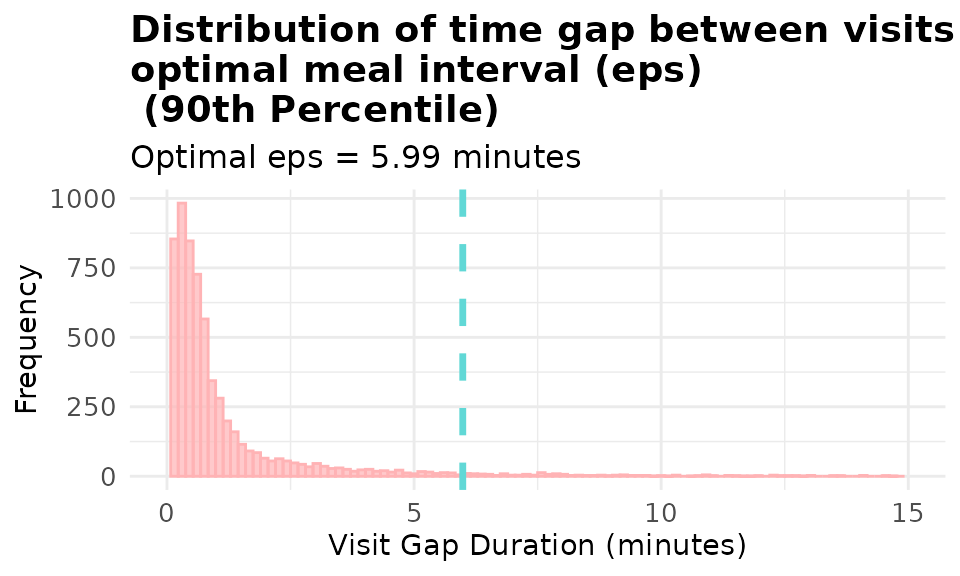
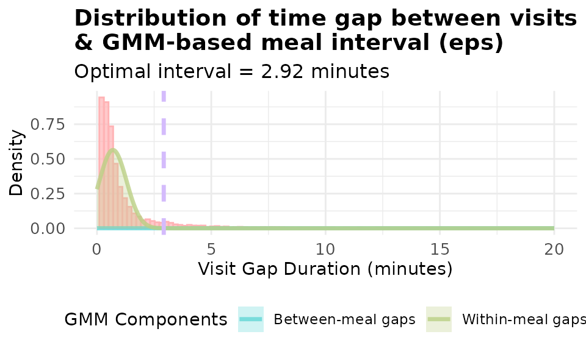
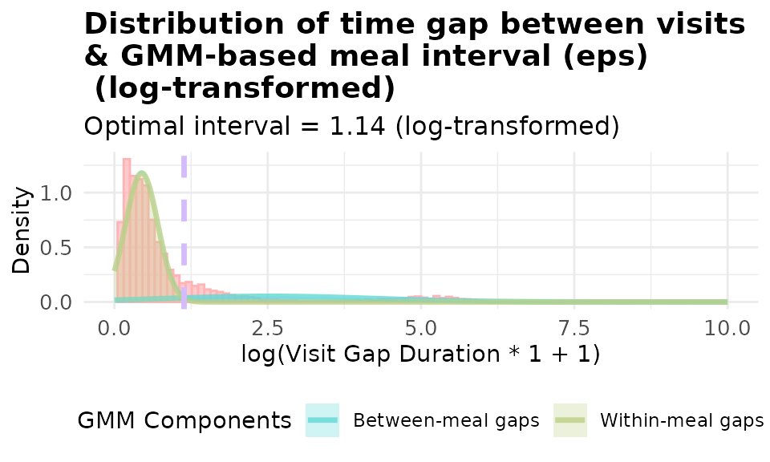
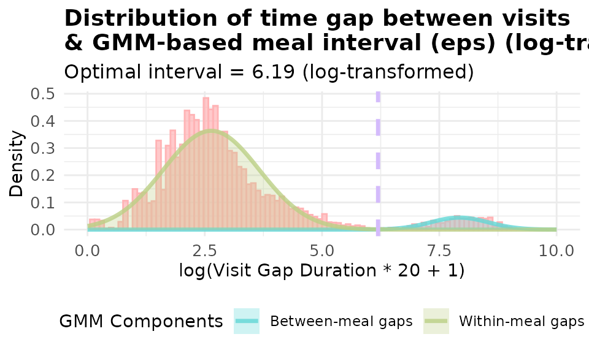
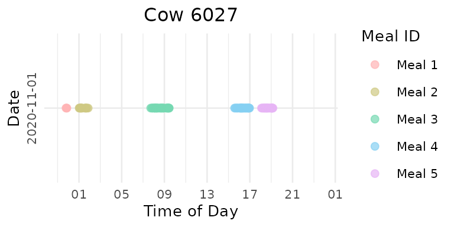
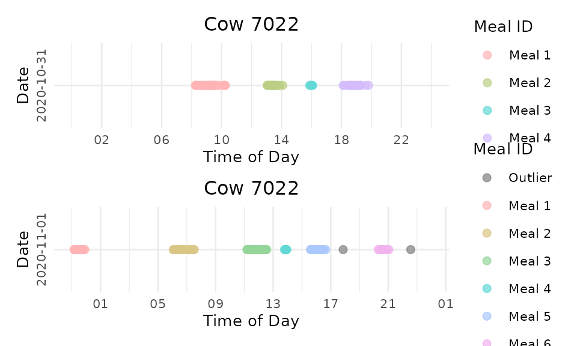
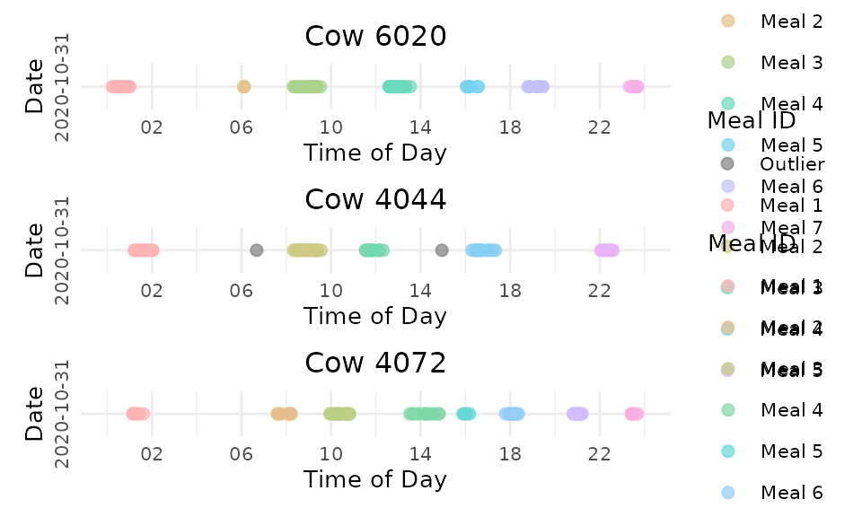

# 2. Meal Clustering

``` r
library(moo4feed)
library(ggplot2)
library(dplyr)
```

## 1. 🚨 Important: Set Your Global Variables First!

Before proceeding with meal clustering analysis, configure global
variables to match your data structure:

``` r
# Configure global variables for your data structure
set_global_cols(
  # Time zone
  tz = "America/Vancouver",
  
  # Column names in your data files
  id_col = "cow",
  trans_col = "transponder",
  start_col = "start",
  end_col = "end",
  bin_col = "bin",
  dur_col = "duration",
  intake_col = "intake",
  start_weight_col = "start_weight",
  end_weight_col = "end_weight",
  
  # Bin settings
  bins_feed = 1:30,
  bins_wat = 1:5,
  bin_offset = 100
)
```

## 2. Introduction to Meal Clustering

🦦 Ollie the Otter, our in-house data scientist explains: “Individual
feeding visits represent only part of the behavioral story. Animals
often take brief breaks during sustained feeding periods. Meal
clustering groups related visits into meaningful feeding events.”

### Objectives

This tutorial demonstrates how to:

> 1.  **Analyze inter-visit intervals** - Examine time gaps between
>     consecutive visits
> 2.  **Determine optimal clustering parameters** - Find biologically
>     meaningful thresholds using Gaussian Mixture Model
> 3.  **Apply clustering algorithms** - Group visits into meals using
>     DBSCAN
> 4.  **Visualize feeding patterns** - Create timeline plots to
>     visualize meal behavior

## 3. Data Preparation

> ⚠️ **Warning**: Some of the functions in meal clustering take a long
> time to run 🐢. I suggest trying the functions on a small subset of
> your data first, and potentially process one small chunk of data at a
> time or implement parallel processing.

``` r
# Load example cleaned data
data(clean_feed)

# Verify data structure
cat("Available dates:", names(clean_feed), "\n")
#> Available dates: 2020-10-31 2020-11-01
cat("Total number of cows in day one:", length(unique(clean_feed[[1]]$cow)), "\n")
#> Total number of cows in day one: 47
```

## 4. Problems with Fixed Meal Intervals

Traditional studies often use arbitrary fixed meal intervals (60 or 90
minutes) without customization to different datasets collected in
different environments. This approach fails to account for differences
among different farms, various data collection methods, and animals with
different feeding habits.

### Demonstration: Fixed 90-Minute Interval

``` r
# Apply fixed 90-minute interval clustering on the second day the first cow
selected_animal <- unique(clean_feed[[2]]$cow)[1]
selected_date <- names(clean_feed)[2]

cat("Demonstrating fixed interval issues with animal:", selected_animal, "on", selected_date, "\n")
#> Demonstrating fixed interval issues with animal: 6027 on 2020-11-01

# Cluster meals using fixed 90-minute interval and label visits for visualization
fixed_labeled <- meal_label_visits(
  data = clean_feed[[2]][which(clean_feed[[2]]$cow == selected_animal),],
  eps = 90,
  min_pts = 2,
  lower_bound = NULL,
  upper_bound = NULL,
  eps_scope = "all_animals"
)

p_fixed <- viz_meal_clusters(data = fixed_labeled)

print(p_fixed)
```



``` r

cat("Fixed interval (90 min) resulted in", max(fixed_labeled$meal_id), "meals\n")
#> Fixed interval (90 min) resulted in 3 meals
```

As you can see there is **over-grouping**: Visits separated by natural
resting periods are forced together

## 5. Data-Driven Meal Interval Selection

### Method 1: Percentile-Based Selection

The percentile method calculates gaps between consecutive visits for
each animal within each day, allowing you to set the customized
threshold for YOUR data. By default we take a high percentile (default
93rd) as the threshold. Visits separated by less than this threshold
belong to the same meal.

``` r
# Calculate optimal interval using percentile method without restricting the 
# interval has to be between the lower_bound and upper_bound (default is 5 to 60 minutes)
demo_data <- clean_feed
eps_percentile <- meal_interval(data = demo_data, 
                               method = "percentile", 
                               percentile = 0.9,
                               lower_bound = NULL, # default wass 5 minutes
                               upper_bound = NULL, # default wass 60 minutes
                               use_log_transform = TRUE,
                               log_multiplier = 20,
                               log_offset = 1,
                               id_col = id_col2(), # you don't need to specify this and the 3 other column names, the function will use the global variables
                               start_col = start_col2(), 
                               end_col = end_col2(),
                               tz = tz2())

cat("Optimal interval (93rd percentile):", round(eps_percentile, 2), "minutes\n")
#> Optimal interval (93rd percentile): 5.99 minutes
```

#### Visualizing Percentile Method

- Now let’s visualize the distribution of the gaps.

``` r
# Visualize gap distribution with percentile-based eps
# Try changing the percentile to 0.75, 0.85, 0.95, 0.99 and see how it affects the threshold!
p1 <- viz_eps_percentile(data = demo_data, 
                        percentile = 0.9,  # 🎯 Change this value!
                        lower_bound = NULL, 
                        upper_bound = NULL,
                        bins = 100,
                        colors = grDevices::hcl.colors(2, "Set 3"),
                        title_prefix = "Distribution of time gap between visits & \noptimal meal interval (eps)\n",
                        xlim = 15)

print(p1)
```



### Method 2: Gaussian Mixture Model (GMM)

Using the percentile method could still be a bit rigid. Gaussian Mixture
Model (GMM) is a more flexible method that can find natural
discontinuities in YOUR data. The GMM method is like fitting two bell
curves to our data:

> 1.  Fits a 2-component Gaussian mixture model to inter-visit gaps
> 2.  Identifies two populations: **within-meal gaps** (short) and
>     **between-meal gaps** (long)
> 3.  Finds the intersection point between these distributions as the
>     optimal threshold
> 4.  Can use log-transformation to better handle skewed gap
>     distributions

``` r
# Calculate optimal interval using GMM method
eps_gmm <- meal_interval(data = demo_data, 
                        method = "gmm", 
                        percentile = 0.9,
                        lower_bound = NULL,
                        upper_bound = NULL,
                        use_log_transform = TRUE,  # 🎯 Try changing this to FALSE!
                        log_multiplier = 20,       # 🎯 Try different values: 1, 10, 20
                        log_offset = 1)          # 🎯 Try different values: 0.5, 2

cat("Optimal interval (GMM):", round(eps_gmm, 2), "minutes\n")
#> Optimal interval (GMM): 24.44 minutes
```

#### 🎯 Experiment with Log Transformations in GMM!

*“The log transformation has some knobs we can twist!” Ollie says
excitedly. “Let’s see how different parameters affect our results!”*

``` r
# 🎯 TRY THIS: Change these parameter combinations!
# Try different multipliers: 5, 10, 20, 30, 50
# Try different offsets: 0.5, 1, 2
log_params <- list(
  list(multiplier = 1, offset = 1),    # 🎯 Change these values!
  list(multiplier = 20, offset = 1),    # 🎯 Change these values!
  list(multiplier = 30, offset = 1)     # 🎯 Change these values!
)

for (i in seq_along(log_params)) {
  eps_val <- meal_interval(data = demo_data, 
                          method = "gmm", 
                          percentile = 0.9,
                          lower_bound = NULL,
                          upper_bound = NULL,
                          use_log_transform = TRUE,
                          log_multiplier = log_params[[i]]$multiplier,  # 🎯 Your input here!
                          log_offset = log_params[[i]]$offset)         # 🎯 Your input here!
  
  cat("Log params (mult=", log_params[[i]]$multiplier, ", offset=", log_params[[i]]$offset, 
      "): eps =", round(eps_val, 2), "minutes\n")
}
#> Log params (mult= 1 , offset= 1 ): eps = 2.11 minutes
#> Log params (mult= 20 , offset= 1 ): eps = 24.44 minutes
#> Log params (mult= 30 , offset= 1 ): eps = 25.67 minutes
```

#### Visualize different Log Transformations

Log transformation often improves GMM fitting for highly skewed gap
distributions:

``` r
# Compare GMM with and without log transformation
p_gmm_no_log <- viz_eps_gmm(demo_data, 
                            lower_bound = NULL,
                            upper_bound = NULL,
                            bins = 100,
                            colors = grDevices::hcl.colors(4, "Set 3"),
                            title_prefix = "Distribution of time gap between visits \n& GMM-based meal interval (eps)",
                            show_components = TRUE,
                            use_log_transform = FALSE,
                            xlim = 20)
print(p_gmm_no_log)
```



``` r

# with basic log transformation: log(x + 1) where x is the gap in minutes
p_gmm_log <- viz_eps_gmm(demo_data, 
                        lower_bound = NULL,
                        upper_bound = NULL,
                        bins = 100,
                        colors = grDevices::hcl.colors(4, "Set 3"),
                        title_prefix = "Distribution of time gap between visits \n& GMM-based meal interval (eps)\n",
                        show_components = TRUE,
                        use_log_transform = TRUE,
                        log_multiplier = 1,
                        log_offset = 1,
                        xlim = 10)
print(p_gmm_log)
```



``` r

# with customzied log transformation: log(20x + 1) where x is the gap in minutes
p_gmm_log_20 <- viz_eps_gmm(demo_data, 
                            lower_bound = NULL,
                            upper_bound = NULL,
                            bins = 100,
                            colors = grDevices::hcl.colors(4, "Set 3"),
                            title_prefix = "Distribution of time gap between visits \n& GMM-based meal interval (eps)\n",
                            show_components = TRUE,
                            use_log_transform = TRUE,
                            log_multiplier = 20,
                            log_offset = 1,
                            xlim = 10)
print(p_gmm_log_20)
```



It’s obvious that using log(20x + 1) yield a better fitted model for our
data. The data-driven approaches allows you to visualize and set the
threshold customized to YOUR data.

Now let’s cluster the data using the GMM method and visualize the meal
clustering results.

## 6. DBSCAN Clustering Algorithm

### How DBSCAN Works

DBSCAN is an unsupervised learning algorithm. It is like looking for
“busy neighborhoods of visits”:

> 1.  **Core points**: Visits with enough nearby friends (at least
>     `min_pts` neighbors within `eps` time)
> 2.  **Border points**: Visits near a busy neighborhood but not busy
>     around themselves
> 3.  **Noise points**: Lonely visits that don’t belong to any meal
>     (isolated visit/visits)
> 4.  **Clusters**: Groups of connected busy neighborhoods = **MEALS!**

For meal clustering:

- **Points** = feeding visit start times 🕐
- **Distance** = time difference between the end time of the previous
  visit and the start time of the current visit ⏱️
- **eps** = maximum time gap between every 2 visits within a meal ⏰
- **min_pts** = minimum visits to form a dense meal cluster 🍽️

### Apply DBSCAN Clustering

``` r
# Cluster meals with default parameters
# 🎯 TRY THIS: Change these min_pts values!
# Try: c(1, 2, 3, 4) or c(2, 3, 5, 7) or even c(1, 2, 4, 8)
# Rule of thumb: min_pts >= D + 1 where D is the number of dimensions of the data.
# So for us min_pts = 1 + 1 = 2
meals_basic <- cluster_meals(data = demo_data,
                            eps = NULL,  # Auto-determine eps using GMM method
                            min_pts = 2,  # 🎯 Try changing this to 3, 4, or 5!
                            method = "gmm",
                            percentile = 0.9,
                            eps_scope = "all_animals",
                            lower_bound = NULL,
                            upper_bound = NULL,
                            use_log_transform = TRUE,
                            log_multiplier = 20,
                            log_offset = 1)

# Look at the results
head(meals_basic)
#>   cluster  cow       date meal_id          meal_start            meal_end
#> 1       1 2074 2020-10-31       1 2020-10-31 06:06:52 2020-10-31 06:46:59
#> 2       2 2074 2020-10-31       2 2020-10-31 09:49:38 2020-10-31 11:34:18
#> 3       3 2074 2020-10-31       3 2020-10-31 15:59:27 2020-10-31 16:17:59
#> 4       4 2074 2020-10-31       4 2020-10-31 18:39:33 2020-10-31 19:32:11
#> 5       5 2074 2020-10-31       5 2020-10-31 22:33:59 2020-10-31 23:39:47
#> 6       1 2074 2020-11-01       1 2020-11-01 06:03:33 2020-11-01 06:26:43
#>   meal_duration visit_count total_intake unique_bins_count feeding_percentage
#> 1          2407           7         12.3                 5           84.08808
#> 2          6280          15         14.5                 9           54.92038
#> 3          1112           6          5.4                 6           64.83813
#> 4          3158          11         13.4                 6           75.58581
#> 5          3948           6         12.2                 5           63.04458
#> 6          1390           6          7.3                 4           79.28058
cat("Total meals identified:", nrow(meals_basic), " in 2 days\n")
#> Total meals identified: 554  in 2 days
cat("Meals per animal:\n")
#> Meals per animal:
head(table(meals_basic$cow, meals_basic$date))
#>       
#>        2020-10-31 2020-11-01
#>   2074          5          5
#>   3150          7          9
#>   4001          6          3
#>   4044          5          5
#>   4070          7          3
#>   4072          8          5
```

### Different eps Scopes

You can calculate optimal eps using different data scopes:

- **all_animals** = calculate a universal optimal eps using visit gaps
  for all animals from all days
- **one_animal_all_days** = Customize eps for each individual animal,
  calculate eps based on every animal across all days
- **one_animal_single_day** = Customize eps for each individual and
  different days, calculate eps based on each animal on each day

``` r
# Compare different eps calculation scopes
scopes <- c("all_animals", "one_animal_all_days", "one_animal_single_day")
scope_results <- list()

for (scope in scopes) {
  meals_temp <- cluster_meals(data = demo_data,
                             eps = NULL,
                             min_pts = 2,
                             method = "gmm",
                             percentile = 0.9,
                             eps_scope = scope,  # 🎯 This changes in the loop!
                             lower_bound = NULL,
                             upper_bound = NULL,
                             use_log_transform = TRUE,
                             log_multiplier = 20,
                             log_offset = 1)
  
  scope_results[[scope]] <- nrow(meals_temp)
}

cat("Meals identified by different eps scopes:\n")
#> Meals identified by different eps scopes:
for (scope in names(scope_results)) {
  cat(scope, ":", scope_results[[scope]], "meals\n")
}
#> all_animals : 554 meals
#> one_animal_all_days : 951 meals
#> one_animal_single_day : 881 meals
```

## 7. Labeling Individual Visits

**Note**:The
[`meal_label_visits()`](https://skysheng7.github.io/moo4feed/reference/meal_label_visits.md)
function respect your input data structure. If your input data is a list
of dataframes, it will return a labeled list of dataframes; if your
input data is a dataframe, it will return a labeled dataframe.

Label individual visits with meal assignments for detailed analysis:

``` r
# Label each visit with its meal information
labeled_visits <- meal_label_visits(data = demo_data,
                                   eps = NULL,
                                   min_pts = 2,
                                   method = "gmm",
                                   percentile = 0.9,
                                   eps_scope = "all_animals",
                                   lower_bound = NULL,
                                   upper_bound = NULL,
                                   use_log_transform = TRUE,
                                   log_multiplier = 20,
                                   log_offset = 1)

day1 <- labeled_visits[[1]]

# Check the new columns
head(day1)
#> # A tibble: 6 × 17
#>   transponder   cow   bin start               end                 duration
#>         <int> <int> <dbl> <dttm>              <dttm>                 <dbl>
#> 1    12448407  6020     1 2020-10-31 00:26:12 2020-10-31 00:27:36       84
#> 2    11954014  4044     1 2020-10-31 01:17:43 2020-10-31 01:22:13      270
#> 3    11954042  4072     1 2020-10-31 01:37:30 2020-10-31 01:37:52       22
#> 4    12200070  5124     1 2020-10-31 06:05:49 2020-10-31 06:07:52      123
#> 5    12448407  6020     1 2020-10-31 06:08:02 2020-10-31 06:09:44      102
#> 6    21292850  6069     1 2020-10-31 06:09:55 2020-10-31 06:12:05      130
#> # ℹ 11 more variables: start_weight <dbl>, end_weight <dbl>, intake <dbl>,
#> #   date <date>, rate <dbl>, meal_id <int>, meal_start <dttm>, meal_end <dttm>,
#> #   meal_duration <dbl>, total_intake <dbl>, visit_count <int>

# Summary of meal assignments
cat("Visit assignments:\n")
#> Visit assignments:
cat("Total visits assigned to meals:", sum(day1$meal_id > 0), "\n")
#> Total visits assigned to meals: 3410
cat("Feeding visits that are not assigned to meals (outliers,meal_id = 0) on day 1:", sum(day1$meal_id == 0), "\n")
#> Feeding visits that are not assigned to meals (outliers,meal_id = 0) on day 1: 8
```

## 8. Meal Pattern Visualization

### Timeline Plots

Create timeline visualizations showing meal patterns throughout the day:

- A plot list is returned for each animal on each day. The plot list is
  organized by animal then date

``` r
# Create timeline plots for meal clusters
meal_plots <- viz_meal_clusters(data = labeled_visits,
                               point_size = 2,
                               point_alpha = 0.7,
                               ncol_facet = 1,
                               date_format = "%Y-%m-%d",
                               time_breaks = "4 hours",
                               time_labels = "%H",
                               color_palette = "Set 3",  # 🎯 Try "Dark 2", "Pastel 1"!
                               outlier_color = "grey50",
                               title_prefix = "Cow",  # 🎯 Try "Animal" or ""!
                               text_size = 10,
                               title_size = NULL)
```

### Compare Data-Driven vs. Fixed Interval Results

- Now let’s compare the data-driven vs. fixed interval results!

Using fixed interval clustering, we set the eps to 90 minutes:

``` r
# Cluster meals with fixed 90-minute interval
print(p_fixed)
```


Using data-driven GMM method to determine the eps and DBSCAN for
clustering:

``` r
# Compare optimized vs. fixed interval for the same animal
# first digit means sequence of the animal, second digit means sequence of the day
# Display sample plots
meal_plots[["6027"]][[2]]  # First animal, second day
```



It’s obvious that the data-driven clustering method yields a more
reasonable clustering result.

### Individual Animal Analysis

Extract plots for specific animals on specific dates:

``` r
# Get plots for a specific animal on specific day
animal_plot <- extract_plots(meal_plots, animals = "7022", dates = "2020-10-31")

# Combine multiple days for one animal
combined_plots <- combine_animal_plots(meal_plots, 
                                      animal_id = "7022",
                                      plots_per_page = 3,
                                      method = "vertical")

print(combined_plots[[1]])
```



Compare multiple animals on the same date:

``` r
# Combine multiple animals for one date
date_plots <- combine_date_plots(meal_plots,
                                date = "2020-10-31",
                                plots_per_page = 3,
                                method = "vertical")

date_plots[["1"]]
```



## 9. Summary

This tutorial demonstrated advanced meal clustering techniques. Key
advantages of data-driven meal clustering:

- **Biological relevance**: We find natural cutoffs between within-meal
  and between-meal gaps
- **Individual accommodation**: Methods can adapt to individual animal
  differences
- **Validation capability**: Visual tools allow verification of
  clustering results

## 10. Code Cheatsheet

``` r
#' Copy and modify these code blocks for your own analysis!

# ---- SETUP: Global Variables (REQUIRED FIRST!) ----
library(moo4feed)
library(ggplot2)
library(dplyr)

# Set up your column names and timezone (modify these!)
set_global_cols(
  # Time zone
  tz = "America/Vancouver",
  
  # Column names in your data files
  id_col = "cow",
  trans_col = "transponder",
  start_col = "start",
  end_col = "end",
  bin_col = "bin",
  dur_col = "duration",
  intake_col = "intake",
  start_weight_col = "start_weight",
  end_weight_col = "end_weight",
  
  # Bin settings
  bins_feed = 1:30,
  bins_wat = 1:5,
  bin_offset = 100
)

# Load your data
data(clean_feed)  # Or load your own cleaned data

# ---- OPTIONAL: Fixed Interval Clustering (for comparison) ----
# Traditional approach using fixed interval (not recommended as primary method)
fixed_labeled <- meal_label_visits(
  data = your_data,
  eps = 90,                             # Fixed interval in minutes
  min_pts = 2,
  lower_bound = NULL,
  upper_bound = NULL,
  eps_scope = "all_animals"
)

# Visualize fixed interval results
p_fixed <- viz_meal_clusters(data = fixed_labeled)
print(p_fixed)

# ---- STEP 1: Find Optimal Meal Interval ----
# Method 1: Simple percentile approach
eps_percentile <- meal_interval(
  data = your_data, 
  method = "percentile", 
  percentile = 0.9,                    # Try: 0.80, 0.9, 0.95, 0.99
  lower_bound = NULL,                   # Default is 5 minutes
  upper_bound = NULL,                   # Default is 60 minutes
  use_log_transform = TRUE,
  log_multiplier = 20,
  log_offset = 1,
  id_col = id_col2(),                   # Optional, uses global variables if not specified
  start_col = start_col2(), 
  end_col = end_col2(),
  tz = tz2()
)

# Method 2: Gaussian Mixture Model (more sophisticated)
eps_gmm <- meal_interval(
  data = your_data, 
  method = "gmm", 
  percentile = 0.9,                    # Try: 0.9, 0.95
  lower_bound = NULL, 
  upper_bound = NULL,
  use_log_transform = TRUE,             # Try: FALSE
  log_multiplier = 20,                  # Try: 1, 10, 30, 50
  log_offset = 1,                       # Try: 0.5, 2
  id_col = id_col2(), 
  start_col = start_col2(), 
  end_col = end_col2(),
  tz = tz2()
)

# Experiment with different log transformation parameters
log_params <- list(
  list(multiplier = 1, offset = 1),
  list(multiplier = 20, offset = 1),
  list(multiplier = 30, offset = 1)
)

for (i in seq_along(log_params)) {
  eps_val <- meal_interval(
    data = your_data, 
    method = "gmm", 
    percentile = 0.9,
    lower_bound = NULL,
    upper_bound = NULL,
    use_log_transform = TRUE,
    log_multiplier = log_params[[i]]$multiplier,
    log_offset = log_params[[i]]$offset
  )
  cat("Log params (mult=", log_params[[i]]$multiplier, 
      ", offset=", log_params[[i]]$offset, 
      "): eps =", round(eps_val, 2), "minutes\n")
}

# Method 3: Conservative approach (uses both methods, takes minimum)
eps_both <- meal_interval(
  data = your_data, 
  method = "both", 
  percentile = 0.9,
  lower_bound = NULL, 
  upper_bound = NULL,
  use_log_transform = TRUE,
  log_multiplier = 20,
  log_offset = 1,
  id_col = id_col2(), 
  start_col = start_col2(), 
  end_col = end_col2(),
  tz = tz2()
)

# ---- STEP 2: Visualize Gap Distributions ----
# Visualize percentile method
p1 <- viz_eps_percentile(
  data = your_data, 
  percentile = 0.9,                    # Try different values!
  lower_bound = NULL, 
  upper_bound = NULL,
  bins = 100,
  colors = grDevices::hcl.colors(2, "Set 3"),
  title_prefix = "Distribution of time gap between visits & \noptimal meal interval (eps)\n",
  xlim = 15,                           # Adjust for your data range
  id_col = id_col2(), 
  start_col = start_col2(), 
  end_col = end_col2(),
  tz = tz2()
)

# Visualize GMM method  
p2 <- viz_eps_gmm(
  data = your_data, 
  lower_bound = NULL,
  upper_bound = NULL,
  bins = 100,
  colors = grDevices::hcl.colors(4, "Set 3"),
  title_prefix = "Distribution of time gap between visits \n& GMM-based meal interval (eps)",
  show_components = TRUE,               # Try: FALSE
  use_log_transform = TRUE,             # Try: FALSE
  log_multiplier = 20,
  log_offset = 1,
  xlim = 10,                            # Use smaller values for log transform
  id_col = id_col2(), 
  start_col = start_col2(), 
  end_col = end_col2(),
  tz = tz2()
)

# Compare GMM with different log transformations
# Without log transformation
p_gmm_no_log <- viz_eps_gmm(
  data = your_data, 
  lower_bound = NULL,
  upper_bound = NULL,
  bins = 100,
  colors = grDevices::hcl.colors(4, "Set 3"),
  title_prefix = "Distribution of time gap between visits \n& GMM-based meal interval (eps)",
  show_components = TRUE,
  use_log_transform = FALSE,
  xlim = 20
)
print(p_gmm_no_log)

# With basic log transformation: log(x + 1)
p_gmm_log <- viz_eps_gmm(
  data = your_data, 
  lower_bound = NULL,
  upper_bound = NULL,
  bins = 100,
  colors = grDevices::hcl.colors(4, "Set 3"),
  title_prefix = "Distribution of time gap between visits \n& GMM-based meal interval (eps)\n",
  show_components = TRUE,
  use_log_transform = TRUE,
  log_multiplier = 1,
  log_offset = 1,
  xlim = 10
)
print(p_gmm_log)

# With customized log transformation: log(20x + 1)
p_gmm_log_20 <- viz_eps_gmm(
  data = your_data, 
  lower_bound = NULL,
  upper_bound = NULL,
  bins = 100,
  colors = grDevices::hcl.colors(4, "Set 3"),
  title_prefix = "Distribution of time gap between visits \n& GMM-based meal interval (eps)\n",
  show_components = TRUE,
  use_log_transform = TRUE,
  log_multiplier = 20,
  log_offset = 1,
  xlim = 10
)
print(p_gmm_log_20)

# ---- STEP 3: Cluster Visits into Meals ----
# - Step 1 + 2 are optional, it's designed to help you find the optimal interval (eps) 
#   or find the best automatic method of identifyingoptimal eps for the clustering.
# - You can skip step 1 + 2 and just use the 2 functions below if you are confident.
# Option A: Just get meal summaries
meals <- cluster_meals(
  data = your_data,
  eps = NULL,                           # Auto-determine, or set specific value
  min_pts = 2,                          # Try: 3, 4, 5 for stricter clustering
  method = "gmm",                       # Try: "percentile", "both"
  percentile = 0.9,                     # Try: 0.93, 0.95
  eps_scope = "all_animals",            # Try: "one_animal_all_days", "one_animal_single_day"
  lower_bound = NULL,                   # Default is 5 minutes, NULL = no restriction
  upper_bound = NULL,                   # Default is 60 minutes, NULL = no restriction
  use_log_transform = TRUE,
  log_multiplier = 20,
  log_offset = 1,
  id_col = id_col2(),
  start_col = start_col2(),
  end_col = end_col2(),
  bin_col = bin_col2(),
  intake_col = intake_col2(),
  dur_col = duration_col2(),
  tz = tz2()
)

# Compare different eps calculation scopes
scopes <- c("all_animals", "one_animal_all_days", "one_animal_single_day")
scope_results <- list()

for (scope in scopes) {
  meals_temp <- cluster_meals(
    data = your_data,
    eps = NULL,
    min_pts = 2,
    method = "gmm",
    percentile = 0.9,
    eps_scope = scope,
    lower_bound = NULL,
    upper_bound = NULL,
    use_log_transform = TRUE,
    log_multiplier = 20,
    log_offset = 1
  )
  scope_results[[scope]] <- nrow(meals_temp)
}

# Print comparison results
cat("Meals identified by different eps scopes:\n")
for (scope in names(scope_results)) {
  cat(scope, ":", scope_results[[scope]], "meals\n")
}

# Option B: Label individual visits with meal info (recommended!)
labeled_visits <- meal_label_visits(
  data = your_data,
  eps = NULL,                           # Auto-determine optimal interval
  min_pts = 2,                          # Minimum visits to form a meal
  method = "gmm",                       # Try: "percentile", "both"
  percentile = 0.9,                    # Try: 0.9, 0.95
  eps_scope = "all_animals",            # Try: "one_animal_all_days", "one_animal_single_day"
  lower_bound = NULL,
  upper_bound = NULL,
  use_log_transform = TRUE,
  log_multiplier = 20,
  log_offset = 1,
  id_col = id_col2(),
  start_col = start_col2(),
  end_col = end_col2(),
  bin_col = bin_col2(),
  intake_col = intake_col2(),
  dur_col = duration_col2(),
  tz = tz2()
)

# ---- STEP 4: Visualize Meal Patterns ----
# Create timeline plots showing meals
meal_plots <- viz_meal_clusters(
  data = labeled_visits,
  point_size = 2,                       # Try: 1, 3, 4
  point_alpha = 0.7,                    # Try: 0.5, 0.8, 1.0
  ncol_facet = 1,
  date_format = "%Y-%m-%d",
  time_breaks = "4 hours",              # Try: "2 hours", "6 hours"
  time_labels = "%H",
  color_palette = "Set 3",              # Try: "Dark 2", "Pastel 1", "Set 1"
  outlier_color = "grey50",             # Try: "red", "black"
  title_prefix = "Cow",                 # Try: "Animal", ""
  text_size = 10,                       # Try: 12, 14, 16
  title_size = NULL,
  id_col = id_col2(),
  start_col = start_col2(),
  tz = tz2()
)

# View specific animal on specific day
meal_plots[["6027"]][[2]]  # First number is animal ID, second is day index

# ---- STEP 5: Extract and Combine Specific Plots ----
# Get plots for specific animals
animal_plots <- extract_plots(
  plot_list = meal_plots, 
  animals = c("6084", "5120"),          # Your animal IDs
  dates = NULL                          # All dates, or specify: c("2020-10-31")
)

# Get plots for specific dates
date_plots <- extract_plots(
  plot_list = meal_plots,
  animals = NULL,                       # All animals
  dates = "2020-10-31"                  # Your specific date
)

# Combine multiple days for one animal
combined_plots <- combine_animal_plots(
  plot_list = meal_plots, 
  animal_id = "7022",                   # Your animal ID (was "5124" above, use your ID)
  plots_per_page = 3,                   # Number of plots per page (was 4 in demo)
  method = "vertical"                   # Try: "grid"
)

print(combined_plots[[1]])

# Combine multiple animals for one date
date_combined <- combine_date_plots(
  plot_list = meal_plots,
  date = "2020-10-31",                  # Your specific date
  plots_per_page = 3,
  method = "vertical"
)

print(date_combined[["1"]])

# ---- BONUS: Quick Analysis ----
# Check meal summary statistics
summary(meals$meal_duration)           # Meal durations in seconds
summary(meals$visit_count)             # Visits per meal
summary(meals$total_intake)            # Intake per meal
meals_summary <- table(meals$cow, meals$date)           # Meals per animal, per day
meals_summary

# Check labeling success on the first day
labeled_visits_summary <- table(labeled_visits[[1]]$meal_id == 0)    # TRUE = outliers, FALSE = assigned to meals
labeled_visits_summary
```
