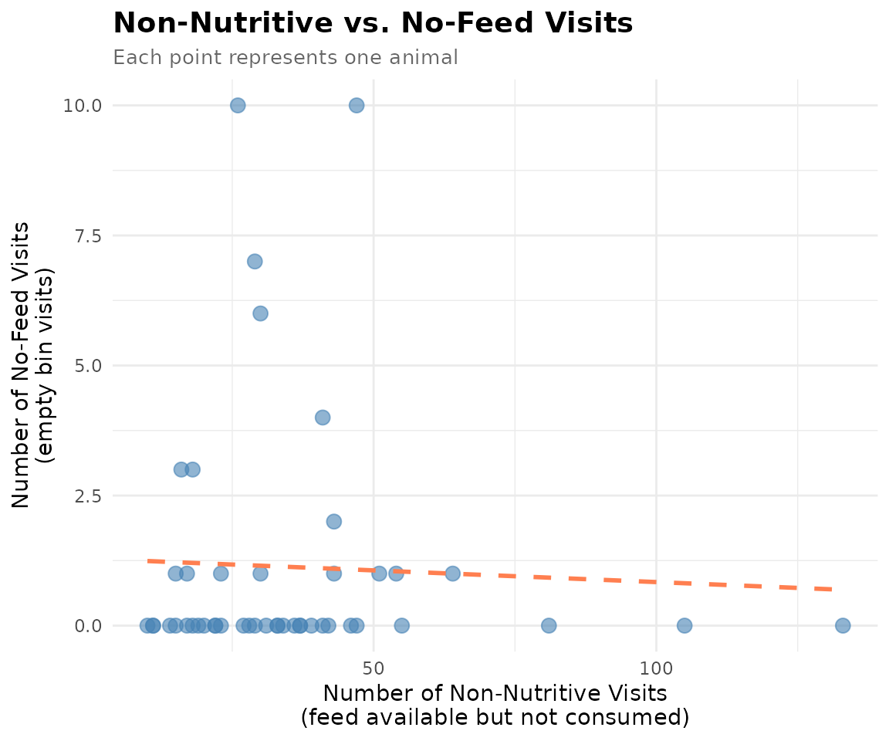

# 6. Non-Nutritive Visit Analysis

``` r
library(moo4feed)
library(ggplot2)
library(dplyr)
```

## 1. 🚨 Important: Set Your Global Variables First!

Before analyzing non-nutritive visit patterns, configure global
variables to match your data structure:

``` r
# Configure global variables for your data structure
set_global_cols(
  id_col = "cow",           # Animal ID column name
  start_col = "start",      # Visit start time column
  end_col = "end",          # Visit end time column
  bin_col = "bin",          # Bin/feeder ID column
  intake_col = "intake",    # Feed intake amount column
  dur_col = "duration",     # Visit duration column
  tz = "America/Vancouver"  # Your timezone
)

# Verify configuration
cat("✅ Global variables configured:\n")
#> ✅ Global variables configured:
cat("ID column:", id_col2(), "\n")
#> ID column: cow
cat("Start time column:", start_col2(), "\n")
#> Start time column: start
cat("End time column:", end_col2(), "\n")
#> End time column: end
cat("Bin column:", bin_col2(), "\n")
#> Bin column: bin
cat("Intake column:", intake_col2(), "\n")
#> Intake column: intake
cat("Duration column:", duration_col2(), "\n")
#> Duration column: duration
cat("Timezone:", tz2(), "\n")
#> Timezone: America/Vancouver
```

## 2. Introduction to Non-Nutritive Visits

🦦 Ollie the Otter explains: “Not every bin visit results in eating!
Sometimes animals visit a feeder, see that feed is available, but choose
not to eat. These are called non-nutritive visits. Understanding this
behavior helps researchers identify selective feeding patterns, food
preferences, and potential health issues.”

Non-nutritive visits can reveal important behavioral insights:

- **Feed selectivity**: Animals may reject certain feed types or quality
- **Social dynamics**: Animals may visit bins to assess feeding
  opportunities without committing
- **Health monitoring**: Changes in non-nutritive visit patterns may
  indicate illness or stress
- **Resource competition**: High non-nutritive visits may suggest
  animals are frequently displaced before they can eat

### What We’ll Learn

This tutorial demonstrates how to:

> 1.  **Calculate non-nutritive visits** - Identify when animals visit
>     bins with feed available but don’t eat
> 2.  **Calculate no-feed visits** - Identify when animals visit empty
>     bins
> 3.  **Analyze patterns** - Understand individual differences in
>     feeding selectivity

## 3. Prerequisites

This tutorial assumes completion of previous data processing steps in
**Tutorial 1: Data Cleaning**

## 4. Data Preparation

``` r
# Load cleaned example data
data(clean_feed)

# If you're using your own data from previous tutorials, use this instead:
# clean_feed <- your_cleaned_feed_data     # From your cleaning results

# Quick peek at our data structure
cat("Feed data structure:\n")
#> Feed data structure:
head(clean_feed[[1]], 3)  # First day, first 3 rows
#> # A tibble: 3 × 11
#>   transponder   cow   bin start               end                 duration
#>         <int> <int> <dbl> <dttm>              <dttm>                 <dbl>
#> 1    12448407  6020     1 2020-10-31 00:26:12 2020-10-31 00:27:36       84
#> 2    11954014  4044     1 2020-10-31 01:17:43 2020-10-31 01:22:13      270
#> 3    11954042  4072     1 2020-10-31 01:37:30 2020-10-31 01:37:52       22
#> # ℹ 5 more variables: start_weight <dbl>, end_weight <dbl>, intake <dbl>,
#> #   date <date>, rate <dbl>

cat("\nTotal days of data:", length(clean_feed), "\n")
#> 
#> Total days of data: 2
cat("Number of animals on first day:", length(unique(clean_feed[[1]]$cow)), "\n")
#> Number of animals on first day: 47
```

## 5. Understanding Non-Nutritive Visits

A **non-nutritive visit** occurs when: - The animal visits a feeding
bin - Feed is available in the bin (start weight \> calibration error) -
The animal consumes little or no feed (intake ≤ calibration error)

The **calibration error** is the measurement threshold below which
values are considered zero due to equipment sensitivity (typically 0.5
kg for feed bins).

### Calculate Non-Nutritive Visits

``` r
# Create quality control configuration with calibration error
my_qc_config <- qc_config(
  calibration_error = 0.5    # Equipment measurement threshold (kg)
)

# Calculate non-nutritive visits for each animal on each day
non_nutritive <- calculate_non_nutritive_visits(
  data = clean_feed,           # Our cleaned feed data
  cfg = my_qc_config           # Configuration with calibration error
)

# Examine the first day's results
cat("Non-nutritive visits on first day:\n")
#> Non-nutritive visits on first day:
head(non_nutritive[[1]])
#> # A tibble: 6 × 2
#>     cow number_of_non_nutritive_visits
#>   <int>                          <int>
#> 1  2074                             19
#> 2  3150                             18
#> 3  4001                             17
#> 4  4044                             30
#> 5  4070                             18
#> 6  4072                             43

# Summary statistics
cat("\nSummary of non-nutritive visits (first day):\n")
#> 
#> Summary of non-nutritive visits (first day):
summary(non_nutritive[[1]]$number_of_non_nutritive_visits)
#>    Min. 1st Qu.  Median    Mean 3rd Qu.    Max. 
#>   10.00   19.50   30.00   35.38   42.50  133.00
```

## 6. Understanding No-Feed Visits

A **no-feed visit** (or empty bin visit) occurs when: - The animal
visits a feeding bin - No feed is available in the bin (start weight ≤
calibration error) - The animal cannot consume anything (intake ≤
calibration error)

These visits indicate animals are checking bins that are already empty,
which may reflect: - High feeding competition (bins emptied quickly) -
Poor feed distribution timing - Exploration behavior

### Calculate No-Feed Visits

``` r
# Calculate visits to empty bins for each animal on each day
no_feed <- calculate_no_feed_visits(
  data = clean_feed,           # Our cleaned feed data
  cfg = my_qc_config           # Configuration with calibration error
)

# Examine the first day's results
cat("No-feed visits on first day:\n")
#> No-feed visits on first day:
head(no_feed[[1]])
#> # A tibble: 6 × 2
#>     cow number_of_visits_when_no_feed
#>   <int>                         <int>
#> 1  4044                             1
#> 2  4070                             3
#> 3  4072                             1
#> 4  4080                             1
#> 5  5041                             1
#> 6  5067                             6

# Summary statistics
cat("\nSummary of no-feed visits (first day):\n")
#> 
#> Summary of no-feed visits (first day):
summary(no_feed[[1]]$number_of_visits_when_no_feed)
#>    Min. 1st Qu.  Median    Mean 3rd Qu.    Max. 
#>   1.000   1.000   1.500   3.312   4.500  10.000
```

## 7. Comparing Non-Nutritive and No-Feed Patterns

Let’s combine both metrics to understand the full picture of feeding
behavior:

``` r
# Combine non-nutritive and no-feed data for first day
combined_day1 <- non_nutritive[[1]] |>
  dplyr::full_join(
    no_feed[[1]],
    by = "cow"
  ) |>
  dplyr::mutate(
    number_of_non_nutritive_visits = tidyr::replace_na(number_of_non_nutritive_visits, 0),
    number_of_visits_when_no_feed = tidyr::replace_na(number_of_visits_when_no_feed, 0)
  )

# Display animals with highest non-nutritive visits
cat("Animals with most non-nutritive visits (first day):\n")
#> Animals with most non-nutritive visits (first day):
combined_day1 |>
  dplyr::arrange(dplyr::desc(number_of_non_nutritive_visits)) |>
  head(5)
#> # A tibble: 5 × 3
#>     cow number_of_non_nutritive_visits number_of_visits_when_no_feed
#>   <int>                          <int>                         <int>
#> 1  7027                            133                             0
#> 2  7030                            105                             0
#> 3  5042                             81                             0
#> 4  5041                             64                             1
#> 5  6055                             55                             0

# Display animals with highest no-feed visits
cat("\nAnimals with most no-feed visits (first day):\n")
#> 
#> Animals with most no-feed visits (first day):
combined_day1 |>
  dplyr::arrange(dplyr::desc(number_of_visits_when_no_feed)) |>
  head(5)
#> # A tibble: 5 × 3
#>     cow number_of_non_nutritive_visits number_of_visits_when_no_feed
#>   <int>                          <int>                         <int>
#> 1  5124                             47                            10
#> 2  6005                             26                            10
#> 3  6030                             29                             7
#> 4  5067                             30                             6
#> 5  7023                             41                             4
```

### Visualize the Relationship

``` r
# Create scatter plot showing relationship between visit types
ggplot(combined_day1, aes(x = number_of_non_nutritive_visits,
                          y = number_of_visits_when_no_feed)) +
  geom_point(alpha = 0.6, size = 3, color = "steelblue") +
  geom_smooth(method = "lm", se = FALSE, color = "coral", linetype = "dashed") +
  labs(
    title = "Non-Nutritive vs. No-Feed Visits",
    subtitle = "Each point represents one animal",
    x = "Number of Non-Nutritive Visits\n(feed available but not consumed)",
    y = "Number of No-Feed Visits\n(empty bin visits)"
  ) +
  theme_minimal() +
  theme(
    plot.title = element_text(face = "bold", size = 14),
    plot.subtitle = element_text(size = 10, color = "gray40")
  )
```



## 8. Temporal Patterns Across Days

Understanding how these patterns change over time can reveal important
trends:

``` r
# Combine all days for temporal analysis
all_non_nutritive <- do.call(rbind, lapply(names(non_nutritive), function(date) {
  non_nutritive[[date]] |>
    dplyr::mutate(date = date)
}))

all_no_feed <- do.call(rbind, lapply(names(no_feed), function(date) {
  no_feed[[date]] |>
    dplyr::mutate(date = date)
}))

# Calculate daily averages
daily_summary <- all_non_nutritive |>
  dplyr::group_by(date) |>
  dplyr::summarize(
    avg_non_nutritive = mean(number_of_non_nutritive_visits),
    .groups = "drop"
  ) |>
  dplyr::left_join(
    all_no_feed |>
      dplyr::group_by(date) |>
      dplyr::summarize(
        avg_no_feed = mean(number_of_visits_when_no_feed),
        .groups = "drop"
      ),
    by = "date"
  )

cat("Daily averages across all animals:\n")
#> Daily averages across all animals:
print(daily_summary)
#> # A tibble: 2 × 3
#>   date       avg_non_nutritive avg_no_feed
#>   <chr>                  <dbl>       <dbl>
#> 1 2020-10-31              35.4        3.31
#> 2 2020-11-01              39.8        3.70
```

### Identify Most Selective Animals

``` r
# Calculate average non-nutritive visits per animal across all days
animal_selectivity <- all_non_nutritive |>
  dplyr::group_by(cow) |>
  dplyr::summarize(
    avg_non_nutritive_visits = mean(number_of_non_nutritive_visits),
    days_observed = dplyr::n(),
    .groups = "drop"
  ) |>
  dplyr::arrange(dplyr::desc(avg_non_nutritive_visits))

cat("🏆 TOP 5 MOST SELECTIVE ANIMALS (highest non-nutritive visits):\n")
#> 🏆 TOP 5 MOST SELECTIVE ANIMALS (highest non-nutritive visits):
head(animal_selectivity, 5)
#> # A tibble: 5 × 3
#>     cow avg_non_nutritive_visits days_observed
#>   <int>                    <dbl>         <int>
#> 1  7027                    118.              2
#> 2  7030                    104               2
#> 3  5042                     81.5             2
#> 4  6055                     70               2
#> 5  6027                     61               2

cat("\n🍽️ TOP 5 LEAST SELECTIVE ANIMALS (lowest non-nutritive visits):\n")
#> 
#> 🍽️ TOP 5 LEAST SELECTIVE ANIMALS (lowest non-nutritive visits):
tail(animal_selectivity, 5)
#> # A tibble: 5 × 3
#>     cow avg_non_nutritive_visits days_observed
#>   <int>                    <dbl>         <int>
#> 1  4070                     17               2
#> 2  5114                     16.5             2
#> 3  4001                     16               2
#> 4  6129                     15.5             2
#> 5  6042                     15               2
```

## 9. Practical Interpretation

### High Non-Nutritive Visits May Indicate:

- **Feed quality issues**: Animals rejecting poor-quality or unpalatable
  feed
- **Feed selectivity**: Animals preferring certain feed types or
  freshness
- **Social displacement**: Animals being pushed away before consuming
  adequate amounts
- **Health concerns**: Sick animals showing reduced appetite despite
  checking bins

### High No-Feed Visits May Indicate:

- **Inadequate feed supply**: Bins frequently empty before all animals
  can eat
- **Intense feeding competition**: Dominant animals consuming available
  feed quickly
- **Poor feeding management**: Feed delivery timing not matching animal
  behavior patterns
- **Exploration behavior**: Animals actively searching for feeding
  opportunities

## 10. Summary

This tutorial demonstrated analysis of non-nutritive and no-feed visit
patterns:

✅ **Non-nutritive visits**: Identified when animals visit bins with
feed but don’t eat

✅ **No-feed visits**: Identified when animals visit empty bins

✅ **Individual patterns**: Analyzed which animals show highest
selectivity

✅ **Temporal trends**: Examined how patterns change across days

These metrics provide valuable insights into feeding selectivity,
resource competition, and potential welfare issues.

## 11. Code Cheatsheet

``` r
#' Copy and modify these code blocks for your own analysis!

# ---- SETUP: Global Variables (REQUIRED FIRST!) ----
library(moo4feed)
library(dplyr)
library(ggplot2)

# Set up your column names and timezone (modify these!)
set_global_cols(
  id_col = "cow",           # Your animal ID column
  start_col = "start",      # Visit start time column
  end_col = "end",          # Visit end time column
  bin_col = "bin",          # Bin/feeder ID column
  intake_col = "intake",    # Feed intake amount column
  dur_col = "duration",     # Visit duration column
  tz = "America/Vancouver"  # Your timezone
)

# ---- STEP 1: Load Your Data ----
# Use your own cleaned data from previous tutorials:
# clean_feed <- your_cleaned_feed_data

# ---- STEP 2: Create QC Configuration ----
my_qc_config <- qc_config(
  calibration_error = 0.5    # Equipment measurement threshold (kg)
)

# ---- STEP 3: Calculate Non-Nutritive Visits ----
# Visits when feed is available but animal doesn't eat
non_nutritive <- calculate_non_nutritive_visits(
  data = your_clean_feed,          # Your cleaned feed data
  cfg = my_qc_config,              # QC configuration
  id_col = id_col2(),              # Animal ID column (default from global vars)
  intake_col = intake_col2(),      # Intake column (default from global vars)
  start_weight_col = start_weight_col2()  # Start weight column (default from global vars)
)

# ---- STEP 4: Calculate No-Feed Visits ----
# Visits when bin is empty (no feed available)
no_feed <- calculate_no_feed_visits(
  data = your_clean_feed,          # Your cleaned feed data
  cfg = my_qc_config,              # QC configuration
  id_col = id_col2(),              # Animal ID column (default from global vars)
  intake_col = intake_col2(),      # Intake column (default from global vars)
  start_weight_col = start_weight_col2()  # Start weight column (default from global vars)
)

# ---- STEP 5: Combine and Analyze Results ----
# For a specific day
day1_combined <- non_nutritive[[1]] |>
  dplyr::full_join(no_feed[[1]], by = "cow") |>
  dplyr::mutate(
    number_of_non_nutritive_visits = tidyr::replace_na(number_of_non_nutritive_visits, 0),
    number_of_visits_when_no_feed = tidyr::replace_na(number_of_visits_when_no_feed, 0)
  )

# Identify most selective animals
most_selective <- day1_combined |>
  dplyr::arrange(dplyr::desc(number_of_non_nutritive_visits)) |>
  head(10)

# Animals checking empty bins most often
empty_bin_checkers <- day1_combined |>
  dplyr::arrange(dplyr::desc(number_of_visits_when_no_feed)) |>
  head(10)

# ---- STEP 6: Temporal Analysis Across Days ----
# Combine all days
all_non_nutritive <- do.call(rbind, lapply(names(non_nutritive), function(date) {
  non_nutritive[[date]] |>
    dplyr::mutate(date = date)
}))

all_no_feed <- do.call(rbind, lapply(names(no_feed), function(date) {
  no_feed[[date]] |>
    dplyr::mutate(date = date)
}))

# Calculate daily averages
daily_summary <- all_non_nutritive |>
  dplyr::group_by(date) |>
  dplyr::summarize(
    avg_non_nutritive = mean(number_of_non_nutritive_visits),
    .groups = "drop"
  ) |>
  dplyr::left_join(
    all_no_feed |>
      dplyr::group_by(date) |>
      dplyr::summarize(
        avg_no_feed = mean(number_of_visits_when_no_feed),
        .groups = "drop"
      ),
    by = "date"
  )

# Calculate per-animal averages across all days
animal_selectivity <- all_non_nutritive |>
  dplyr::group_by(cow) |>
  dplyr::summarize(
    avg_non_nutritive_visits = mean(number_of_non_nutritive_visits),
    days_observed = dplyr::n(),
    .groups = "drop"
  ) |>
  dplyr::arrange(dplyr::desc(avg_non_nutritive_visits))

# ---- STEP 7: Visualization ----
# Scatter plot of visit types
ggplot(day1_combined, aes(x = number_of_non_nutritive_visits,
                          y = number_of_visits_when_no_feed)) +
  geom_point(alpha = 0.6, size = 3, color = "steelblue") +
  geom_smooth(method = "lm", se = FALSE, color = "coral", linetype = "dashed") +
  labs(
    title = "Non-Nutritive vs. No-Feed Visits",
    x = "Non-Nutritive Visits (feed available, not consumed)",
    y = "No-Feed Visits (empty bin)"
  ) +
  theme_minimal()
```

------------------------------------------------------------------------

**🦦 Ollie’s Final Words**: *“Remember, non-nutritive visits aren’t
always bad! They’re natural exploration behavior. However, sudden
increases in non-nutritive visits across many animals might signal feed
quality issues or health concerns worth investigating.”*

**Next Steps**: Use these metrics alongside other behavioral measures
(from previous tutorials) to build a comprehensive picture of animal
welfare and feeding patterns! 🍽️✨
