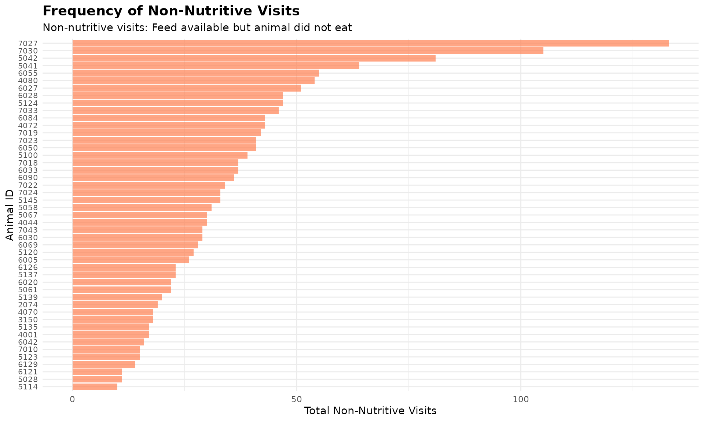
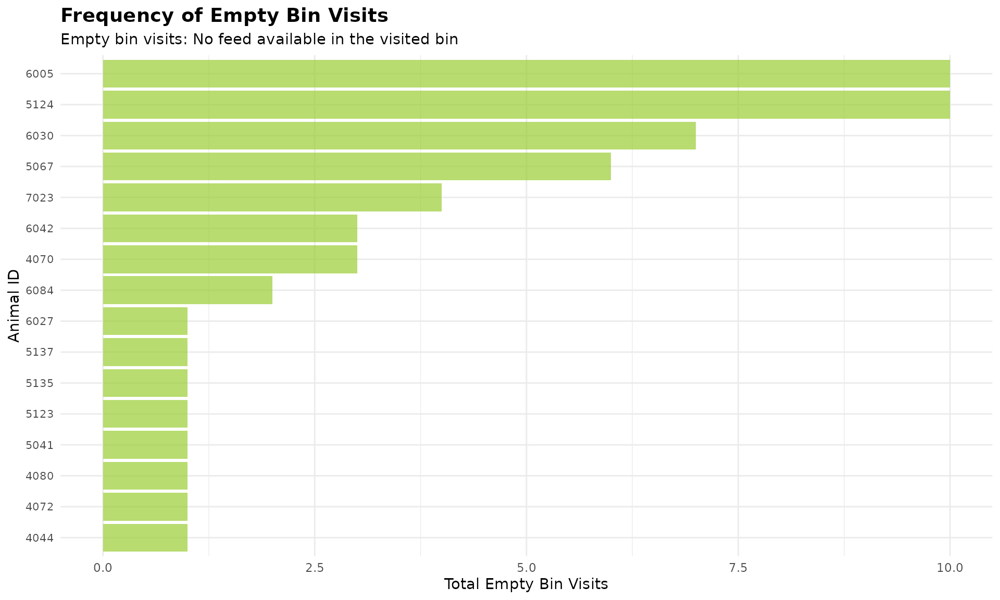

# 6. Non-Nutritive Visit Analysis

``` r
library(moo4feed)
library(ggplot2)
library(dplyr)
```

## 1. 🚨 Important: Set Your Global Variables First

Before analyzing non-nutritive visit patterns, configure global
variables to match your data structure:

``` r
# Configure global variables for your data structure
set_global_cols(
  id_col = "cow",           # Animal ID column name
  start_col = "start",      # Visit start time column
  end_col = "end",          # Visit end time column
  bin_col = "bin",          # Bin/feeder ID column
  intake_col = "intake",    # Feed intake amount column
  dur_col = "duration",     # Visit duration column
  tz = "America/Vancouver"  # Your timezone
)
```

## 2. Introduction to Non-Nutritive Visits

In nature, animals explore their environment while foraging. In the
barn, we have observed that not every bin visit result in the cow
actually feeding. Sometimes they visit a feeder, see that feed is
available, but choose not to eat. We refer to those as non-nutritive
visits, which potentially reflects exploratory behaviour.

## 3. Prerequisites

This tutorial assumes completion of previous data processing steps in
[**Tutorial 1: Data
Cleaning**](https://skysheng7.github.io/moo4feed/articles/data_cleaning.md).

## 4. Data Preparation

``` r
# Load cleaned example data
data(clean_feed)

# If you're using your own data from previous tutorials, use this instead:
# clean_feed <- your_cleaned_feed_data     # From your cleaning results
```

## 5. Understanding Non-Nutritive Visits

A **non-nutritive visit** is defined as when:

- The animal visits a bin
- Feed is available in the bin (start weight \> calibration error)
- The animal consumes little or no feed (intake ≤ calibration error)

The **calibration error** is the measurement threshold below which
values are considered zero due to equipment sensitivity (typically 0.5
kg for feed bins).

### Sorting Results

Both
[`calculate_non_nutritive_visits()`](https://skysheng7.github.io/moo4feed/reference/calculate_non_nutritive_visits.md)
and
[`calculate_no_feed_visits()`](https://skysheng7.github.io/moo4feed/reference/calculate_no_feed_visits.md)
support an optional `sort` parameter to order results by visit
frequency:

- `sort = 0` (default) - No sorting
- `sort = 1` - Ascending order (lowest to highest visits)  
- `sort = -1` - Descending order (highest to lowest visits)

This feature helps quickly identify animals with the most (or least)
visits of each type.

### Calculate Non-Nutritive Visits

``` r
# Create quality control configuration with calibration error
my_qc_config <- qc_config(
  calibration_error = 0.5    # Equipment measurement threshold (kg)
)

# Calculate non-nutritive visits for each animal on each day. 
non_nutritive <- calculate_non_nutritive_visits(
  data = clean_feed,           # Our cleaned feed data
  cfg = my_qc_config           # Configuration with calibration error
)

# Examine the first day's results (unsorted)
cat("Non-nutritive visits on first day (unsorted):\n")
#> Non-nutritive visits on first day (unsorted):
head(non_nutritive[[1]])
#> # A tibble: 6 × 2
#>     cow number_of_non_nutritive_visits
#>   <int>                          <int>
#> 1  2074                             19
#> 2  3150                             18
#> 3  4001                             17
#> 4  4044                             30
#> 5  4070                             18
#> 6  4072                             43
```

### Using the Sort Parameter

``` r
# Sort by highest non-nutritive visits first (descending)
non_nutritive_desc <- calculate_non_nutritive_visits(
  data = clean_feed,
  cfg = my_qc_config,
  sort = -1    # Sort descending (highest first)
)

cat("\n Animals with MOST non-nutritive visits (top 5):\n")
#> 
#>  Animals with MOST non-nutritive visits (top 5):
head(non_nutritive_desc[[1]], 5)
#> # A tibble: 5 × 2
#>     cow number_of_non_nutritive_visits
#>   <int>                          <int>
#> 1  7027                            133
#> 2  7030                            105
#> 3  5042                             81
#> 4  5041                             64
#> 5  6055                             55

# Sort by lowest non-nutritive visits first (ascending)
non_nutritive_asc <- calculate_non_nutritive_visits(
  data = clean_feed,
  cfg = my_qc_config,
  sort = 1     # Sort ascending (lowest first)
)

cat("\n Animals with LEAST non-nutritive visits (top 5):\n")
#> 
#>  Animals with LEAST non-nutritive visits (top 5):
head(non_nutritive_asc[[1]], 5)
#> # A tibble: 5 × 2
#>     cow number_of_non_nutritive_visits
#>   <int>                          <int>
#> 1  5114                             10
#> 2  5028                             11
#> 3  6121                             11
#> 4  6129                             14
#> 5  5123                             15
```

## 6. Understanding No-Feed Visits

A **no-feed visit** (or empty bin visit) occurs when:

- The animal visits a feeding bin
- No feed is available in the bin (start weight ≤ calibration error)
- The animal cannot consume anything (intake ≤ calibration error)

These visits indicate animals are checking bins that are already empty,
which may reflect:

- The animal having lots of empty bin visits may indicate that they are
  disadvantaged, because they can only eat the “leftovers” after others
  have finished eating.
- High feeding competition (bins emptied quickly)
- Feed management issues (e.g., we may need to adjust the feed delivery
  timing or amount)

### Calculate No-Feed Visits

``` r
# Calculate visits to empty bins for each animal on each day
no_feed <- calculate_no_feed_visits(
  data = clean_feed,           # Our cleaned feed data
  cfg = my_qc_config           # Configuration with calibration error
)

# Examine the first day's results (unsorted)
cat("No-feed visits on first day (unsorted):\n")
#> No-feed visits on first day (unsorted):
head(no_feed[[1]])
#> # A tibble: 6 × 2
#>     cow number_of_visits_when_no_feed
#>   <int>                         <int>
#> 1  4044                             1
#> 2  4070                             3
#> 3  4072                             1
#> 4  4080                             1
#> 5  5041                             1
#> 6  5067                             6

# Sort by highest empty bin visits (descending) to identify animals checking empty bins most
no_feed_desc <- calculate_no_feed_visits(
  data = clean_feed,
  cfg = my_qc_config,
  sort = -1    # Sort descending (highest first)
)

cat("\n Animals checking EMPTY bins most often (top 5):\n")
#> 
#>  Animals checking EMPTY bins most often (top 5):
head(no_feed_desc[[1]], 5)
#> # A tibble: 5 × 2
#>     cow number_of_visits_when_no_feed
#>   <int>                         <int>
#> 1  5124                            10
#> 2  6005                            10
#> 3  6030                             7
#> 4  5067                             6
#> 5  7023                             4
```

### Visualize Non-Nutritive and No-Feed Patterns

``` r
# Use first day's data and get animals with most non-nutritive visits
top_nn <- head(non_nutritive_desc[[1]], 50)

ggplot(top_nn, aes(x = reorder(cow, number_of_non_nutritive_visits), y = number_of_non_nutritive_visits)) +
  geom_bar(stat = "identity", fill = "coral", alpha = 0.7) +
  coord_flip() +
  labs(
    title = "Frequency of Non-Nutritive Visits",
    subtitle = "Non-nutritive visits: Feed available but animal did not eat",
    x = "Animal ID",
    y = "Total Non-Nutritive Visits"
  ) +
  theme_minimal() +
  theme(
    axis.text.y = element_text(size = 8),
    plot.title = element_text(size = 14, face = "bold"),
    plot.subtitle = element_text(size = 11)
  )
```



``` r
# Use first day's data and get animals checking empty bins
top_empty <- head(no_feed_desc[[1]], 50)

ggplot(top_empty, aes(x = reorder(cow, number_of_visits_when_no_feed), y = number_of_visits_when_no_feed)) +
  geom_bar(stat = "identity", fill = "olivedrab3", alpha = 0.7) +
  coord_flip() +
  labs(
    title = "Frequency of Empty Bin Visits",
    subtitle = "Empty bin visits: No feed available in the visited bin",
    x = "Animal ID",
    y = "Total Empty Bin Visits"
  ) +
  theme_minimal() +
  theme(
    axis.text.y = element_text(size = 8),
    plot.title = element_text(size = 14, face = "bold"),
    plot.subtitle = element_text(size = 11)
  )
```



**Note:** Many animals have no empty bin visits, so they are excluded
from the plot.

## 7. Code Cheatsheet

``` r
#' Copy and modify these code blocks for your own analysis!

# ---- SETUP: Global Variables (REQUIRED FIRST!) ----
library(moo4feed)
library(ggplot2)
library(dplyr)

# Set up your column names and timezone (modify these!)
set_global_cols(
  id_col = "cow",           # Your animal ID column
  start_col = "start",      # Visit start time column
  end_col = "end",          # Visit end time column
  bin_col = "bin",          # Bin/feeder ID column
  intake_col = "intake",    # Feed intake amount column
  dur_col = "duration",     # Visit duration column
  tz = "America/Vancouver"  # Your timezone
)

# ---- STEP 1: Load Your Data ----
# Load your cleaned data
data(clean_feed)

# Or use your own cleaned data from previous tutorials:
# clean_feed <- your_cleaned_feed_data

# ---- STEP 2: Create QC Configuration ----
my_qc_config <- qc_config(
  calibration_error = 0.5    # Equipment measurement threshold (kg)
)

# ---- STEP 3: Calculate Non-Nutritive Visits ----
# Basic calculation (unsorted)
non_nutritive <- calculate_non_nutritive_visits(
  data = clean_feed,
  cfg = my_qc_config
)

# View first day results
head(non_nutritive[[1]])

# Sort by highest visits first (descending)
non_nutritive_desc <- calculate_non_nutritive_visits(
  data = clean_feed,
  cfg = my_qc_config,
  sort = -1
)

head(non_nutritive_desc[[1]], 5)

# Sort by lowest visits first (ascending)
non_nutritive_asc <- calculate_non_nutritive_visits(
  data = clean_feed,
  cfg = my_qc_config,
  sort = 1
)

head(non_nutritive_asc[[1]], 5)

# ---- STEP 4: Calculate No-Feed Visits ----
# Basic calculation (unsorted)
no_feed <- calculate_no_feed_visits(
  data = clean_feed,
  cfg = my_qc_config
)

# View first day results
head(no_feed[[1]])

# Sort by highest empty bin visits (descending)
no_feed_desc <- calculate_no_feed_visits(
  data = clean_feed,
  cfg = my_qc_config,
  sort = -1
)

head(no_feed_desc[[1]], 5)

# ---- STEP 5: Visualize Results ----
# Non-nutritive visits bar plot (first day example)
top_nn <- head(non_nutritive_desc[[1]], 50)

ggplot(top_nn, aes(x = reorder(cow, number_of_non_nutritive_visits), y = number_of_non_nutritive_visits)) +
  geom_bar(stat = "identity", fill = "coral", alpha = 0.7) +
  coord_flip() +
  labs(
    title = "Frequency of Non-Nutritive Visits",
    subtitle = "Non-nutritive visits: Feed available but animal did not eat",
    x = "Animal ID",
    y = "Total Non-Nutritive Visits"
  ) +
  theme_minimal() +
  theme(
    axis.text.y = element_text(size = 8),
    plot.title = element_text(size = 14, face = "bold"),
    plot.subtitle = element_text(size = 11)
  )

# Empty bin visits bar plot (first day example)
top_empty <- head(no_feed_desc[[1]], 50)

ggplot(top_empty, aes(x = reorder(cow, number_of_visits_when_no_feed), y = number_of_visits_when_no_feed)) +
  geom_bar(stat = "identity", fill = "olivedrab3", alpha = 0.7) +
  coord_flip() +
  labs(
    title = "Frequency of Empty Bin Visits",
    subtitle = "Empty bin visits: No feed available in the visited bin",
    x = "Animal ID",
    y = "Total Empty Bin Visits"
  ) +
  theme_minimal() +
  theme(
    axis.text.y = element_text(size = 8),
    plot.title = element_text(size = 14, face = "bold"),
    plot.subtitle = element_text(size = 11)
  )
```

------------------------------------------------------------------------
