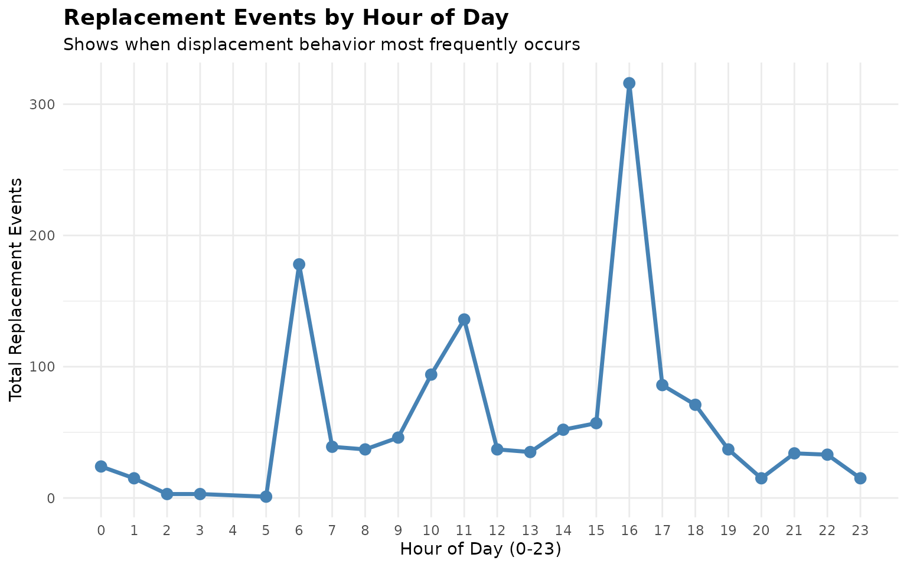
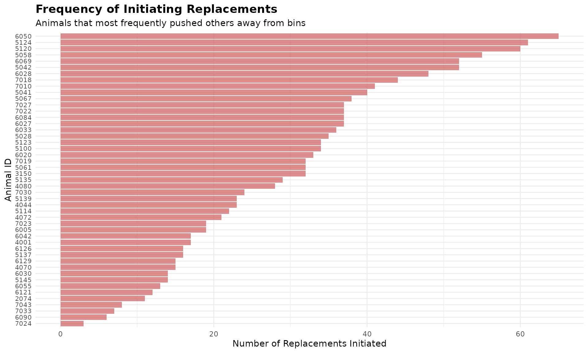

# 4. Replacement Detection

``` r
library(moo4feed)
library(ggplot2)
library(dplyr)
```

## 1. 🚨 Important: Set Your Global Variables First

Before analyzing replacement behavior, configure global variables to
match your data structure:

``` r
# Configure global variables for your data structure
set_global_cols(
  id_col = "cow",           # Animal ID column name
  start_col = "start",      # Visit start time column  
  end_col = "end",          # Visit end time column
  bin_col = "bin",          # Bin/feeder ID column
  intake_col = "intake",    # Feed intake amount column
  dur_col = "duration",     # Visit duration column
  tz = "America/Vancouver"  # Your timezone
)
```

## 2. Introduction to Replacement Detection

🦦 Ollie the Otter explains: “Replacement events occur when one animal
pushes and displaces another animal that is actively feeding or drinking
from a feeding station within a short time window. These social
interactions reveal important information about herd dynamics and
dominance hierarchies.”

Understanding replacement behavior helps researchers and farm managers:

- **Monitor social stress**: High replacement rates may indicate social
  tension
- **Identify dominant animals**: Animals that frequently replace others
- **Affective state**: Animals frequently get replaced may experience
  longitudinal stress

### What We’ll Learn

This tutorial demonstrates how to: **Detect replacement events** using
validated time thresholds

## 3. Prerequisites

This tutorial assumes completion of previous data processing steps in
**Tutorial 1: Data Cleaning**

## 4. Data Preparation

``` r
# Load cleaned example data
data(clean_comb)

# If you're using your own data from previous tutorials, use this instead:
# clean_feed <- your_cleaned_feed_data     # From your cleaning results
# clean_water <- your_cleaned_water_data   # From your cleaning results

# Quick peek at our data structure
cat("Feed and water data structure:\n")
#> Feed and water data structure:
head(clean_comb[[1]], 3)  # First day, first 3 rows
#> # A tibble: 3 × 11
#>   transponder   cow   bin start               end                 duration
#>         <int> <int> <dbl> <dttm>              <dttm>                 <dbl>
#> 1    12448407  6020     1 2020-10-31 00:26:12 2020-10-31 00:27:36       84
#> 2    11954014  4044     1 2020-10-31 01:17:43 2020-10-31 01:22:13      270
#> 3    11954042  4072     1 2020-10-31 01:37:30 2020-10-31 01:37:52       22
#> # ℹ 5 more variables: start_weight <dbl>, end_weight <dbl>, intake <dbl>,
#> #   date <date>, rate <dbl>

cat("\nTotal days of feed & water data:", length(clean_comb), "\n")
#> 
#> Total days of feed & water data: 2
```

## 5. Understanding Replacement Events

A replacement event is defined as when one animal (actor) takes over a
feeding station from another animal (reactor) within a short time
threshold. The default threshold of 26 seconds is based on validated
research.

### Key Components

- **Reactor cow**: The cow that was replaced (had to leave the bin)
- **Actor cow**: The cow that initiated the replacement (took over the
  bin)  
- **Time threshold**: Maximum gap between when one cow leaves and
  another arrives (default: 26 seconds)
- **Validation**: Events are verified by checking if the actor cow has
  an “alibi” (was feeding elsewhere when the reactor left)

### Detecting Replacement Events

``` r
# Process replacement events for all days
replacements <- record_replacement_days(
  comb = clean_comb,           # Our cleaned feed data
  cfg = qc_config(replacement_threshold = 26)      # Time gap (seconds) to classify replacement behavior
)

# Examine the first few replacement events
head(replacements[[1]])
#> # A tibble: 6 × 6
#>   reactor_cow   bin time                date       actor_cow bout_interval
#>         <int> <dbl> <dttm>              <date>         <int> <Duration>   
#> 1        5124     1 2020-10-31 06:07:52 2020-10-31      6020 10s          
#> 2        6020     1 2020-10-31 06:09:44 2020-10-31      6069 11s          
#> 3        6069     1 2020-10-31 06:12:05 2020-10-31      5124 10s          
#> 4        5124     1 2020-10-31 06:13:37 2020-10-31      5067 10s          
#> 5        7010     1 2020-10-31 06:20:15 2020-10-31      7018 11s          
#> 6        7018     1 2020-10-31 06:20:58 2020-10-31      7010 9s

# Summary of replacement events
cat("Replacement events per day:\n")
#> Replacement events per day:
sapply(replacements, nrow)
#> 2020-10-31 2020-11-01 
#>        655        709
```

Each replacement event contains:

- **`reactor_cow`**: ID of the cow that was replaced
- **`actor_cow`**: ID of the cow that initiated the replacement
- **`bin`**: Feeding/drinking station where the replacement occurred
- **`time`**: Timestamp when the replacement happened
- **`date`**: Date of the event
- **`bout_interval`**: Time gap between when the reactor left and actor
  entered the bin

## 6. Analyzing Replacement Patterns

### Most Active cows

``` r
# Combine all days for analysis
all_replacements <- do.call(rbind, replacements)

# cows that most frequently replace others (actors)
top_actors <- all_replacements |>
  dplyr::count(actor_cow, sort = TRUE, name = "times_replaced_others") |>
  head(5)

cat("Top 10 cows that most frequently displace others:\n")
#> Top 10 cows that most frequently displace others:
print(top_actors)
#> # A tibble: 5 × 2
#>   actor_cow times_replaced_others
#>       <int>                 <int>
#> 1      6050                    65
#> 2      5124                    61
#> 3      5120                    60
#> 4      5058                    55
#> 5      5042                    52

# cows that are most frequently replaced (reactors)
top_reactors <- all_replacements |>
  dplyr::count(reactor_cow, sort = TRUE, name = "times_replaced") |>
  head(5)

cat("\nTop 10 cows that are most frequently displaced:\n")
#> 
#> Top 10 cows that are most frequently displaced:
print(top_reactors)
#> # A tibble: 5 × 2
#>   reactor_cow times_replaced
#>         <int>          <int>
#> 1        7018             57
#> 2        5042             50
#> 3        7027             49
#> 4        7030             46
#> 5        5123             43
```

### Replacement Timing Patterns

``` r
# Analyze replacement timing throughout the day
all_replacements$hour <- lubridate::hour(all_replacements$time)

hourly_replacements <- all_replacements |>
  dplyr::count(hour, name = "replacement_count")

cat("Replacement events by hour of day:\n")
#> Replacement events by hour of day:
print(hourly_replacements)
#> # A tibble: 23 × 2
#>     hour replacement_count
#>    <int>             <int>
#>  1     0                24
#>  2     1                15
#>  3     2                 3
#>  4     3                 3
#>  5     5                 1
#>  6     6               178
#>  7     7                39
#>  8     8                37
#>  9     9                46
#> 10    10                94
#> # ℹ 13 more rows
```

### Visualize Replacement Patterns

``` r
# Visualize replacement events by hour
ggplot(hourly_replacements, aes(x = hour, y = replacement_count)) +
  geom_line(color = "steelblue", linewidth = 1.2) +
  geom_point(color = "steelblue", size = 3) +
  scale_x_continuous(breaks = 0:23) +
  labs(
    title = "Replacement Events by Hour of Day",
    subtitle = "Shows when displacement behavior most frequently occurs",
    x = "Hour of Day (0-23)",
    y = "Total Replacement Events"
  ) +
  theme_minimal() +
  theme(
    plot.title = element_text(size = 14, face = "bold"),
    panel.grid.minor.x = element_blank()
  )
```



``` r
# Visualize top 50 most active displacing animals
top_50_actors <- head(all_replacements |>
  dplyr::count(actor_cow, sort = TRUE, name = "times_replaced_others"), 50)

ggplot(top_50_actors, aes(x = reorder(actor_cow, times_replaced_others), y = times_replaced_others)) +
  geom_bar(stat = "identity", fill = "indianred", alpha = 0.7) +
  coord_flip() +
  labs(
    title = "Frequency of Initiating Replacements",
    subtitle = "Animals that most frequently pushed others away from bins",
    x = "Animal ID",
    y = "Number of Replacements Initiated"
  ) +
  theme_minimal() +
  theme(
    axis.text.y = element_text(size = 8),
    plot.title = element_text(size = 14, face = "bold")
  )
```



## 7. Summary

This tutorial demonstrated replacement detection for understanding
social dynamics:

- **Event detection**: Identified and validated replacement events using
  time thresholds

- **Pattern analysis**: Analyzed which cows are most active in
  displacement behavior

- **Timing insights**: Examined when most replacement events occur
  throughout the day

## 8. Code Cheatsheet

``` r
#' Copy and modify these code blocks for your own analysis!

# ---- SETUP: Global Variables (REQUIRED FIRST!) ----
library(moo4feed)
library(ggplot2)
library(dplyr)

# Set up your column names and timezone (modify these!)
set_global_cols(
  id_col = "cow",           # Your animal ID column
  start_col = "start",      # Visit start time column  
  end_col = "end",          # Visit end time column
  bin_col = "bin",          # Bin/feeder ID column
  intake_col = "intake",    # Feed intake amount column
  dur_col = "duration",     # Visit duration column
  tz = "America/Vancouver"  # Your timezone
)

# ---- STEP 1: Load Your Data ----
# Load your cleaned data
data(clean_comb)

# Or use your own cleaned data from previous tutorials:
# clean_comb <- your_cleaned_comb_data

# ---- STEP 2: Detect Replacement Events ----
# Process replacement events for all days
replacements <- record_replacement_days(
  comb = clean_comb,                    # Your cleaned feed/water or both feed + water data
  cfg = qc_config(replacement_threshold = 26)  # Time gap (seconds) to classify replacement behavior
)

# Examine the first few replacement events
head(replacements[[1]])

# Summary of replacement events
cat("Replacement events per day:\n")
sapply(replacements, nrow)

# ---- STEP 3: Analyze Replacement Patterns ----
# Combine all days for analysis
all_replacements <- do.call(rbind, replacements)

# Animals that most frequently replace others (actors)
top_actors <- all_replacements |>
  dplyr::count(actor_cow, sort = TRUE, name = "times_replaced_others") |>
  head(5)

cat("Top cows that most frequently displace others:\n")
print(top_actors)

# Animals that are most frequently replaced (reactors)
top_reactors <- all_replacements |>
  dplyr::count(reactor_cow, sort = TRUE, name = "times_replaced") |>
  head(5)

cat("\nTop cows that are most frequently displaced:\n")
print(top_reactors)

# Analyze replacement timing throughout the day
all_replacements$hour <- lubridate::hour(all_replacements$time)

hourly_replacements <- all_replacements |>
  dplyr::count(hour, name = "replacement_count")

cat("\nReplacement events by hour of day:\n")
print(hourly_replacements)

# ---- STEP 4: Visualize Results ----
# Replacement events by hour
ggplot(hourly_replacements, aes(x = hour, y = replacement_count)) +
  geom_line(color = "steelblue", linewidth = 1.2) +
  geom_point(color = "steelblue", size = 3) +
  scale_x_continuous(breaks = 0:23) +
  labs(
    title = "Replacement Events by Hour of Day",
    subtitle = "Shows when displacement behavior most frequently occurs",
    x = "Hour of Day (0-23)",
    y = "Total Replacement Events"
  ) +
  theme_minimal() +
  theme(
    plot.title = element_text(size = 14, face = "bold"),
    panel.grid.minor.x = element_blank()
  )

# Most active displacing animals bar plot
top_50_actors <- head(all_replacements |>
  dplyr::count(actor_cow, sort = TRUE, name = "times_replaced_others"), 50)

ggplot(top_50_actors, aes(x = reorder(actor_cow, times_replaced_others), y = times_replaced_others)) +
  geom_bar(stat = "identity", fill = "indianred", alpha = 0.7) +
  coord_flip() +
  labs(
    title = "Frequency of Initiating Replacements",
    subtitle = "Animals that most frequently pushed others away from bins",
    x = "Animal ID",
    y = "Number of Replacements Initiated"
  ) +
  theme_minimal() +
  theme(
    axis.text.y = element_text(size = 8),
    plot.title = element_text(size = 14, face = "bold")
  )
```
