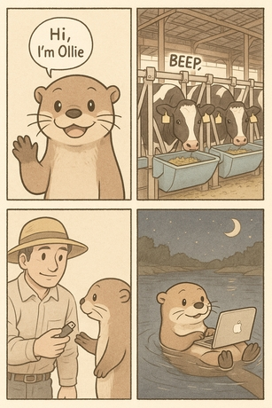

```{r, include = FALSE}
knitr::opts_chunk$set(
  collapse = TRUE,
  comment = "#>",
  fig.width = 6,
  fig.height = 4,
  warning = FALSE,
  message = FALSE
)
```

# Meet Ollie 🦦

> *"Hey there, my dear friends!"* I'm **Ollie the Otter** , a curious river-explorer and data‑scientist‑in‑training. One morning while gliding along my favorite stream, I spotted a dairy barn where **hundreds of cows** were visiting automatic feeders and drinkers. The beeping RFID readers and steady munch-munch-munching created a beautiful data symphony!
>
> Each night, back at my mossy den, I curl up with my otter‑sized laptop and learn about R. The friendly farmers have shared their raw visit logs, so I can uncover the hidden tales behind my cow friends. I'm fascinated by how **every single cow writes its own story in the data**—and tonight we're going to read their stories together using the **`moo4feed`** package. Ready to splash in? Let's go!

```{r, echo=FALSE}


```

------------------------------------------------------------------------

## 1. Why Clean Your Data? 🧹

Raw data from automatic feeders contains numerous quality issues including inconsistent timestamps, erroneous visit records, and measurement errors. Data cleaning transforms these raw records into analysis-ready datasets suitable for behavioral research.

## 2. Load Required Packages 🧰

```{r setup-packages}
library(moo4feed)   # Main package for animal data processing
library(ggplot2)    # For visualization
library(dplyr)      # For data manipulation
```

The `moo4feed` package includes sample datasets from dairy research facilities, allowing you to follow this tutorial without your own data.

------------------------------------------------------------------------

## 3. Where Are Your Files? 📂

```{r paths}
# For your own data, edit this line:
# extdata_path <- "/path/to/my/raw/files"  # ← your folder path

# For demonstration with sample data:
extdata_path <- system.file("extdata", package = "moo4feed")
```

### Separate Storage for Feeders and Drinkers

If your feeder and drinker files are stored separately:

```{r echo=TRUE, eval=FALSE}
extdata_path_f <- "/path/to/feeder/files"    # 🐄 For feed data
extdata_path_w <- "/path/to/drinker/files"   # 🚰 For water data
```

------------------------------------------------------------------------

## 4. Load in Data files 🔍

We use filename patterns to distinguish feeder data from drinker data:

```{r list-files}
# Find all feeder files (VR*.DAT pattern)
fileNames.f <- list.files(
  path       = extdata_path,     # 🐄 Where to look
  pattern    = "^VR.*\\.DAT$",   # 🐄 Pattern to match
  recursive  = TRUE,             # Look in subfolders too
  full.names = TRUE              # Include full path
) |> sort()                      # Keep them in order

# Find all drinker files (VW*.DAT pattern)
fileNames.w <- list.files(
  path       = extdata_path,     # 🚰 Where to look
  pattern    = "^VW.*\\.DAT$",   # 🚰 Pattern to match
  recursive  = TRUE,
  full.names = TRUE
) |> sort()
```

> **File Naming Requirements:** All filenames must contain a six-digit date (YYMMDD) sequence. The system extracts the first six-digit sequence as the date.
>
> **Different Filename Patterns:** Change the `pattern` to match your file names. For example, if your files are named `FEED_20250715.csv`, you could use `pattern = "^FEED_.*\\.csv$"`.

> ✅ Valid formats: `VR200306.DAT`, `Feeder_data_200306.DAT`, `wat_200306_01.DAT`
>
> ❌ Invalid: `wat_01_200306.DAT` (leading digits interfere with date extraction)

------------------------------------------------------------------------

## 5. Handle Daylight Saving Time ⏰

Daylight saving time transitions can create timestamp inconsistencies. Identify DST change dates for your study period:

```{r}
# Identify DST transitions for your data years
dst_df <- get_dst_switch_info(
  years = c(2020, 2021),     # 📅 EDIT THIS to match your data years
  tz = "America/Chicago"     # EDIT THIS to your timezone if needed
                             # `Sys.timezone()` uses the timezone your computer is located at. 
)
print(dst_df)
```

> **Geographic Limitation 🌎:** Currently this function only supports North American time zones. Please contact maintainers for additional timezone support.

------------------------------------------------------------------------

## 6. Process Data Files 🔄

### Match Files by Date

To analyze only days with both feeder AND drinker data:

```{r}
# Match feeder and drinker files by date
date_compare <- compare_files(fileNames.f, fileNames.w)
fileNames.f <- date_compare$feed    # Updated feeder file list
fileNames.w <- date_compare$water   # Updated drinker file list
cat("Filenames for your feeder data: \n\n", fileNames.f)
cat("\n\n")
cat("Filenames for your drinker data: \n\n", fileNames.w)

# Get the overall date range of your dataset
date_result <- get_date_range(fileNames.f)
cat("Dataset date range: ", date_result, "\n")
```

### 📌 Configure global settings for your data

There are two ways to set up global variables for your data:

#### Option 1: Configure all settings at once with `set_global_cols()`

This is the simplest approach - set everything in one function call:

```{r global-setup-all-at-once}
# Configure all global variables in one call
set_global_cols(
  # Time zone
  tz = "America/Vancouver",
  
  # Column names in your data files
  id_col = "cow",             # animal ID column
  trans_col = "transponder",  # transponder ID column
  start_col = "start",        # visit start time column
  end_col = "end",            # visit end time column
  bin_col = "bin",            # bin ID column
  dur_col = "duration",       # duration column
  intake_col = "intake",      # intake column
  start_weight_col = "start_weight",  # start weight column
  end_weight_col = "end_weight",      # end weight column
  
  # Bin settings
  bins_feed = 1:30,           # feed bin IDs in your barn
  bins_wat = 1:5,             # water bin IDs in your barn
  bin_offset = 100            # add this to water bin IDs to differentiate from feeder IDs
)
```

#### Option 2: Configure settings individually

Alternatively, you can set each variable separately:

```{r global-setup-individual, eval=FALSE}
# ── Time zone ──────────────────────────────────────────────────────────────
set_tz2("America/Vancouver")   # governs the handling of timestamp data

# ── Column names in the raw feeder/drinker files ──────────────────────────────
set_id_col2("cow")             # animal ID
set_trans_col2("transponder")  # ID of transponder
set_start_col2("start")        # visit start time
set_end_col2("end")            # visit end time
set_bin_col2("bin")            # feed-bin identifier

# ── Binning rules ──────────────────────────────────────────────────────────
set_bins_feed2(1:30)           # the ID of 30 feed bins present in the barn
set_bins_wat2(1:5)             # the ID of 5 water bins present in the barn
set_bin_offset2(100)           # add 100 to water bin ID to differentiate from feeder ID
```

> **Ollie's Tip:** 💡 After setting these global variables, all helper functions automatically use them. However, you can still override any setting for a specific function call by directly providing the parameter.

You can verify any setting at any time with the corresponding getter functions:

```{r}
cat("Timezone:", tz2(), "\n")
cat("ID column:", id_col2(), "\n")
cat("Feed bins:", paste(bins_feed2(), collapse = ", "), "\n")
```

------------------------------------------------------------------------

### Process Feeder Data

```{r process-feeder}
# Define your column names (if your files don't have headers)
# 👉 EDIT THIS to match your data file structure
col_names <- c("transponder", "cow", "bin", "start", "end", "duration", 
              "start_weight", "end_weight", "comment", "intake", "intake2", 
              "X1", "X2", "X3", "X4", "x5")

# Invalid IDs to remove (test tags, etc.)
# 👉 EDIT THIS to remove any test tags or invalid IDs in your data
drop_ids <- c(0, 1556, 5015, 1111, 1112, 1113, 1114)

# Columns to retain for analysis
# 👉 EDIT THIS to keep only the columns you need for analysis
select_cols <- c("transponder", "cow", "bin", "start", "end", 
                "duration", "start_weight", "end_weight", "intake")

# Process all feeder files
all_fed <- process_all_feed(
    files = fileNames.f,
    col_names   = col_names,     # Column names for your data
    drop_ids    = drop_ids,      # IDs to remove
    select_cols = select_cols,   # Columns to keep (from above)
    sep         = ",",           # 👉 EDIT if your files use a different separator (tab="\t")
    header      = FALSE,         # 👉 Change to TRUE if your files have header rows
    adjust_dst  = TRUE           # Set to FALSE if you don't want DST corrections
)

str(all_fed)
```

Notice we **didn't** specify `id_col`, `trans_col`, `start_col`, `end_col`, `bin_col`, `bins`, or `tz`—they're all filled in automatically from the global settings you defined above. If you ever need a one-off override (for example, a different time-zone just for this call) you can still pass that argument directly:

``` r
process_all_feed(files = fileNames.f, tz = "UTC", adjust_dst = FALSE)
```

------------------------------------------------------------------------

### Process Water Data

```{r process-water}
# Column names (only needed because drinker files have no headers)
col_names_wat <- c(
  "transponder", "cow", "bin", "start", "end",
  "duration", "start_weight", "end_weight", "intake"
)

select_cols_wat <- c(
  "transponder", "cow", "bin", "start", "end",
  "duration", "start_weight", "end_weight", "intake"
)

# Process all water files
all_wat <- process_all_water(
  files        = fileNames.w,
  col_names    = col_names_wat,
  drop_ids     = drop_ids,
  select_cols  = select_cols_wat,
  sep          = ",",
  header       = FALSE,
  adjust_dst   = TRUE          # Disable if you don't need DST correction
)

str(all_wat)
```

------------------------------------------------------------------------

## 7. Quality Check Your Data 🕵️‍♀️

Quality control identifies and corrects common data issues including overlapping visits, impossible values, and missing records.

### Configure Quality Check Parameters

```{r qc-config}
# Define quality control thresholds
my_qc_config <- qc_config(
  # Feed thresholds
  high_dur_feed = 2000,          # Flag feed visits longer than 2000 seconds
  large_intake_visit_feed = 8,   # Flag feed visits with more than 8kg intake
  large_intake_rate_feed = 0.008, # Flag feed intake rates above 0.008 kg/s
  low_feed_intake = 35,          # Flag cows eating less than 35kg/day
  high_feed_intake = 75,         # Flag cows eating more than 75kg/day
  
  # Water thresholds
  high_dur_water = 1800,         # Flag water visits longer than 1800 seconds
  large_intake_visit_water = 30, # Flag water visits with more than 30L intake
  large_intake_rate_water = 0.35, # Flag water intake rates above 0.35 L/s
  low_wat_intake = 60,           # Flag cows drinking less than 60L/day
  high_wat_intake = 180,         # Flag cows drinking more than 180L/day
  
  # General settings
  low_visit_threshold = 10,      # Flag bins with fewer than 10 visits/day
  total_cows_expected = 48,      # Set to your herd size
  replacement_threshold = 26,    # Time gap (s) to classify replacement behavior
  calibration_error = 0.5        # Feeder/drinkercalibration error (kg/L)
)
```

### Run the quality check

```{r run-qc}
# Run comprehensive quality check
qc_results <- qc(
  feed = all_fed,               # Your processed feeder data
  water = all_wat,              # Your processed drinker data
  cfg = my_qc_config,           # Your custom thresholds
  verbose = FALSE,               # Do not show detailed error messages, set to TRUE to see them
  fix_double_detections = TRUE  # Automatically fix overlapping visits
)

# Store warnings for review
warning <- qc_results$warnings
```

The `qc()` function performs multiple validation steps:

> 1. Combined feed and water data for analysis
> 2. Checked if we have the expected number of cows each day
> 3. Flagged double detections (when the same cow is detected at different bins at the same time) and fixed them
> 4. Flagged negative values in duration, intake, or weight measurements
> 5. Removed records with negative durations or intakes
> 6. Identified abnormally large feed/water intakes
> 7. Flags cows that did not feed or drink after noon (potentially lost ear tag or due to illness)
> 8. Flagged bins with very low traffic or no visits at all

### Extract Cleaned Data

```{r cleaned-data}
# The qc_results contains our cleaned data
qc_feed <- qc_results$feed     # Cleaned feeder data
qc_water <- qc_results$water   # Cleaned drinker data
qc_combined <- qc_results$combined   # Merged feed+water data
```

## 8. Traditional vs. Advanced Outlier Detection 📊

### Traditional 3-Standard Deviation Method

Historically, dairy research has used rigid statistical cutoffs to remove outliers. The traditional approach removes all data points beyond 3 standard deviations from the mean:

```{r traditional-outlier-method, fig.width=8, fig.height=5}
# Demonstrate traditional outlier removal on feed data
demo_feed <- qc_feed[[1]]  # First day for demonstration

# Calculate traditional 3-SD cutoffs for intake
intake_mean <- mean(demo_feed$intake, na.rm = TRUE)
intake_sd <- sd(demo_feed$intake, na.rm = TRUE)
intake_lower <- intake_mean - 3 * intake_sd
intake_upper <- intake_mean + 3 * intake_sd

# Calculate traditional 3-SD cutoffs for duration
dur_mean <- mean(demo_feed$duration, na.rm = TRUE)
dur_sd <- sd(demo_feed$duration, na.rm = TRUE)
dur_lower <- dur_mean - 3 * dur_sd
dur_upper <- dur_mean + 3 * dur_sd

# Flag outliers using traditional method
demo_feed$traditional_outlier <- (demo_feed$intake < intake_lower | 
                                 demo_feed$intake > intake_upper |
                                 demo_feed$duration < dur_lower | 
                                 demo_feed$duration > dur_upper)

# Visualize traditional outlier detection
p_traditional <- ggplot(demo_feed, aes(x = duration, y = intake)) +
  geom_point(aes(color = traditional_outlier), alpha = 0.6, size = 1.5) +
  scale_color_manual(values = c("FALSE" = "lightblue", "TRUE" = "red"),
                     labels = c("Normal", "Outlier")) +
  geom_vline(xintercept = c(dur_lower, dur_upper), linetype = "dashed", color = "red") +
  geom_hline(yintercept = c(intake_lower, intake_upper), linetype = "dashed", color = "red") +
  labs(title = "Traditional 3-SD Outlier Detection",
       subtitle = "Rigid rectangular boundaries remove potentially valid data",
       x = "Duration (seconds)", y = "Intake (kg)",
       color = "Classification") +
  theme_minimal() +
  theme(legend.position = "bottom")

print(p_traditional)

cat("Traditional method flags", sum(demo_feed$traditional_outlier), 
    "out of", nrow(demo_feed), "visits as outliers\n")
```

### Problems with Traditional Approach

The traditional 3-SD method has several limitations:

1. **Rigid boundaries**: Creates rectangular cutoff zones that don't reflect biological rationales
2. **Single-variable focus**: Evaluates each variable independently
3. **Ignores correlations**: Misses important relationships between intake, duration, and rate
4. **Over-conservative**: May remove biologically plausible extreme values

## 9. Advanced KNN Outlier Detection 🔬

K-Nearest Neighbors (KNN) outlier detection evaluates data points in multidimensional space, 
considering relationships between intake, duration, and rate simultaneously.
The KNN method looks at each data point and compares it to its neighbors. 
If a point is very different from its neighbors (in terms of intake, duration, and rate), 
it might be an outlier.

### KNN Method Advantages

- **Multidimensional analysis**: Considers intake, duration, and rate together
- **Flexible boundaries**: You can change the boundaries to fit YOUR data
- **Relationship-aware**: Preserves correlations between variables

```{r knn-outliers, fig.width=8, fig.height=5}
# Apply KNN outlier detection
feed_with_outliers <- knn_clean_feed(
  qc_feed,            # Our cleaned feed data
  k = 50,                # Number of neighbors to consider
  threshold_percentile = 99.3,  # Threshold for outlier detection
  # Custom scaling helps balance the influence of each variable
  custom_scaling = list(
    rate = 10000,        # Scaling for intake rate
    intake = 7,          # Scaling for intake amount
    duration = 0.03      # Scaling for duration
  ),
  remove_outliers = FALSE # Set to TRUE if you wish to remove outliers
)

# Visualize KNN outlier detection
p_knn <- viz_outliers(
  feed_with_outliers,
  x_var = "rate",
  y_var = "intake",
  title = "Feed Outliers: Rate vs Intake",
  jitter_amount = 0,
  regular_color = "lightgreen",
  outlier_color = "orange"
)
print(p1)
```

> **Ollie's Tips for KNN Outlier Detection:** 🦦
>
> - **Experiment with settings**: Try different values for `k`, `threshold_percentile`, and `custom_scaling` to see what works best for your data
> - **Visualize before removing**: Always use `viz_outliers()` to check if the detected outliers make sense before removing them
> - **Custom scaling matters**: Adjusting the scaling values helps balance the influence of different variables and adjusting for variables at different scales:
>   - e.g., duration is in tens to hundreds of seconds, but rate is often < 1, so rate needs to be scaled up in order to be comparable to duration
>   - Increase scaling for variables that should have more influence
>   - Decrease scaling for variables that should have less influence
> - **Why these scaling values?**: These values were chosen to be conservative and not remove too many data points. From previous experience, it's likely for a cow to have very long durations per visit, but very unlikely to have large intake in a short time, so we flagged outliers to catch visits with large intake and high rate.
> - **Be cautious**: Don't set `remove_outliers = TRUE` until you're confident the detection is working correctly

**Important Note**: The 2D visualization above only shows two dimensions (duration vs. intake), but KNN analysis operates in 3D space using:

1. **Intake** (kg)
2. **Duration** (seconds)
3. **Rate** (kg/s)

Some points that appear normal in 2D may be outliers when considering all three dimensions.

### Apply KNN to Water Data

```{r knn-water-outliers, fig.width=8, fig.height=5}
# KNN outlier detection for water data
water_with_outliers <- knn_clean_water(
  qc_water,           # Our cleaned water data
  k = 50,                # Number of neighbors to consider
  threshold_percentile = 99.8,  # Threshold for outlier detection
  # Water data often needs different scaling
  custom_scaling = list(
    rate = 2000,           # Scaling for intake rate
    intake = 1,          # Scaling for intake amount
    duration = 0.01      # Scaling for duration
  ),
  remove_outliers = FALSE # Set to TRUE if you wish to remove outliers
)

# Let's also look at rate vs intake
p2 <- viz_outliers(
  water_with_outliers,
  x_var = "rate",
  y_var = "intake",
  title = "Water Outliers: Rate vs Intake",
  jitter_amount = 0,
  regular_color = "lightblue",
  outlier_color = "orange"
)
print(p2)
```

### Remove Outliers

Once you're satisfied with the outlier detection, you can choose to remove them:

```{r remove-outliers, eval=TRUE}
# Remove outliers from feed data
cleaned_feed_no_outliers <- knn_clean_feed(
  qc_feed,
  k = 50,
  threshold_percentile = 99.3,
  custom_scaling = list(rate = 10000, intake = 7, duration = 0.03),
  remove_outliers = TRUE
)

# Remove outliers from water data
cleaned_water_no_outliers <- knn_clean_water(
  qc_water,
  k = 50,
  threshold_percentile = 99.8,
  custom_scaling = list(rate = 2000, intake = 1, duration = 0.01),
  remove_outliers = TRUE
)

# Create final cleaned datasets
clean_feed <- cleaned_feed_no_outliers
clean_water <- cleaned_water_no_outliers
clean_comb <- combine_feed_water(clean_feed, clean_water)
```

## 10. Daily Intake Summaries 📈

```{r daily-summary}
# Generate daily intake summaries
daily_summary <- feed_water_summary(
  feed = qc_feed,           # Your cleaned feed data 
  water = qc_water,         # Your cleaned water data
  warn = warning,              # Warning dataframe to update
  cfg = my_qc_config           # Quality check configuration
)

# Inspect the summary results
summary_df <- daily_summary$summary
head(summary_df)

# Look at the updated warnings that include intake anomalies
warning <- daily_summary$warn
head(warning)
```

## 11. Summary

This tutorial demonstrated comprehensive data cleaning for automatic feeder data:

✅ **File processing**: Handled multiple data files with date matching
✅ **Quality control**: Identified and corrected common data issues  
✅ **Advanced outlier detection**: Compared traditional vs. KNN methods
✅ **Daily summaries**: Created analysis-ready intake metrics

The cleaned datasets are now ready for behavioral analysis as demonstrated in subsequent tutorials.

## 12. Code Reference 📋

```{r cheatsheet, eval=FALSE}
# === 1. Load packages ===
library(moo4feed)

# === 2. Set paths to data files ===
# For your own data:
# extdata_path <- "/path/to/my/raw/files"

# Or for the demo data:
extdata_path <- system.file("extdata", package = "moo4feed")

# If feeders and drinkers are in different folders:
# extdata_path_f <- "/path/to/feeder/files"
# extdata_path_w <- "/path/to/drinker/files"

# === 3. Find data files ===
# Find all feeder files (VR*.DAT)
fileNames.f <- list.files(
  path       = extdata_path,
  pattern    = "^VR.*\\.DAT$",
  recursive  = TRUE,
  full.names = TRUE
) |> sort()

# Find all drinker files (VW*.DAT)
fileNames.w <- list.files(
  path       = extdata_path,
  pattern    = "^VW.*\\.DAT$",
  recursive  = TRUE,
  full.names = TRUE
) |> sort()

# === 4. Handle daylight saving time ===
dst_df <- get_dst_switch_info(years = c(2020, 2021), tz = "America/Chicago")

# === 5. Match files by date ===
date_compare <- compare_files(fileNames.f, fileNames.w)
fileNames.f <- date_compare$feed
fileNames.w <- date_compare$water

# Get the overall date range
date_result <- get_date_range(fileNames.f)

# === 6. Configure global settings ===
# Option 1: All at once
set_global_cols(
  # Time zone
  tz = "America/Vancouver",
  
  # Column names in your data files
  id_col = "cow",
  trans_col = "transponder",
  start_col = "start",
  end_col = "end",
  bin_col = "bin",
  dur_col = "duration",
  intake_col = "intake",
  start_weight_col = "start_weight",
  end_weight_col = "end_weight",
  
  # Bin settings
  bins_feed = 1:30,
  bins_wat = 1:5,
  bin_offset = 100
)

# Option 2: Individual settings (alternative)
# set_tz2("America/Vancouver")
# set_id_col2("cow")
# set_trans_col2("transponder")
# set_start_col2("start")
# set_end_col2("end")
# set_bin_col2("bin")
# set_bins_feed2(1:30)
# set_bins_wat2(1:5)
# set_bin_offset2(100)

# === 7. Process feeder data ===
# Define column names for feeder files
col_names <- c("transponder", "cow", "bin", "start", "end", "duration", 
              "start_weight", "end_weight", "comment", "intake", "intake2", 
              "X1", "X2", "X3", "X4", "x5")

# IDs to remove
drop_ids <- c(0, 1556, 5015, 1111, 1112, 1113, 1114)

# Columns to keep
select_cols <- c("transponder", "cow", "bin", "start", "end", 
                "duration", "start_weight", "end_weight", "intake")

# Process all feeder files
all_fed <- process_all_feed(
    files = fileNames.f,
    col_names   = col_names,
    drop_ids    = drop_ids,
    select_cols = select_cols,
    sep         = ",",
    header      = FALSE,
    adjust_dst  = TRUE
)

# === 8. Process water data ===
# Column names for water files
col_names_wat <- c(
  "transponder", "cow", "bin", "start", "end",
  "duration", "start_weight", "end_weight", "intake"
)

# Use same IDs to remove
drop_ids <- c(0, 1556, 5015, 1111:1114)

# Columns to keep
select_cols_wat <- c(
  "transponder", "cow", "bin", "start", "end",
  "duration", "start_weight", "end_weight", "intake"
)

# Process all water files
all_wat <- process_all_water(
  files        = fileNames.w,
  col_names    = col_names_wat,
  drop_ids     = drop_ids,
  select_cols  = select_cols_wat,
  sep          = ",",
  header       = FALSE,
  adjust_dst   = TRUE
)

# === 9. Quality check configuration ===
my_qc_config <- qc_config(
  # Feed thresholds
  high_dur_feed = 2000,
  large_intake_visit_feed = 8,
  large_intake_rate_feed = 0.008,
  low_feed_intake = 35,
  high_feed_intake = 75,
  
  # Water thresholds
  high_dur_water = 1800,
  large_intake_visit_water = 30,
  large_intake_rate_water = 0.35,
  low_wat_intake = 60,
  high_wat_intake = 180,
  
  # General settings
  low_visit_threshold = 10,
  total_cows_expected = 48,
  replacement_threshold = 26,
  calibration_error = 0.5
)

# === 10. Run quality check ===
qc_results <- qc(
  feed = all_fed,
  water = all_wat,
  cfg = my_qc_config,
  verbose = FALSE,
  fix_double_detections = TRUE
)

# Store warnings
warning <- qc_results$warnings

# === 11. Extract cleaned data ===
qc_feed <- qc_results$feed
qc_water <- qc_results$water
qc_combined <- qc_results$combined

# === 12. KNN outlier detection ===
# Detect outliers in feed data
feed_with_outliers <- knn_clean_feed(
  qc_feed,
  k = 50,
  threshold_percentile = 99.3,
  custom_scaling = list(
    rate = 10000,
    intake = 7,
    duration = 0.03
  ),
  remove_outliers = FALSE
)

# Visualize feed outliers
p1 <- viz_outliers(
  feed_with_outliers,
  x_var = "duration",
  y_var = "intake",
  title = "Feed Outliers: Duration vs Intake",
  jitter_amount = 0.2,
  regular_color = "lightgreen",
  outlier_color = "orange"
)
print(p1)

p2 <- viz_outliers(
  feed_with_outliers,
  x_var = "rate",
  y_var = "intake",
  title = "Feed Outliers: Rate vs Intake",
  jitter_amount = 0,
  regular_color = "lightgreen",
  outlier_color = "orange"
)
print(p2)

# Detect outliers in water data
water_with_outliers <- knn_clean_water(
  qc_water,
  k = 50,
  threshold_percentile = 99.8,
  custom_scaling = list(
    rate = 2000,
    intake = 1,
    duration = 0.01
  ),
  remove_outliers = FALSE
)

# Visualize water outliers
p3 <- viz_outliers(
  water_with_outliers,
  x_var = "duration",
  y_var = "intake",
  title = "Water Outliers: Duration vs Intake",
  regular_color = "lightblue",
  outlier_color = "orange"
)
print(p3)

p4 <- viz_outliers(
  water_with_outliers,
  x_var = "rate",
  y_var = "intake",
  title = "Water Outliers: Rate vs Intake",
  jitter_amount = 0,
  regular_color = "lightblue",
  outlier_color = "orange"
)
print(p4)

# Remove outliers
cleaned_feed_no_outliers <- knn_clean_feed(
  qc_feed,
  k = 50,
  threshold_percentile = 99.3,
  custom_scaling = list(rate = 10000, intake = 7, duration = 0.03),
  remove_outliers = TRUE
)

# Same for water data
cleaned_water_no_outliers <- knn_clean_water(
  qc_water,
  k = 50,
  threshold_percentile = 99.8,
  custom_scaling = list(rate = 2000, intake = 1, duration = 0.01),
  remove_outliers = TRUE
)

# Set final cleaned datasets
clean_feed <- cleaned_feed_no_outliers
clean_water <- cleaned_water_no_outliers
clean_comb <- combine_feed_water(clean_feed, clean_water)

# === 13. Create daily summaries ===
daily_summary <- feed_water_summary(
  feed = qc_feed,
  water = qc_water,
  warn = warning,
  cfg = my_qc_config
)

# Get summary dataframe
summary_df <- daily_summary$summary

# Get updated warnings
warning <- daily_summary$warn

```

